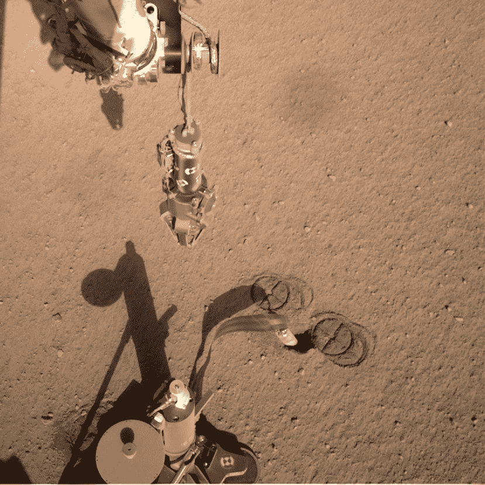

# 多孔鼹鼠:修复火星洞察鼹鼠

> 原文：<https://hackaday.com/2019/08/07/holey-moley-fixing-the-mars-insight-mole/>

在 20 世纪 90 年代初，美国国家航空航天局在探索太空的方式上经历了巨大的变化。他们所有的项目都是具有大胆目标的大型项目的日子已经一去不复返了。美国国家航空航天局的大部分项目将归入探索项目，并遵循“更快、更好、更便宜”的口号，目标集中，预算更少，尽可能多地重复使用设备。

后来成为火星洞察号任务的想法首次出现在 2010 年，旨在以之前任务没有的方式探索火星。海盗号在 20 世纪 70 年代探索过火星表面，寻找生命的化学迹象，而探索者计划的漫游者四处游荡，探索表面地质，洞察号的任务是深入观察这颗红色星球。

可悲的是,“洞察号”观察火星风化层下的主要手段目前被卡在地表下几厘米处。美国宇航局和 JPL 的工程师们正在努力解决这个问题，虽然还不能确定他们是否会成功，但最近事情已经开始好转。让我们快速看看问题是什么，以及一个可能让任务回到正轨的潜在解决方案。

## 任务

经过六个月的旅程，洞察号于 2018 年 11 月以壮观的方式抵达火星。美国国家航空航天局对着陆的报道非常出色，以至于获得了两项艾美奖奖的提名。与以前的许多次不同，火星未能以受害者的身份声称自己有洞察力，随着着陆器安全地停在火星赤道以北不远的 Elysium Planitia 上，科学正式开始了。

大多数着陆器都是独立的平台，执行科学任务所需的所有仪器都内置在飞行器的空间框架中。这降低了复杂性，降低了成本——但前提是科学允许。由于 InSight 的设计目的是通过地震和热来探索火星，因此为了消除着陆器上设备的振动和热效应，有必要提供两个系留仪器包，可以使用机械臂部署到表面。

部署的两个仪器中的第一个是 SEIS，或内部结构的地震实验。一旦安全就位并投入使用，机械臂就将热流和物理属性包放在几米之外。惠普配备了一个穿透器，设计用于在火星风化层中挖掘 5 米深的洞穴，同时跟踪一系列热传感器和加热元件，旨在研究地表下的热剖面，从而更好地了解火星内核中的热流。

 [https://www.youtube.com/embed/KAxiHK6dYvE?version=3&rel=1&showsearch=0&showinfo=1&iv_load_policy=1&fs=1&hl=en-US&autohide=2&wmode=transparent](https://www.youtube.com/embed/KAxiHK6dYvE?version=3&rel=1&showsearch=0&showinfo=1&iv_load_policy=1&fs=1&hl=en-US&autohide=2&wmode=transparent)

## 问题是

被称为“鼹鼠”的惠普穿甲弹于 2019 年 2 月 28 日开始撞击风化层。任务策划者给了穿甲弹两个月的时间来挖掘它的最大深度，但是不到一周，鼹鼠就放弃了。“鼹鼠”只放出了 30 厘米长的布满仪器的系绳，它四分之一的长度还在 HP 的保护罩内。探测器远离了 3 米的最小有效深度，美国宇航局和 JPL 的工程师需要找出原因。

早期的猜测集中在让地球上几乎每个挖洞者都感到惊愕的事情上:鼹鼠撞上了一块岩石。任务规划者已经使用其他着陆器的数据来选择一个尽可能没有岩石的区域，早期估计鼹鼠有大约 4%的机会撞到它无法绕过的岩石。要么是美国国家航空航天局非常不走运地放置了这台仪器，要么是发生了其他事情。

The mole in its hole after the HP³ support was removed. Note the footprints from the support, and the double impressions from vibrations while the mole burrowed. Source: [NASA Mars InSight](https://mars.nasa.gov/insight/)

另一种可能性是摩擦，或者更具体地说，是缺乏摩擦。“鼹鼠”的内部结构与普通的电动冲击驱动器没有太大区别。在 mole 中，电动马达驱动销抵靠锤子，锤子的外圆周上有倾斜的凸轮。随着销的旋转，凸轮克服弹簧压力将锤提起，直到锤到达斜面的末端。然后，弹簧将锤子向下压向穿甲弹的尖端，向下施加强大的力。风化层对穿甲弹壳体的摩擦力，以及第二个阻尼弹簧的力，阻止了鼹鼠从洞里弹回来。

这就是问题所在，至少根据目前的想法是这样。由于火星引力较低，鼹鼠试图挖掘的单个风化层颗粒似乎没有被压实。可能是因为没有东西固定它，所以鼹鼠没有取得进展，而且这个装置只是在跳来跳去，没有挖得更深。

## 狐狸

为了评估这一点，任务控制人员决定他们需要看一看鼹鼠。被惠普塔覆盖，没有办法告诉到底发生了什么，所以制定了一个移动它的计划。这不是一件容易的事；除了它必然会解开一些科学系绳，可能会导致混乱之外，鼹鼠也有可能会被什么东西绊住，被完全拉出洞穴，彻底结束它的使命。除此之外，在高延迟连接上操作机械臂也很复杂，而且需要精心的计划。

去除幽门螺旋杆菌的过程非常艰难，分三个非常缓慢、非常谨慎的阶段。7 月 26 日，美国宇航局公布了裸露鼹鼠的照片，这些照片似乎证实了低摩擦风化层理论:鼹鼠的末端歪斜地坐在一个宽锥形孔内，这正是你所期待的在一个地方弹跳的东西，而不是撞上岩石并被卡住。

任务规划者现在正在利用所有的数据来制定拯救惠普的计划。使用复制穿透器和模拟火星风化层在地球上进行的测试似乎证实了摩擦问题是罪魁祸首，在这种情况下可能有其他选择。这只鼹鼠可能只需要一点额外的摩擦力就能启动；如果有足够多的船体与风化层接触，可能就足以开始向下移动。为此，据报道，美国宇航局正在酝酿一项计划，使用机械臂上的样本勺来填补漏洞，并压实鼹鼠周围的浮土。这可能只是让事情重新开始。

 <https://hackaday.com/wp-content/uploads/2019/07/EAbFBqoU4AIGBV8.mp4?_=1>

[https://hackaday.com/wp-content/uploads/2019/07/EAbFBqoU4AIGBV8.mp4](https://hackaday.com/wp-content/uploads/2019/07/EAbFBqoU4AIGBV8.mp4)

无论如何，InSight 团队已经在困难的条件下做了大量的工作来解决这个问题。如果他们幸运的话，我们可能很快就会看到鼹鼠长长的 Kapton 尾巴消失在我们挖过的最深的地外洞穴中，我们将开始了解更多关于红色星球的内部。