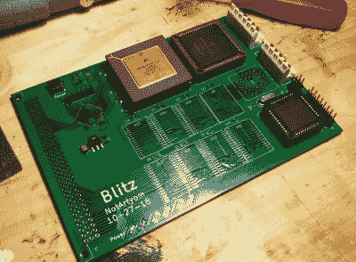

# 家酿 68K 微型 ATX 计算机运行自己的操作系统

> 原文：<https://hackaday.com/2021/03/27/homebrew-68k-micro-atx-computer-runs-its-own-os/>

在 Hackaday，我们对自制的摩托罗拉 68000 电脑并不陌生，但更多的时候，它们往往是复古简约主义的实验。古老的处理器通常只由少数几个组件组成，它们很有可能已经在一块 perfboard 上占据了一席之地。然后[NotArtyom]派出他的突击队，把酒吧推向了顶峰。

毫无疑问，Blitz 不仅仅是经典芯片的简单演示。开放式硬件主板具有板载软盘、IDE 和 PS/2 接口，以及三个 8 位 ISA 扩展槽。摩托罗拉 68030 CPU 以 50 兆赫的速度运行，4 MB 的内存和 512 KB 的只读存储器。专为适应微型 ATX 主板标准而设计，你甚至可以在当代 PC 机箱中安装 Blitz，并在标准 ATX 电源上运行它。

An earlier prototype of the Blitz motherboard.

如果硬件不够令人印象深刻，[NotArtyom]继续前进，[为它创建了自己的开源的类似 DOS 的操作系统来运行](https://github.com/ProbablyNotArtyom/G-DOS)。用可移植的 C 编写，G-DOS 可以在各种 m68k 板上运行，也可以在 ARM 和 PowerPC 机器上运行。这本身就是一个令人难以置信的项目。如果你想找些东西来炫耀你的自制电脑，你当然可以做得比下载 G-DOS 更糟。如果你把它移植到新的主板上，一定要让[NotArtyom]知道。

[NotArtyom]花了三年时间开发 Blitz 和 G-DOS，他的唯一目标是更好地理解自制计算机。他没有兴趣将设计货币化或将其变成一个工具包，而是希望它能成为其他有类似兴趣的人的资源和灵感。哦，是的，他甚至在高中毕业前就做了这些。如果你以前没有质疑过你生活中的成就，现在将是一个开始的好时机。

有兴趣建立自己的摩托罗拉 68000 电脑，但还没有达到[NotArtyom]的魔法水平？你可以从简单一点的东西开始，比如 68k-nano T1，或者如果你真的陷入困境，[就直接干掉一个龙珠 68328 T3。](https://hackaday.com/2018/01/28/the-tiniest-working-68k-system/)