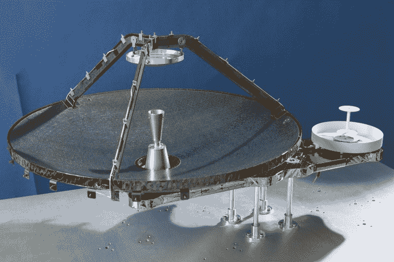
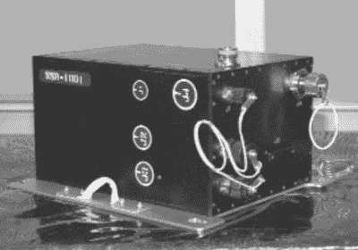

# 詹姆斯·韦伯望远镜如何给家里打电话？

> 原文：<https://hackaday.com/2022/07/25/how-does-the-james-webb-telescope-phone-home/>

当谈到像詹姆斯·韦伯太空望远镜这样的工程奇迹时，所涉及的技术是如此专业，以至于一般人很少能真正理解。我们正在谈论一个耗资 100 亿美元建造的红外天文台，它在 50k(223°C；370 华氏度)，距离地球 150 万公里(93 万英里)，你不会指望它与你的普通笔记本电脑共享任何部件。

但如果是这样的话，公众会更容易理解。因此，毫不奇怪，本周我们看到几个科技网站头条报道了詹姆斯·韦伯太空望远镜内的“微型固态驱动器”。他们惊叹于天文台在只有 68g 板载存储空间的情况下提供如此令人难以置信的图像的能力，这一数字低于如今你在中端智能手机上所能看到的数字。专注于固态硬盘(SSD)及其相对微薄的容量给了这些文章一个易于被主流受众掌握的试金石。即使这是一个有缺陷的比较，读者们还是得到了一个关于饮水机的有趣事实——“我的电脑的驱动比詹姆斯·韦伯的大。”

当然，我们知道美国宇航局没有打了易贝一个过时的三星 EVO 固态硬盘巴掌到他们的下一代太空天文台。事实是，固态驱动器[的官方名称是固态记录器(SSR)](https://jwst-docs.stsci.edu/jwst-observatory-hardware/jwst-solid-state-recorder) ，是为满足 JWST 任务的确切要求而定制的；就像飞船上的其他组件一样。同样，它有些不寻常的 68 GB 容量不仅仅是一些任意的数字，它是根据船上科学仪器的需要精确计算的。

新闻中关于詹姆斯·韦伯太空望远镜的存储能力或缺乏存储能力的讨论如此之多，这似乎是深入研究天文台这个特殊子系统的绝佳时机。SSR 是如何被利用的，工程师们是如何达到这一特定能力的，它的设计与以前的太空望远镜如哈勃相比如何？

## 深空高速

詹姆斯·韦伯太空望远镜的通信需求给工程师们提出了一个特别艰巨的挑战。为了实现其科学目标，航天器必须远离地球，但同时，需要相当大的带宽来及时返回所有收集的数据。

为了方便这种数据传输，JWST 在铰接支架上安装了一个直径为 0.6 米(2 英尺)的 Ka 波段高增益天线(HGA)，无论天文台当前在空间中的方向如何，它都可以指向地球。这种 Ka 波段链路通过[美国宇航局的深空网络(DSN)](https://hackaday.com/2017/07/21/serious-dx-the-deep-space-network/) 提供理论上 3.5 MBps 的最大带宽，尽管实际可达到的数据速率取决于许多因素。

JWST’s Ka-band antenna (left), next to the S-band telemetry antenna

不幸的是，这种返回地球的高速链接并不总是可用的，因为 DSN 需要与许多遥远的航天器进行通信。根据网络目前的利用率，JWST 每天被分配了两个四小时的窗口用于数据传输。理论上，这意味着飞船*应该能够在 24 小时内将超过 100 GB 的数据传输回地球，但实际上还有其他问题需要考虑。*

首先，高增益天线无法持续跟踪地球，因为它的运动会产生轻微的振动，可能会破坏微妙的观察。相反，它每 2.7 小时移动一次[，以将行星保持在天线的波束宽度内。只要有可能，观察将被安排在这周围，但是不可避免地，冲突最终将会出现。要么必须缩短高速数据传输，要么在天线重新调整期间暂停长时间的观测。任务规划者将不得不仔细权衡他们的选择，决定性因素可能是所讨论的观测的科学重要性。](https://jwst-docs.stsci.edu/jwst-observatory-hardware/jwst-spacecraft-bus/jwst-communications-subsystem)

在链路的两端，还需要考虑停机时间。DSN 可能暂时无法接收传输，或者飞船上可能有问题，阻止它进行定期广播。在与天文台标准下行链路相关的后勤挑战和不可预见的通信延迟的可能性之间，詹姆斯·韦伯唯一有希望进行全天候观测的方式是拥有一个相当大的机载数据缓存。

## 飞行测试技术

Hubble’s 1.5 GB SSR

在个人计算领域，固态硬盘是一项相对较新的发展。但几十年来，美国宇航局一直很清楚它的优势，即更轻的重量和没有移动部件。航天局并不以在旗舰任务中部署未经测试的概念而闻名，这也没什么不同。自 1999 年以来，他们一直在哈勃太空望远镜上使用类似的方法，当时宇航员在第三次维修任务中用 1.5 GB SSR 取代了飞船原来的磁带存储。

自然，哈勃的 SSR 的低容量至少部分是由于这个时代。但即使如此，这仍然是一个相当大的升级，因为 SSR 取代的磁带录音机只能容纳大约 150 MB。请记住，哈勃拍摄的图像分辨率远低于 JWST，但与地球轨道上的航天器的通信自然要比在深空中的通信可靠得多。

## 存储和转发

总的来说，美国宇航局估计詹姆斯·韦伯应该能够在每天两次的窗口中通过 DSN 传输 28 GB 多一点。为了提供完整的 24 小时缓冲，航天器因此需要大约 60 GB 的机载存储。那么 SSR 为什么是 68 GB 呢？部分原因是有些空间是留给天文台自己使用的。还因为，正如飞行系统工程师 Alex Hunter 向 IEEE SpectrumT3*解释的那样，额外的容量给了系统一些喘息的空间，因为磨损和辐射会在未来十年侵蚀 SSR 的闪存。*

24 小时似乎不是一个安全网，但这个数字有几个附带条件。根据詹姆斯·韦伯号上实际使用的科学仪器，每天产生的实际数据量可能会低得多。如果高速通信受阻，地面控制人员可能会暂停数据密集型观测，直到问题得到解决。如果有必要，NASA 也可以分配额外的 DSN 时间来处理积压的工作。简而言之，有足够的应急措施，SSR 的容量永远不会成为问题。

因此，尽管你肯定可以在一款中端 Chromebook 中找到一个比 NASA 最近在詹姆斯·韦伯太空望远镜上进行的长达十年的任务更大的固态驱动器，但仔细的规划和金钱可以买到的最佳工程的健康剂量意味着尺寸不是一切。

[编者按:是的，我们知道这幅图显示了 JWST 从望远镜焦点发出的辐射。这一次，我会为不够具体的艺术要求承担责任。但是你不得不承认，如果你是一个艺术家而不是一个搞无线电的人，他们看起来表面上有点相似。]