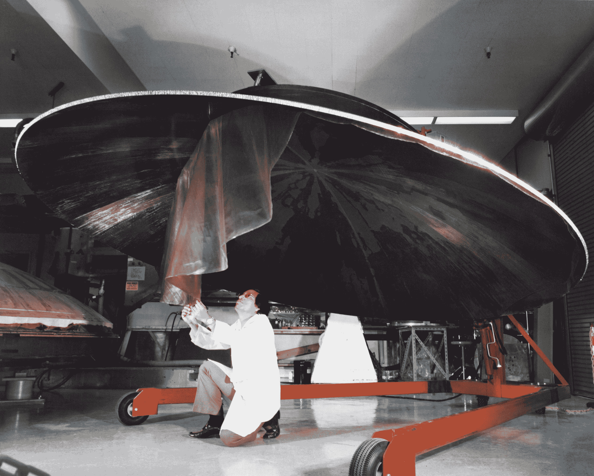
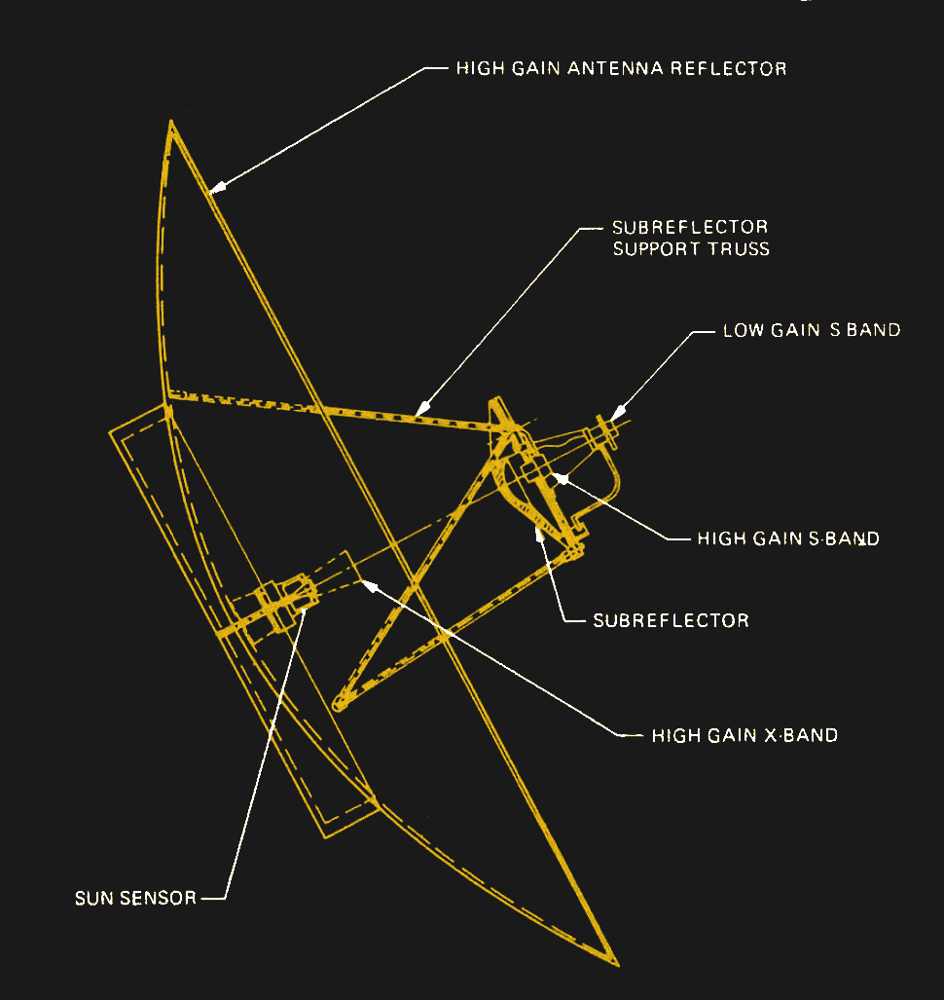
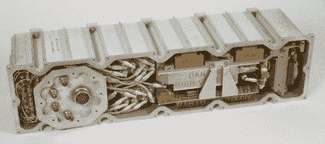

# 这么多年过去了，航海家号怎么还能说话？

> 原文：<https://hackaday.com/2022/06/08/how-is-voyager-still-talking-after-all-these-years/>

科技新闻频道最近充斥着从旅行者 1 号 T3 发回的[奇怪信号的故事。而通常的嫌疑人却得出了通常的结论——外星人！！—在缺乏对异常现象的坚定解释的情况下，我们中的一些人将这一事件视为一个机会，对这两个旅行者飞船(现已超过 40 岁)仍然与我们地球上的人保持联系感到惊讶，尽管这已经在可以想象的最恶劣的环境中覆盖了大约 200 亿公里。](https://hackaday.com/2022/05/21/voyager-1-talks-some-nonsense-but-is-still-working/)

像许多美国宇航局的项目一样，旅行者号已经远远超过了它最初的设计目标，直到今天仍然在报告有用的科学数据。但这怎么可能呢？是什么 20 世纪 70 年代的无线电技术让它进入了双太空探测器，使它不仅完成了探索外行星的主要任务，还让它们进入了星际空间的扩展任务，并仍然保持双向联系？事实证明，航海家号的无线电没有什么神奇之处——只是坚实的工程加上健康的冗余，以及多年来相当好的运气。

## 大盘子

对于一个在许多方面定义了后阿波罗时代的行星探索计划来说,“旅行者”号的构想出人意料地早。复杂的任务剖面起源于 20 世纪 60 年代中期的“行星大旅行”概念，该概念计划利用 20 世纪 70 年代末出现的外行星排列。如果在正确的时间发射，探测器在最初的动力助推后，在被抛出并最终进入星际空间之前，只需利用重力辅助就可以到达木星、土星、天王星和海王星。

参观所有外行星的想法太诱人了，不能错过，随着作为彩排的前往木星的先锋任务的成功，旅行者计划被设计出来。像所有美国宇航局的项目一样，旅行者号有一定的主要任务目标，即项目经理有理由相信他们能够完成的一组最小的行星科学实验。旅行者飞船的设计是为了满足这些核心任务目标，但规划者也希望这些飞行器能够在最后的行星相遇后幸存下来，并在穿越虚空时提供有价值的数据。因此，航天器和地面上的硬件都反映了这种希望。

Voyager primary reflector being manufactured, circa 1975\. The body of the dish is made from honeycomb aluminum and is covered with graphite-impregnated epoxy laminate skins. The surface precision of the finished dish is 250 μm. Source: NASA/JPL

深空网络(DSN)的地面站(我们已经在[中深入介绍过了](https://hackaday.com/2017/07/21/serious-dx-the-deep-space-network/))和旅行者飞船本身最突出的物理特征是它们的抛物面天线。虽然规模可能有所不同 DSN 运动望远镜的直径可达 70 米——但旅行者双胞胎都是用最大的碟形天线发射的，可以装进泰坦 IIIE 运载火箭的整流罩。

Voyager High-Gain Antenna (HGA) schematic. Note the Cassegrain optics, as well as the frequency-selective subreflector that’s transparent to S-band (2.3-GHz) but reflects X-band (8.4-GHz). Click to enlarge. Source: NASA/JPL

每个旅行者号航天器上的高增益天线(HGA)的主反射器是一个直径为 3.7 米的抛物面天线。该盘由蜂窝铝制成，覆盖有石墨浸渍的环氧树脂层压板外壳。反射器的表面被加工成高度光滑，表面精度为 250 微米，这是用于上行链路和下行链路的 S 波段(2.3 GHz)和仅用于下行链路的 X 波段(8.4 GHz)所需要的。

像 DSN 中的地面天线一样，Voyager 天线是卡塞格林反射器设计，在主反射器的焦点处使用频率选择副反射器(FSS)。副反射器聚焦并校正进入的 X 波段波，使其向下朝向主抛物面天线的中心，X 波段馈电喇叭位于该中心。这种安排在 X 波段提供了大约 48 dBi 的增益和 0.5°的波束宽度。S 波段的布置略有不同，馈电喇叭位于副反射器内部。副反射器材料的频率选择特性允许 S 波段信号直接穿过它并直接照射主反射器。这在 S 波段提供了大约 36 dBi 的增益，波束宽度为 2.3。还有一个低增益 S 波段天线，具有或多或少的心形辐射模式，位于副反射器组件面向地球的一侧，但这只用于任务的前 80 天。

## 二等于一

每辆旅行者号总线上的十个隔间中有三个是专用于射频子系统(RFS)的发射器、接收器、放大器和调制器的。与所有高风险的太空任务一样，冗余是游戏的名字 RFS 中几乎每个潜在的单点故障都有某种备份，这是一种工程设计决策，在过去 40 年里，两个航天器上不止一次证明了任务节约。

在上行链路方面，每艘航海家号都有两台 S 波段双转换超外差接收机。1978 年 4 月，就在预定与木星相遇的前一年，旅行者 2 号上的主要 S 波段接收器被飞船上的故障保护算法关闭，该算法在很长一段时间内未能接收到来自地球的任何命令。备用接收器被打开，但发现在锁相环电路中有一个坏的电容器，用于调整主要由于地球运动引起的多普勒频移变化。任务控制人员命令飞船切换回主接收器，但这再次失败，使得*旅行者 2 号*无法从地面接受命令。

幸运的是，故障保护程序在一周没有通信后重新打开了备用接收器，但这让控制器陷入了困境。为了继续这项任务，他们需要找到一种方法来使用不可靠的备用接收器来指挥飞船。他们提出了一个复杂的方案，其中 DSN 控制器根据预测的多普勒频移猜测上行链路频率。问题是，由于坏电容，信号需要在接收器锁定频率的 100 Hz 以内，并且该频率会随着接收器的温度变化，每度变化约 400 Hz。这意味着控制器需要每周进行两次测试，以确定当前的锁定频率，并在上传任何可能改变航天器温度的命令后，让航天器热稳定三天。

## 双重下行链接

An Apollo-era TWTA, similar to the S-band and X-band power amps used on Voyager. Source: [Ken Shirriff](https://www.righto.com/2021/07/inside-20-watt-traveling-wave-tube.html)

在发射端，X-波段和 S-波段发射机都使用独立的激励器和放大器，并且每个都有多个以实现冗余。尽管下行链路主要通过 X 波段发射机，但两个 S 波段激励器中的任何一个都可以馈入两个不同的功率放大器。固态放大器(SSA)向喇叭天线提供 6 W 或 15 W 的可选功率输出，而单独的[行波管放大器(TWTA)](https://hackaday.com/2021/07/16/inside-a-20-watt-traveling-wave-tube-amplifier-from-apollo/) 提供 6.5 W 或 19 W。双 X 波段激励器使用 S 波段激励器作为其频率参考，使用两个专用 TWTA 之一，每个 twta 可以向高增益天线发送 12 W 或 18W。

无线电系统下行链路中的冗余将在拯救两个航天器的主要任务中发挥作用。1987 年 10 月，旅行者 1 号遭遇了 X 波段 TWTAs 中的一次故障。一年多一点后，*号旅行者 2 号*遇到了同样的问题。两艘飞船都能够切换到另一个 TWTA，允许*旅行者 1 号*发回太阳系著名的[“全家福”](https://solarsystem.nasa.gov/resources/536/voyager-1s-pale-blue-dot/)包括地球的淡蓝色圆点照片，并允许*旅行者 2 号*发回 1989 年飞越海王星的数据。

## 越来越慢

旅行者系统上的无线电系统主要是为支持行星飞越而设计的，因此被优化为将尽可能多的科学数据传输回 DSN。接近每一颗外行星意味着每一艘飞船在飞越期间都急剧加速，此时正是船上十个科学仪器产生最大数据的时刻。为了避免瓶颈，每艘航海家号都配备了一台数字磁带录音机(DTR) ，这基本上是一个花哨的 8 轨磁带卡座，用来缓冲科学数据，供以后的下行传输使用。

此外，每艘航海家号的距离越来越远，大大减少了下行科学数据的可用带宽。当飞船第一次飞越木星时，数据流的速度相对较快，为每秒 115，200 比特。现在，随着每个航天器接近一个完整的光天距离，数据只能以 160 bps 的速度传输。上行命令甚至更慢，只有 16 bps，并使用 18 千瓦的功率从 DSN 的 70 米碟形天线发射到太空。在当前到旅行者 1 号的 230 亿公里距离上的上行链路路径损耗超过 200 dB 在下行链路方面，DSN 望远镜必须挖掘已经衰减到阿托瓦特(10 ^(-18) W)范围的信号。

旅行者 1 号和 T2 旅行者 2 号的无线电系统仍然在他们行星任务的主要部分工作，这是一项值得庆祝的技术成就。尽管在太空中经历了四十年的挑战和多次系统故障，但两个航天器仍在通信，这几乎是一个奇迹。