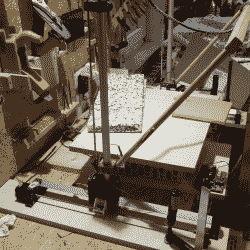

# 多少才算多？

> 原文：<https://hackaday.com/2020/12/12/how-much-is-too-much/>

在我的个人项目中，我绝对倾向于极简主义。这通常意味着用最少的零件、最便宜的零件或最低的技术来完成工作。奇怪的是，这并没有延伸到在最短的时间内完成项目，这是一种不亚于金钱或硅的资源。矫枉过正的道路往往是最平坦的道路，但我会选择多石、泥泞的道路。(至少有时候会。)

有一堆关于数控热丝泡沫切割机的伟大设计，它们从粗糙的到可笑的过度设计的都有，可能大多数都属于后一类。你将看到的许多机器都大量借鉴了它们最近的亲戚，数控铣床或 3D 打印机，以及运动硬化钢轨或滚珠丝杠，并由厚中密度纤维板甚至铝板制成。

 数控泡沫切割机需要做的只是在变热的电线上保持一点张力，并缓慢而准确地穿过一块泡沫，泡沫会自动融化。电线移动缓慢，所以框架不需要处理 3D 打印机头的加速度，而且它几乎没有负载，所以它不需要任何强大的驱动和数控轧机的方式。但是，工厂和打印机的机制是如此完善，以至于大多数制造商不觉得有必要最小化，只是简单地建立他们已经知道的东西，从而节省时间。他们制造了一台足够坚固的机器，可以承载一个小孩，而不是一根 60 厘米长、0.4 毫米、比一根鸟毛还轻的金属丝。

我采取了相反的方法，从底层开始尽可能轻和小的建造。(这就是为什么我的机器还没有完成！)通过构建得太少、太不稳定或太简单，我已经看到了更健壮的设计的优势。如果我一开始就有无限量的 v 型槽导轨和滚珠丝杠，我就不会发现它们是多余的，但如果我一开始就有一个能抵抗向内多拉一点的框架，我现在就可以完成了。

过度建设是权宜之计，但也是一条单行道。一旦你有了镀金版的机器并开始运行，就没有什么动力去降低成本或复杂性了；很管用，钱已经花完了。但是当你的机器还不够好的时候，很容易就能判断出哪些需要改进，哪些不需要。矫枉过正是快速完成任务的途径，而反复失败和改进是一路学习的途径。完成后，我就有一个好故事可以讲了。或者至少这是我在等待我的第三个轨托完成印刷时对自己说的话。

This article is part of the Hackaday.com newsletter, delivered every seven days for each of the last 200+ weeks. It also includes our favorite articles from the last seven days that you can see on [the web version of the newsletter](https://mailchi.mp/hackaday.com/hackaday-newsletter-649368). Want this type of article to hit your inbox every Friday morning? [You should sign up](http://eepurl.com/gTMxQf)!