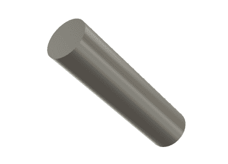
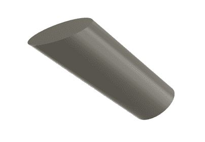
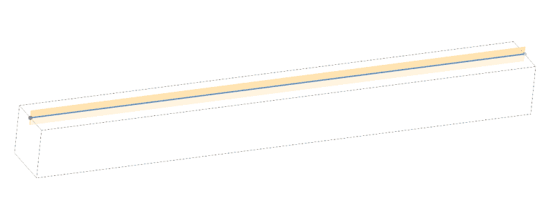
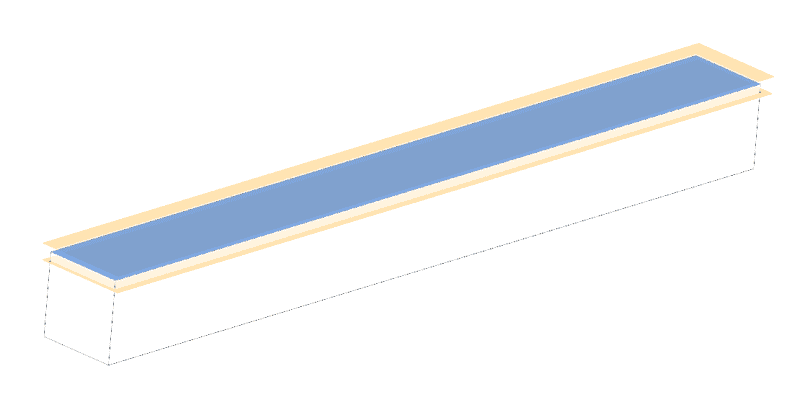
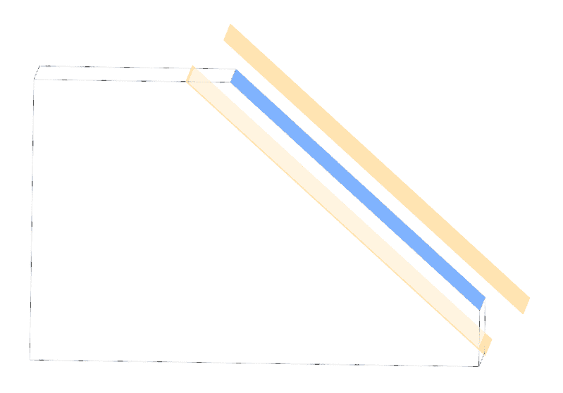
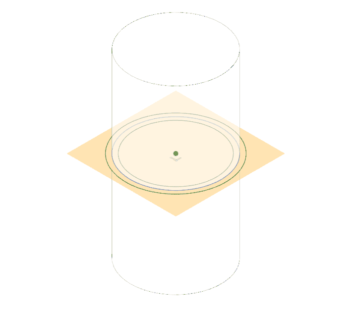
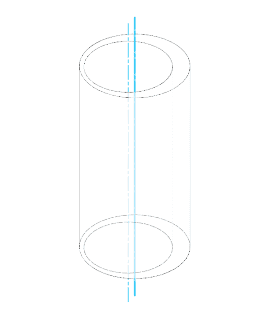

# 这部分有多精确？了解你的 GD&T

> 原文：<https://hackaday.com/2018/10/04/how-precise-is-that-part-know-your-gdt/>

一个设计如何从电脑屏幕变成你手里拿着的东西？不能完全回答这个问题在制造业中是一个巨大的风险，因为。工程师用来确保成功的重要工具之一是几何尺寸和公差(GD&T)。

一份好的技术图纸对于将你的机械零件设计传达给制造商是必不可少的。作为一门专业学科，制图就是创建尽可能清晰的技术图纸，这意味着明确定义特征。该概念最基本的实现是尺寸标注，即表示特征之间的距离或角度。一份合适的技术图纸也会包括这些尺寸的公差，我最近解释了[如何避免累积这些公差的陷阱](https://hackaday.com/2018/07/25/how-and-why-to-avoid-tolerance-stacking-in-your-technical-drawings/)。

然而，尺寸和公差本身并不能说明全部情况。就其本身而言，它们并不指定制造零件的几何形状需要多接近您的完美的名义表示。这就是我们今天要和 GD&T 一起深入探讨的。

## 制造完美的零件

想象你在左边绘制简单的圆柱部分。你至少要指定圆柱体的长度和直径。如果你很彻底——你应该如此——你还应该包括每一个可接受的公差。

  What you wanted  What you got

问题是圆柱体可能不是完美的圆形，平的端面可能不完全垂直于圆柱体的轴。完成的部分可能与你的图纸相匹配，但仍然会被长方形或斜面破坏。即使有严格的公差，你的零件可能最终看起来像右边的零件(为了说明的目的，我已经大大夸大了)。

潜在差异的原因是制造业不完善。该零件可能是在维护不良的车床上车削的，这导致了椭圆形轮廓。使用带锯可以将一个长圆柱体分割成许多指定长度的小块，但可能是刀片磨损了，在切割过程中发生了漂移。由于这些原因，除了基本尺寸之外，明确说明几何形状是什么也是很重要的。

## 定义你的三维形态

像所有与制图相关的事情一样，几何尺寸和公差的细节在不同的标准集之间有所不同。但是，一般概念是通用的。GD&T 使您能够用各种“控件”定义零件的三维形状实际上，它们只是几何公差，但为了避免与你可能习惯的标准尺寸公差混淆，我在本文中将它们称为控制。

例如，圆度控制可以让你告诉制造商你的圆柱体的圆形轮廓需要多接近完美。如果你说它需要 0.01 毫米的圆度，这意味着一个刻度盘指示器在圆柱体周围不会显示最高点和最低点之间超过 0.01 毫米的差异。

可以想象，GD&T 是一个非常强大的工具，可以确保制造商按照您的标准制造您的零件。这也是一个复杂的问题，这也是为什么它没有被经常使用的原因。在许多情况下，你可能可以跳过 GD&T，但是，你可能会收到技术上符合你的规格，但却无法使用的零件。如果你的设计需要精密部件，那就更是如此。GD&T 保护你免于草率制造，只要你知道如何使用它。那么，让我们来看看一些你可以使用的常用控件。

## GD&T 控制的类型

### 位置

| 符号: |  |

通常被称为“真实位置”，这基本上相当于用基本的线性尺寸和公差指定像孔这样的东西的坐标。使用参考曲面的线性尺寸定义位置，并允许位置控制有所变化。在孔的情况下，该变化是围绕该标称位置的圆形包络。

位置不仅比标准线性尺寸公差有更多的用途，而且它所允许的内容也略有不同。由两个带公差的线性尺寸定义的位置将导致可接受的正方形“区域”。在孔示例中，位置控制使该区域成为圆形。

### 正直

| 符号: |  |

最基本的 GD&T 控制，直线度就是它听起来的样子:一个表面上的假想线应该有多直。这仅适用于您调出的曲面。如果你有一个长的方形铝型材，这将决定它可以沿一个轴进出多少。它也可用于零件中心轴的直线度。

### 平坦

| 符号: |  |

平坦度与平直度非常相似，只是它适用于整个表面。移动到该表面上任何位置的千分表都需要在您指定的公差范围内。平面度对于像研磨机或 3D 打印机这样的机器特别有用，因为它们的工作表面根本不能弯曲。

### 平行

| 符号: |  |

这定义了两条理论上的直线应该有多接近平行。如果控制方形铝挤出的一个表面的直线度，可以使用平行度来控制另一侧的表面。平行对于许多线性运动系统来说是必不可少的。

### 垂直

| 符号: |  |

如果两个曲面之间的角度需要为 90 度，您应该使用垂直度。其中一个曲面可以在单个轴上弯曲，就像本文开头的圆柱体一样。这将允许您声明圆柱体的端面需要垂直于圆柱体的轴。值得注意的是，这不是类似“90 +/- 1”的角度公差，而是垂直面必须保持在其中的两个假想平面之间的距离。

### 有角

| 符号: |  |

成角度类似于垂直，只是它可以用于任何角度。也像垂直性一样，真实表面需要落在从名义上的倾斜表面偏移的两个平面内。倾斜度和垂直度控制以这种方式处理，以便质量控制可以使用千分表检查整个表面。

### 圆

| 符号: |  |

如上所述，圆度是对特征圆度的控制。这可能是圆柱体的外表面，也可能是孔的内表面。在这两种情况下，这是一个如何接近一个完美的圆形轮廓的措施。需要注意的是，这仅适用于零件的单个二维横截面。这对于任何圆形零件都很有用，尤其是那些需要在另一个表面上滚动的零件。

### 柱面性

| 符号: |  |

在圆柱体的例子中，我们实际需要的是一组 GD&T 控件，指定它的圆度、直线度和端面的垂直度。因为圆柱体在制造业中非常普遍，所以圆柱度在一个控制中涵盖了所有这些。公差定义了两个假想的圆柱体，一个在标称的内部，一个在标称的外部，制造的零件必须安装在这两个圆柱体之间。

### 集中性

| 符号: |  |

想象实心圆柱体实际上是一根管子。同心度允许您通过指定内圆柱曲面的中心轴与外圆柱曲面的中心轴的距离来确保一致的壁厚。如果它们离得很远，你会在一边有一堵厚墙，在另一边有一堵薄墙。同心度将这些轴保持在您提供的距离内，以避免这种情况。例如，车轮的轮毂需要与外缘非常同心。

# 何时使用 GD&T

如果你读到这里，你可能正处于信息超载的状态。实现 GD&T 需要做很多额外的工作，并且很难跟踪所有不同类型的控制。除了上面列出的方法，还有其他不太常见的处理概要文件的方法。也有一些是专门用来限制跳动的。这可能会让你一头雾水，但好消息是，在现实世界中很少有人期望你对每个零件的每个特性都使用 GD&T。

GD&T 只是一个确保零件符合标准的系统，而你是决定你的作品符合哪些标准的人。如果你只是需要为你在 Tindie 上出售的电子设备准备一个金属片外壳，那么如果其中一个表面偏离完美的平面度半毫米，这可能并不重要。在很多行业，即使是专业的绘图员，除非绝对必要，也会跳过 GD&T。

但是，偶尔，这将是必要的，你应该知道所涉及的基本概念。下次绘制技术图纸时，请花时间考虑哪些特征对零件的功能很重要。然后，想象一下，如果该功能因特征的几何形状出现意外变形而面临风险。如果有这种可能，利用 GD&T，以确保制造商满足您的期望。