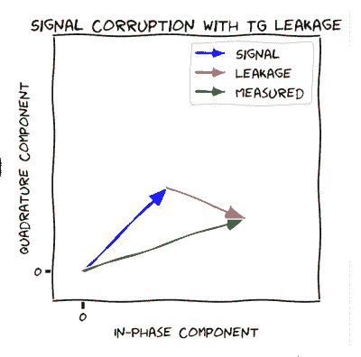

# 如何应对廉价的频谱分析仪

> 原文：<https://hackaday.com/2019/01/25/how-to-deal-with-a-cheap-spectrum-analyzer/>

Hackaday 超级大会是关于展示 Hackaday 社区的硬件英雄事迹的。我们也有同样目标的同行评审期刊，对于 2018 年的 Hackaday 超级会议，我们尝到了第一篇进入我们完全开放的期刊的论文的味道。它来自 Ted Yapo，这确实是一个硬件英雄的故事:当你不想花六万美元买一个矢量网络分析仪时会发生什么？

Ted 的演讲从对网络分析仪的需求开始。这些可以进行射频测量，但是如果你需要的话，做好准备:你可以花两万美元买一个二手的 VNA。大约在 Ted 的项目开始的时候，Rigol 发布了他们的廉价频谱分析仪 DSA815。这东西只花了一千美元。这是他们第一次修改硬件，它只是一个*标量*网络分析仪。作为硬件的第一个版本，有一些问题；有泄漏会影响测量。本底噪声比它应有的要高。不过，这些问题可以通过 ted 的一点小技巧得到纠正:

 [https://www.youtube.com/embed/aysnMPZaPD8?version=3&rel=1&showsearch=0&showinfo=1&iv_load_policy=1&fs=1&hl=en-US&autohide=2&wmode=transparent](https://www.youtube.com/embed/aysnMPZaPD8?version=3&rel=1&showsearch=0&showinfo=1&iv_load_policy=1&fs=1&hl=en-US&autohide=2&wmode=transparent)

Ted 的 Rigol 频谱分析仪由两个基本部分组成。跟踪发生器产生一个信号，通过被测设备馈入。频谱分析仪通过被测设备接收来自跟踪发生器的信号，并在屏幕上显示线条和数字。如果您正在测量设备在 100 kHz 或 1 GHz 下的性能，这就是您所需要的。

The effect of phase shift through a scalar network analyzer

问题在于跟踪发生器和频谱分析仪之间的泄漏。在没有插入任何东西的情况下，该频谱分析仪的本底噪声为-90dB，而泄漏测量值约为-70dB。这是通过 HP355D 可变衰减器测量的，对于测量如此低的信号，这种廉价的频谱分析仪基本上没有用。

不过，这是一个标量网络分析仪，而不是矢量分析仪。Ted 发现泄漏对测量结果的影响可以通过改变信号的相移来控制。只需使用商用二极管混频器(几个二极管和几个变压器)，来自跟踪发生器的信号相位就可以反相 180°。由于相位反转，测得的信号会相对于其应有值发生变化。一点点数学知识，你就可以合理地修正机器中的这种泄漏。

这种新设置的结果是一个标量网络分析仪，它明显优于现有的机器，动态范围高达 30dB。请记住，这个问题已经在 Rigol 频谱分析仪的较新版本中得到纠正(ted 说他的机器的序列号非常低，无论如何)，这不应该被视为对这个特定网络分析仪的审查。然而，这是一个非凡的硬件英雄故事，当你没钱购买你需要的极其昂贵的工具时，使用脑力。

Ted 的演讲很棒，他还写了一篇关于他的工作的论文，发表在《你不知道的事情》杂志的第一版上。我们总是在我们的开放获取期刊中寻找新的文章，所以如果你有一个做一些不应该是可能的事情的肮脏故事，想想[向期刊](https://journal.hackaday.io/submissions)提交你自己的论文。