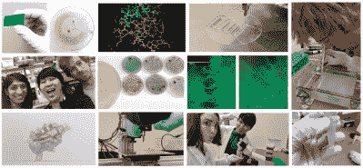

# 如何种植(几乎)任何东西

> 原文：<https://hackaday.com/2020/01/18/how-to-grow-almost-anything/>

麻省理工学院臭名昭著的“如何制造(几乎)任何东西”课程的分支[“如何种植(几乎)任何东西”](https://www.media.mit.edu/courses/htgaa/)探讨了用生物学进行设计背后的核心概念——原型生物分子、工程生物计算机和 3D 打印生物材料。该材料涉及合成生物学、生物技术伦理、蛋白质设计、微流体制造、微生物组测序、CRISPR 和基因克隆的元素。

与最初的 HTMAA 课程类似，HTGAA 每周引入一个新的概念，最终形成一个最终项目。学生学习设计 DNA 实验，使用合成的寡核苷酸引物扩增 PCR 产物，测试基因对大肠杆菌中番茄红素生产的影响。蛋白质分析和折叠，从人类皮肤中分离微生物群落并将细菌限制在图像中，打印包含活工程细菌的 3D 结构，并使用膨胀显微镜(ExM)来可视化小鼠大脑切片。最终项目从在奶油中制造生物计算机到从蜜蜂中分离酵母。

该课程源于一个围绕生物技术研究创建大型社区的计划，要求学生之前接触生物学的时间最少。通过直接使用[动手应用](https://bio.academany.org/classes.html)来生物设计概念，学生能够将他们的理论生物学概念知识直接应用到现实世界的应用中，使其成为生物灵感 DIY 项目的理想跳板。尽管教学大纲并没有完全在网上提供，但有一个过去项目的宝库可以浏览，寻找你的下一个大灵感。

