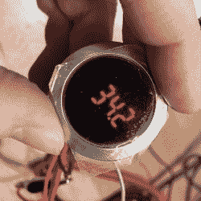

# 当零件用完时，如何保持独特的设备运行

> 原文：<https://hackaday.com/2020/04/23/how-to-keep-unique-equipment-running-when-parts-run-out/>

[JGlass]处理面向公众的技术，他说这包括像剧院设备、零售展示和博物馆展示这样的东西。这些技术中的许多实际上是独一无二的设备，即使它们是由曾经现成的、商业上可获得的部件构成的。当这些机器需要维修时，替换零件并不总是可用的，逆向工程就派上了用场。他最近[开始以识别和替换过时的 7 段工业显示器](https://jeff.glass/2020/03/03/reverse-eng-7-seg-part-1/)为例，记录如何实现这一过程。

 图中显示的特定部分是 [Lascar EM32-4-LED](https://www.alliedelec.com/m/d/535531da0cc330e5c959e59360401632.pdf) ，它在一个独特的设备中上升并死亡。麻烦的是 EM32-4-LED 已经停产，无法获得，驱动整个事情的可编程逻辑控制器(PLC)是一个无法修改的黑匣子。数据表的存在是一个好消息，但这通常只是一个起点。要创建一次性的嵌入式解决方案，需要结合研究、故障排除和设计工作。

为了做到这一点，[JGlass]从浏览数据手册的元素开始，并解释说，首先要对功能有一个高层次的理解，然后深入细节，并随时准备验证、质疑或抛弃自己的假设，这一点很重要。在建立了高层次的理解之后，将物理证据与诸如框图和功能图之类的东西进行匹配，然后打开有故障的组件，看看是否还能学到其他东西。只有到那时，万用表和探针才被拿出来进行更积极的研究。所有这些调查必须始终牢记最终目标:创造一个新的设备，其行为类似于被取代的设备。没有焦点，一个人很容易迷失在细节和未知中。

逆向工程是一个过程，工具越多越好。如果你错过了我们之前发布的关于 JTAG 黑客指南的帖子，现在你有机会去看看，为下一次你需要自己做一些电子侦查工作做好准备。