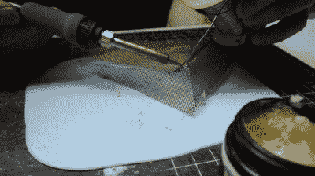

# 如何制作一个优雅的黄铜纸板纸浆模具

> 原文：<https://hackaday.com/2021/11/17/how-to-make-a-classy-brassy-cardboard-pulp-mold/>

当我们最后一次与多产的打字员[Eric Strebel]联系时，他正在完善一款环保无线充电器的设计，并将他最初的纸质原型变成了 2.0 版的纸板，其中考虑到了制造方面的问题。在这个系列的第二个视频的结尾，[Eric]正在打印出这个表格的早期版本，通过它他将最终制作一个用于处理纸板纸浆的黄铜丝网模具。你知道，一些鸡蛋盒的材料。

 [在下面的视频中，是时候通过创建三个较小的模具，然后将它们连接成一个水平模具](https://www.youtube.com/watch?v=R3ArpZRAChw)来构建纸浆模具了。结果是一个单件，然后折叠成一个充电支架，就像鸡蛋盒一样。[Eric]在这里使用黄铜屏，但他说铜也是一个不错的选择。

在用剪刀剪下黄铜并将其捣平后，他使用之前视频中的 3D 打印模具将它们压制成正确的形状。这三块中的每一块都需要一个框架,[Eric]用更多的黄铜丝网制作框架，然后用松散的丝网线将其缝合到模具上，然后用焊料固定连接。

由于所有水的重量可能会使黄铜变形，[埃里克]通过焊接在一个扁平的黄铜带框架上完成了模具。看看下面这个令人敬畏的过程，请继续关注下一个视频，届时[Eric]将制作一些纸板，并推出一些环保充电器。

这看起来是不是太复杂了？[你总是可以跳过整个网模的事情，直接把你的纸板纸屑做成 3D 打印的零件](https://hackaday.com/2021/11/05/pulp-molding-a-use-for-cardboard-confetti/)。

 [https://www.youtube.com/embed/R3ArpZRAChw?version=3&rel=1&showsearch=0&showinfo=1&iv_load_policy=1&fs=1&hl=en-US&autohide=2&wmode=transparent](https://www.youtube.com/embed/R3ArpZRAChw?version=3&rel=1&showsearch=0&showinfo=1&iv_load_policy=1&fs=1&hl=en-US&autohide=2&wmode=transparent)

