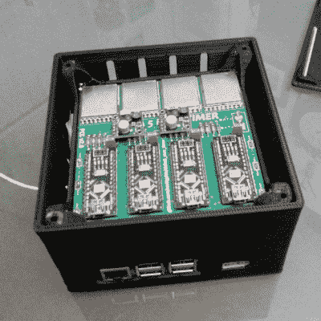

# 如何在没有应答器的情况下为无人机比赛计时

> 原文：<https://hackaday.com/2019/01/31/how-to-time-drone-races-without-transponders/>

无人机比赛非常棒，所有比赛都需要一种方法来记录单圈时间。一种方法是在每个参赛者身上安装应答器，并在他们经过时用某种接收器记录下来。人们已经推出了自己的转发器设计，并取得了一些成功，但下一步是完全放弃附加的转发器，这正是 [Delta 5 比赛计时器](https://github.com/scottgchin/delta5_race_timer)项目所做的。

A sample Delta 5 Race Timer build (Source: [ET Heli](http://www.etheli.com/delta5/index.html))

开源设计有一个聪明的方法。在无人机比赛中，每架飞机都是通过无线视频链接遥控驾驶的。由于比赛中的每架无人机都需要一个视频发射器和自己的广播频道，所以这个想法是将视频信号用作转发器。因此，不需要给飞机增加外部硬件。代价是以这种方式使用视频信号比特制的转发器更棘手，但这样做的硬件是经济的，可访问的，并且该设计在 GitHub 上有很好的记录。

硬件由 ~~RX508~~ RX5808 视频接收器 PCB 组成，稍加修改即可通过 SPI 进行通信。每个 ~~RX508~~ RX5808 都连接到自己的 Arduino，负责低级通信。Arduinos 本身通过 I2C 连接到 Raspberry Pi，允许 Pi 对接收器进行高级控制，同时提供一个支持 web 的用户界面。另外，圆周率不仅仅是一个花哨的秒表。比赛本身可以完全通过 web 界面来组织和运行。这个系统非常有用，以至于其他使用它的框架的项目已经出现，比如由[PropWashed]开发的 [RotorHazard 项目](https://github.com/RotorHazard/RotorHazard)，它使用了相同的硬件设计。

虽然[滚动自己的应答器](https://hackaday.com/2017/05/06/coreir-for-drone-racing/)是让你的比赛继续的好办法，但是使用视频传输信号来完全避开应答器是超级聪明的。事实上，它可以做到与廉价，现成的硬件只是锦上添花。