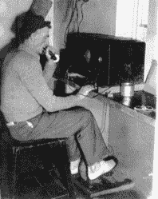
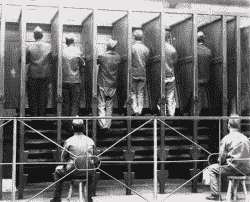

# 人类的力量，过去和未来

> 原文：<https://hackaday.com/2022/03/01/human-power-past-and-future/>

我们假设你已经看过《黑客帝国》——毕竟是 1999 年的。最终，令人惊讶的是，人类被用作人类电池，为智能机器文明提供动力。但是除了释放一些热量之外，这个想法确实有一些先例。毕竟，在有更好的替代品之前，人类已经为磨坊、缝纫机和水泵等机器提供了几个世纪的动力。

## 历史

Reconstruction of a squadron of ancient Greek galley ships.

早期的机器使用手动曲柄、车轮、踏板，甚至踏板动力来利用人类的能量。例如，考虑一艘有许多划手提供引擎的古代战舰。这不是一个伟大的使用人力。厨房里的一名划桨手使用手臂和背部，但很少使用腿。然而，腿部肌肉更大，通常也更强壮。脚踏船或赛车外壳会更有效率，但如果没有大规模生产坚固的金属部件，在古代很难建造和维护这样的机器。

曾经有一段时间，踏板或踏板操纵着从缝纫机到车床的许多机器。直到 20 世纪 40 年代，由于踏板的存在，甚至有老式的收音机能够在没有外部电源的情况下发射和接收信号。

 [https://www.youtube.com/embed/NkCQec9BhCQ?version=3&rel=1&showsearch=0&showinfo=1&iv_load_policy=1&fs=1&hl=en-US&autohide=2&wmode=transparent](https://www.youtube.com/embed/NkCQec9BhCQ?version=3&rel=1&showsearch=0&showinfo=1&iv_load_policy=1&fs=1&hl=en-US&autohide=2&wmode=transparent)

This pedal-powered radio transceiver found use in a lighthouse around 1946.

今天，我们骑的大多是自行车，而且通常是作为一种休闲活动。我们也使用跑步机，但我们使用它们的目的不同于通过人力产生运动。事实上，今天大多数跑步机使用电机移动，所以你可以感觉你在跑步，而不是去任何地方。

## 监狱

这几乎是维多利亚时代英格兰的情况，被判苦役的囚犯被强迫在跑步机上跑步作为一种惩罚形式。1818 年，被判苦役的囚犯必须一直劳动，所以他们被放在无所事事的跑步机上。也有曲柄机器，就像它们听起来的那样:一个有曲柄的机器什么也不做。

到 1895 年，全英国有 39 台跑步机和 29 台曲柄在使用。一些监狱最终采用了浪费的劳动力来磨谷物或抽水，但许多只是“磨风”，除了惩罚囚犯之外没有任何作用。

 [https://www.youtube.com/embed/Al-30Z-aH8M?version=3&rel=1&showsearch=0&showinfo=1&iv_load_policy=1&fs=1&hl=en-US&autohide=2&wmode=transparent](https://www.youtube.com/embed/Al-30Z-aH8M?version=3&rel=1&showsearch=0&showinfo=1&iv_load_policy=1&fs=1&hl=en-US&autohide=2&wmode=transparent)

Prisoners endlessly climb the “stairs” formed by a wheel in Pentonville Prison around 1895.

大约在 1822 年，美国也尝试过罪犯跑步机，但是它们从来都不是很受欢迎。典型的情况是，这些跑步机被设置成轮子，被配置成无止境的楼梯，并有隔板来防止囚犯与相邻的囚犯交流。驾驶 15 分钟可以获得 5 分钟的休息时间，这种情况每天持续 6 个小时。

## 现代

自从电动马达出现以来——更不用说改变监狱的条件了——人们对用人类来驱动机器已经没什么兴趣了。今天踩踏板或使用跑步机很可能是为了锻炼或娱乐，而不是为了提供动力。更糟糕的是，当现代机器试图获取人工能源时，它通常是为了发电，这通常不是一件非常有效的事情。

当然，有时候你真的需要电。例如，手摇手电筒、手机充电器或应急收音机需要电。但是，如果你正在尝试，比如说，抽水，你最好直接使用能量来做这项工作，而不是发电，然后用电动机来完成这项工作。

## 明天会发生什么

然而，我们最近看到一种趋势，电子产品使用越来越少的能源。现在，即使是微型手表的电池也几乎和它们的保存期一样长，这要归功于那些具有强大的电力经济性和改进的电池管理系统的设备。随着设备耗电越来越少，从人体获取电能的机会越来越多。

诚然，权力挂钩似乎已经消失。从在特殊地板上行走的人身上发电的 [Pavegen](https://pavegen.com) 系统似乎不会产生太多的电力，主要用于跟踪脚步而不是产生能量。

但是从人类身上获取能量可以为微功率设备提供能量，特别是可穿戴设备或医疗设备。体热是一个显而易见的候选者，或者——借用 Pavegen 的话——你鞋子里的某种发电机。少数[实验性医疗设备使用血糖](https://www.researchgate.net/publication/255759769_From_cyborg_lobsters_to_a_pacemaker_powered_by_implantable_biofuel_cells)作为燃料。几十年来，自动上弦手表捕捉你手臂的运动，以保持发条运转。也许未来的智能手表会用同样的方法延长电池寿命。

为了实现这一点，你需要[超低功率电子设备](https://hackaday.com/2020/11/04/minimalist-low-power-supercapacitor-sensor-node/)。虽然我们[知道一些诀窍](https://hackaday.com/2018/11/04/weather-station-is-a-tutorial-in-low-power-design/)，但我们可能需要至少再低一个数量级，才能让人力驱动的可穿戴设备不仅仅是一种新奇。

【Banner image: [【蹬力】](https://www.flickr.com/photos/49180634@N05/14683494484) by [KylaBorg，](https://www.flickr.com/photos/49180634@N05) [CC BY 2.0](https://creativecommons.org/licenses/by/2.0/?ref=openverse&atype=rich)