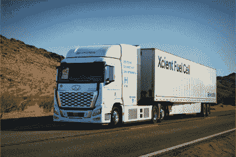
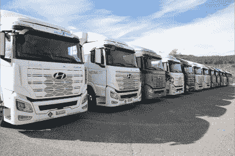
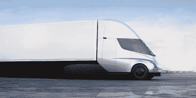

# 现代将引领美国氢燃料电池卡车市场

> 原文：<https://hackaday.com/2022/12/13/hyundai-to-lead-us-market-for-hydrogen-fuel-cell-trucks/>

氢一直被吹捧为未来的潜在燃料。虽然它未能在汽车上流行起来，因为电池已经占据了强大的领先地位，但它仍然为像卡车这样的大型车辆带来了巨大的希望。

在过去的几年里，现代公司一直在这一领域努力工作，推出了燃料电池动力卡车的 Xcient 系列。它将在美国氢货运领域占据主导地位，因为它将于明年在加州推出一个车队。

## 加州，我们来了

Batteries have only just become small and light enough to suit electric cars. They don’t quite scale up for trucking applications just yet, but hydrogen may offer a compelling alternative. *Credit: Hyundai*

在两个独立的项目中，现代将在 2023 年向加州总共投放 35 辆卡车。30 个样品将在由物流公司 Glovis America 运营的 NorCal Zero 项目中工作。它们将在奥克兰港投入使用。另外五个例子将由第一元素燃料公司(FEF)实施，该公司目前是美国最大的氢燃料补给公司。在这方面，现代公司的卡车将用于向公司的加油站网络配送液化氢燃料。这些卡车将在第一年作为示范运行，并向美国环保署报告，随后是四年的商业运行。

现代汽车在为半挂车制造氢动力牵引车方面已经有了丰富的经验。自 2020 年以来，该公司在瑞士运营着一支由 47 辆卡车组成的车队。在过去的两年中，该车队累计行驶了 500 多万英里，卡车在一般物流、制造和零售业务中运输货物。XCIENT 燃料电池 6×4 拖拉机的第一个车队配备了一对燃料电池，每个电池输出 90 千瓦，总输出功率为 180 千瓦。燃料电池与 72 千瓦时的电池结合在一起，这与现代电动 SUV 的大小大致相同。电池有助于在需要的地方为传动系统提供额外的动力，XCIENT 的电机可以提供 350 千瓦的功率和 2237 牛米的扭矩。第一代卡车在充满 31 千克氢气时的行驶里程约为 400 公里(280 英里)，根据环境温度，可以在大约 8-20 分钟内加油。

Hyundai’s fleet of 47 fuel-cell trucks have become a common sight in Switzerland, having racked up 5 million kilometres in just two years. *Credit: Hyundai*

不过，为了大举进军加州，现代公司已经进行了升级，让 XCIENT 卡车的续航里程更长。燃料电池和发动机保持不变，但氢气罐已经升级到可以容纳 67 公斤的燃料。这将为卡车提供每次加油 724 公里(450 英里)的行驶里程。8 级卡车的总重量为 37，200 公斤，但现代汽车公司没有说明确切的有效载荷数字。

## 为什么是氢气呢？

在过去的几年里，电动汽车已经击败了燃料电池汽车。每年都有数百万辆电池电动汽车售出。然而，在大城市，电力驱动尚未渗透到卡车运输市场。虽然取得了进展，但问题仍然在于规模。工程师们已经能够依靠巨大、沉重的电池来弥补现代电动汽车所需的里程数。就卡车而言，所需电池的尺寸变得非常大，通常会降低卡车最初用于运输的有效载荷重量。接下来的问题是如何在合理的时间内为如此巨大的电池提供足够的能量。

Hyundai’s competition will be from battery-electric trucks like the Tesla Semi. Tesla’s current claim to fame is a recent 500-mile test run hauling a full payload, but Hyundai’s trucks have been racking up millions of miles in testing for the last two years. *Credit: Tesla*

在这个领域，氢燃料电池大有可为。大量的能量可以储存在相对较轻的氢中。此外，加油可以相对较快地完成。泵入更多的氢只是需要更长的时间。它不像给大型电池充电那样糟糕，因为大型电池需要更高的功率输出，以及大型升级电缆和连接器。虽然氢的储存和燃料补给曾经是一个困难的命题，但在过去的十年里，丰田和现代这样的公司已经投资于成熟的技术。

快速的加油时间是氢在卡车运输领域发挥潜力的关键。地球上没有一辆电动汽车能在一小时内增加 727 公里的里程。即使有，也可能需要额定功率为兆瓦或更高的电缆和连接器。然而，有了氢，现代可以提供快速加油和远程，同时保持排放清洁和绿色。

另一个问题是重量。半拖车可以运载任何他们想要的东西，最高可达前面提到的 8 级卡车的总重 37，200 公斤。电池携带的重量直接与货物竞争，尽管特斯拉仍未发布任何重量数据，但很可能仅电池重量就在 10，000 千克至 15，000 千克范围内。与 67 公斤的氢燃料负载相比，即使驾驶室和马达的重量明显减轻，这对运输机的利润也是不利的。

氢气可能是清洁世界重型卡车车队的理想解决方案。这可能是通过燃料电池卡车，或者可能是通过不太清洁的氢燃烧发动机。从清洁来源生产氢气仍然面临挑战，尽管[这些挑战并非不可克服。](https://hackaday.com/2022/09/11/renewable-hydrogen-sucked-from-thinish-air/)至于加油站的缺乏，对商业运营商来说没什么大不了的，因为他们已经习惯了从特定的加油站加油。

现代公司对未来的氢燃料卡车也有很大的计划。XCIENT 卡车是为大规模生产而设计的，该公司希望到 2025 年在欧洲有多达 1600 辆卡车投入使用。如果该公司即将在加州进行的试验进展顺利并引起适当的关注，大量公司也可能最终来到美国。