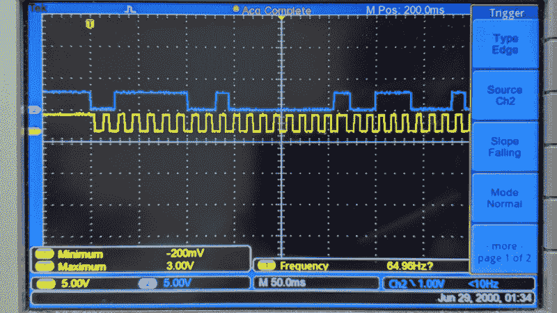

# I2C 纸带阅读机不是你所想的那样

> 原文：<https://hackaday.com/2021/05/03/i2c-paper-tape-reader-is-not-what-you-think/>

我们不太确定是什么推动了这个项目的发展，但[shapoco]已经组装了一个有趣的设备，可以读取 I2C 信号(日本 Twitter 链接)，这些信号被打印在纸带上，呈黑白矩形。他编写了一个程序，将 I2C 字节流打印到包含 SCL 和 SDA 信号模式的条带上。一旦打印出来，你从纸上剪下纸条，把它们粘在一起成为一个长片，形成一个完整的信息——在这种情况下，命令到一个小 LCD 屏幕上，屏幕上会显示短语“你好，磁带 I2C”。

我们不确定胶带穿过的穿孔板底部用环氧树脂粘合的那个矩形小部件里到底有什么。但是很明显，它必须包含一对发光二极管来照亮胶带和一对传感器来检测胶带的反射(查看布线，胶带下面似乎不太可能安装任何东西)。根据一条机器翻译的 Twitter 消息，检测是使用由具有迟滞的 LM393 比较器制成的施密特触发器来完成的(关于这种类型电路的综述，请参见[本 TI 应用笔记](https://www.ti.com/lit/ug/tidu020a/tidu020a.pdf))。这是由此产生的信号的范围捕获。[Shapoco]指出，电路可以运行得更快——视频中的磁带被慢慢拉动，以便更容易看到。

这不是[shapoco]在光学 I2C 通信方面的第一次实验。看看下面的第二个视频，他正在从电脑显示器上读取 I2C 信号。一个人在推特上谈论了多年前软件源代码有时是如何在旧字节杂志上光学打印的，这是我们去年在讨论 Cauzin 条时在 [Hackaday 播客#049](https://hackaday.com/2020/01/10/hackaday-podcast-049-tiny-machine-learning-basement-battery-bonanza-and-does-this-uranium-feel-hot/) 中谈到的话题。

除了很酷，并且可能作为一种教育设备有所帮助，这种技术现在有任何现实世界的应用吗？请在下面的评论区告诉我们你的想法。感谢[Manawyrm]向我们发送此提示。

> 纸带 I2C，动了
> 
> 纸带 pic.twitter.com/9WYa2mxv0T I2C[#沙波拉布](https://twitter.com/hashtag/shapolab?src=hash&ref_src=twsrc%5Etfw)
> 
> — シャポコ🌵(@ shapo co)[2021 年 3 月 21 日](https://twitter.com/shapoco/status/1373534314961326092?ref_src=twsrc%5Etfw)