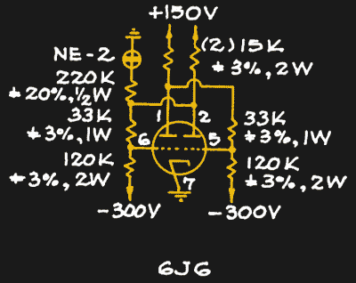
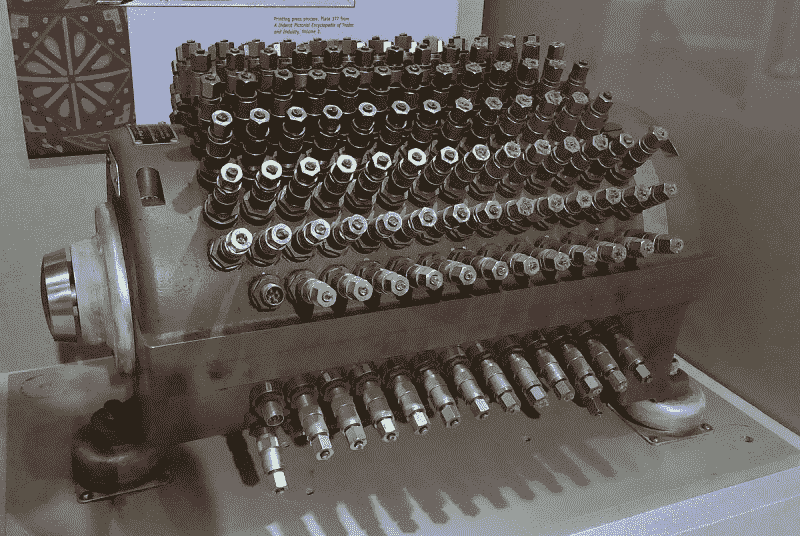
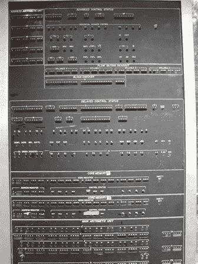
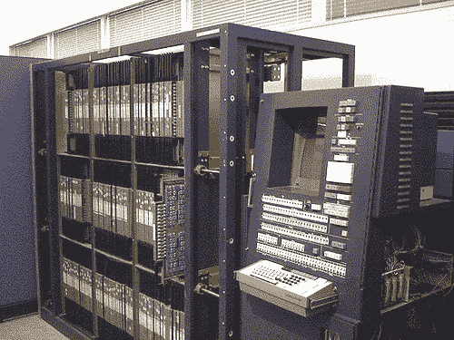
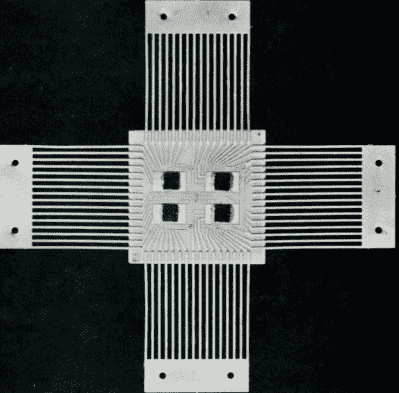

# 伊利亚克是哈尔 9000 的祖父

> 原文：<https://hackaday.com/2018/10/18/illiac-was-hal-9000s-granddaddy/>

科幻小说通常用事实来表达，看着像 HAL 9000 这样的标志性计算机并追溯这种出错的人工智能的起源是很有趣的。你可能会惊讶地发现，你可以追溯哈尔的起源到 1952 年为美国军队建造的一台计算机。

如果你是小说和电影《2001:太空奇遇》的粉丝，你可能记得 HAL 9000 计算机“诞生”在伊利诺伊州的厄巴纳。为什么选这么奇怪的地方？除非你非常了解芝加哥地区，否则厄巴纳很难成为一个家喻户晓的名字。但是厄巴纳在现实生活中的计算机历史上有一席之地。作为伊利诺伊大学厄巴纳-香槟分校的所在地，厄巴纳以生产一系列被称为 ILLIAC 的计算机而闻名，其中一些具有历史意义。特别是，ILLIAC IV 是超级计算机的梦想，虽然不完全成功，但为后来的超级计算机指明了方向。有时你从失败中学到的比成功还多，至少伊利亚克系列中有一部是这方面的典范。

厄巴纳的故事始于 20 世纪 50 年代初。当时，1945 年出版的《EDVAC 报告初稿》正从普林斯顿席卷全国。这本书概述了接替 ENIAC 的军用计算机的设计和构造。在这篇文章中，冯·诺依曼提出了对 EDVAC 的改变，这将使它成为一台存储程序计算机——也就是说，一台同样处理数据和指令的计算机。

## 冯·诺依曼设计的流行

莫里斯·威尔基的 EDSAC 和曼彻斯特婴儿是第一批基于冯·诺依曼的新设计制造计算机的人，但他们不会是最后一批。总之，可能至少有 18 台机器基于本文的架构，包括 MANIAC、Johnniac 和 SILLIAC。确切的数字很难确定，因为许多机器重复使用旧机器，但不管你怎么数，至少有十几台。这些机器通常被称为“IAS 机器”,以发表 EDVAC 报告的普林斯顿实验室命名。

随着计算机研究的浪潮，陆军希望拥有一台存储程序的机器，于是求助于伊利诺伊大学来建造 [ORDVAC](https://archive.org/details/bitsavers_univOfIlliVACManualVolume11952_15195157/page/n0) 。军队于 1952 年接收了这台新机器。它使用了 2000 多个真空管(主要是 6j6 和 5687 ),使用威廉姆斯管有 1000 个 40 位字。作为合同的一部分，军方同意出资建造一台相同的机器，由该大学保存。这台机器就是伊利亚克——后来被称为伊利亚克一号。

## 双胞胎、手机电脑和其他奇怪的东西

伊利亚奇一号于 1952 年末开始运作。那时，伊利亚克和奥德瓦茨很可能是现存的唯一两台相同的计算机。在一个平台上编写的程序可以在另一个平台上运行。这在今天似乎没什么大不了的，但在 1952 年，这些机器又大又贵，所以每种机器只生产了一台。即使这个时代的许多计算机使用相同的基本设计，除了 ILLIAC 和 ORDVAC 之外，没有一台计算机有兼容的指令集。此外，当军队不使用时，ORDVAC 可以在晚上通过大学的电话使用。这使它成为第一个，如果不是第一个，被远程操作的计算机之一。

计算机重量在 3000 到 5000 磅之间，使用十六进制。不过 9 以上的数字用的是 KSNJFL，而不是我们更熟悉的 ABCDEF。显然，根据所用的电传打字机，这有某种意义。这些字母看起来不像是用博多码或默里码排列的，所以也许这是一种我不太熟悉的电传打字机。据我所知，A-F 的使用是 IBM System/360 年后才流行起来的。其他系统，使用其他字母，显然取决于什么是方便他们的硬件。

然而，ILLIAC 最有趣的设计特征之一是它是异步的。通常，CPU 有一个主时钟，每个电路都服从它。但是伊利亚克和奥德瓦茨使用的是菊花链单位。因此，一个单元将完成它的工作，并向下一个单元发出开始的信号。这有一定的优点和缺点，多年来也有类似的 CPU 设计，包括最近的 IBM SyNAPSE。

ILLIAC 是第一部由计算机辅助的音乐作品( [Illiac 组曲](https://www.youtube.com/watch?v=fojKZ1ymZlo))，也是第一部用于基于计算机的教育的[柏拉图](https://en.wikipedia.org/wiki/PLATO_(computer_system))的版本。PLATO 的早期版本只为一个用户服务，尽管第二版可以同时容纳两个用户。

## 错误是常见的

认为哈尔是一个出了问题的计算机头脑，在今天是一个与当时截然不同的命题。我们的现代硬件具有难以置信的低错误率。但是错误和硬件故障在 20 世纪 50 年代特别普遍，必须由计算机操作员来解决。

ILLIAC 的电子管容易出故障，而且没有内置的错误检查功能。在压力条件下的定期测试可以识别缺陷，希望在它们影响正常操作之前。当天会议上的一名发言人指出，威廉姆斯电子管存储器的平均错误间隔时间“现在高达 30 小时。”

输入/输出速度是另一个问题。穿孔纸带阅读机花了 40 分钟才填满机器的内存。后来的一个项目加快了阅读器的速度，将这个数字减少到 8 分钟以下。请记住，这大约是 40K 位的数据，所以想象一下要填满一个现代的闪存驱动器需要什么。

## 增强和副本

ILLIAC 产生了自己的克隆体，包括 ORACLE、CYCLONE 和密歇根州立大学的 MISTIC，它们使用晶体管而不是电子管，并且用内核取代了 Williams 电子管内存。正如我们修补我们的机器一样，这些计算机经常增长，一份参考资料报告说，到 1962 年 ILLIAC 退休时，它已经有 5000 个单词的内存和磁鼓存储，如上图所示。

 这与复制品相差甚远，但绝对是伊利亚克的继任者伊利亚克二世的增强版。这台机器的设计始于 1958 年，并于 1962 年上线。这是一台晶体管机器，有 8K 字的核心存储器。字长为 52 位。这台机器使用异步模块和流水线来获得一种形式的并行执行。它还将高速缓冲存储器用于 I/O 设备。

由于这些改进，这台机器比当时的早期机器快了大约 100 倍。不过，这不是速度冠军——这个荣誉属于速度很快的 IBM 7030 Stretch 计算机，尽管没有承诺的那么快——尽管很明显，该大学不同意这个说法。IBM 将这台机器作为 4 MIPS 的机器出售，但只处理了大约 1.2 MIPS，这被认为是 IBM 最大的失败之一，直到 PC Jr。

## 伊利亚克四世:哈尔的祖父

ILLIAC IV 是一个雄心勃勃的——也许过于雄心勃勃——尝试建造一台大规模并行计算机。该机器将有 4 个象限，每个象限将有一个 CPU(一个控制单元)和 256 个处理单元(PE)。完成后，4 个 CPU 将能够同时处理 64 条数据。但是这个项目从一开始就被问题所困扰。

ILLIAC IV photo by Sascha Pohlflepp CC-BY-2.0

德州仪器(Texas Instruments)本来打算在 IC 中制造 PEs，但后来退出了，这导致了一次重大的重新设计。新的设计必须使用现成的 IC，导致卡更大，对冷却和电源的要求更高。这导致了更多的额外费用。

当他们意识到控制单元使用正逻辑而处理元件使用负逻辑时，另一个成本问题出现了。最后，一个象限是可操作的，因为有关于计算机可能的军事用途的演示，政府指示制造机器的公司 Burroughs 在 1972 年将其交付给 NASA 的 Ames 研究中心，而不是大学。

尽管存在问题——以及由于电源问题导致的频繁停机，这台机器在 1972 年仍然比其他机器快 13 倍。1975 年，它连接到阿帕网——互联网的前身——并成为第一台可接入网络的超级计算机。

## 髂骨 IV 设计是未来的计算机

伊利亚克四号可能尝试得太多太快了。使用大规模 ECL 集成电路、薄膜存储器和在 36 英寸磁盘上存储 80 兆字节的专用磁盘驱动器，在当时都是有风险的。它甚至计划开发一种一次性写入的激光存储系统，可以在一个装有一块聚酯的滚筒上存储兆兆比特的数据。

 记住，在当时，一个封装中有 20 个逻辑门被认为是大规模的。传统的 ECL IC 在一个 16 引脚封装中可能有六个门。TI 的器件有 64 个引脚，包含 20 个门，如此处所示。然而，德州仪器无法控制相声，并要求约一年的时间表缓解。ILLIAC 团队不想等待，重新设计了设备，使用传统的 ECL 集成电路。这将时钟速度从 25 MHz 降低到 16 MHz，使项目超出预算，并使时间表延长了 2 年。原本是一个一英寸见方的 PCB(非常适合我们的[比赛](https://hackaday.com/2018/08/07/the-square-inch-project-rides-again/))，变成了一个 6×10 的电路板。当然，后知后觉是 20/20。一年后，TI 成功地生产出芯片并投入商业销售，但那时团队已经在重新设计的道路上走得太远了。

主板尺寸的增加占用了薄膜存储器的空间。所以你把橱柜做大了，对吗？这导致了信号传播和分布的问题。因此，研究小组转向了新奇的半导体存储器。

## 缩小规模的雄心勃勃的项目

到 1969 年，由于严重超出预算和时间表，他们决定只做一个象限。这大大降低了机器的潜在速度。当艾姆斯在 1972 年得到所有的硬件时，已经晚了好几年，而不是最初的 800 万美元的价格标签，账单高达 3100 万美元。也别忘了，800 万是针对四象限机的，所以有 1/4 的机器将近 4 倍的价格！

从操作上来说，这台机器是一场噩梦。随着时间的推移，印刷电路板破裂，绕线端子短路，卡触点容易氧化，卡插座塑料变软。IC 对湿度非常敏感，还有许多其他问题。到 1973 年，计算机可以运行程序，但结果并不总是正确的。1975 年，艾姆斯开始了为期 4 个月的修复工作。他们更换了 100，000 多个电阻，重新布线了长传播延迟线，清理了电源，并将时钟速度从 16 MHz 降至 13 MHz，只有最初 25 MHz 设计的一半。现在，这台机器至少在某些时候能够可靠地工作了。Ames 还用 PDP-10 替换了原来的 Burroughs 控制计算机。

操作技术反映了避免硬件错误的需要。一位用户描述了他们在 ILLIAC IV 上为你的计算机时间收费的过程。他们会先进行诊断。如果他们通过了，他们会接手你的工作。一旦完成，他们会再次运行诊断。如果诊断通过，您将获得工作结果和工时账单。

虽然定制版本的 Fortran 帮助程序员更好地利用硬件，但一开始性能并不理想。在适合并行执行的问题上，这台机器在 1981 年之前是世界上最快的。请记住，在那个时代，即使是高速也不值得我们多看一眼。例如，从 ILLIAC IV 上的 Burroughs 手册中，他们谈到仅用 0.73 毫秒(730 微秒)对 64 位数据进行 4096 点离散傅立叶变换。根据同一消息来源，IBM 7094 完成同样的任务需要将近 3 秒钟。

## 其他伊利亚人

如果你注意到了，我没有提到伊利亚克三世——它的寿命很短，从 1966 年到 1968 年毁于一场大火。ILLIACs V 及以上是更现代的多节点计算集群。虽然它们本身很有趣，但除了名字之外，它们和伊利亚克四型没有太多的相似之处。

## 伊利亚克的回顾

伊利亚克四号在某种程度上领先于它的时代。半导体存储器是未来的发展方向。大规模集成电路也是如此。更大的电路板需要更多的接地，迫使团队采用 15 层电路板，这在现在很容易，但在当时很难生产。甚至使用一次性写入激光介质的大容量存储在多年后也变得很重要。

考虑到 75%的机器从未建造，时钟速度降低了近一半，它仍然是世界上解决许多问题最快的计算机，这令人印象深刻。如果你想要更多关于伊利亚克四号的核心技术细节，戈登·贝尔在 1970 年代编辑的一本书有一个很好的概述。如果你更愿意从用户的角度来看，这里有[一份 NASA 1977 年的论文，并附有代码清单](https://ntrs.nasa.gov/archive/nasa/casi.ntrs.nasa.gov/19780005424.pdf)。或者你可以[挖掘血淋淋的细节](http://bitsavers.informatik.uni-stuttgart.de/pdf/univOfIllinoisUrbana/illiac/ILLIAC_IV/B-176-B_ILLIAC_IV_Technical_Summary_Apr68.pdf)。

我经常告诉学生，你通常从失败中学到的比从成功中学到的多，伊利亚克四号就是一个很好的例子。这在很大程度上被认为是一个失败，但它是有用的，而且它确实引领了许多重要技术的发展。有趣的是，早期的 IBM 7030 Stretch——ILLIAC II 的当代产品——也有类似的问题。它也过度承诺和交付不足。然而，它催生了后来驱动 IBM 最成功的计算机之一 IBM System/360 的技术。

亚瑟·C·克拉克于 1968 年出版了他的小说，这是 ILLIAC 项目开始 16 年后的事了。他想象的 20 世纪 90 年代最复杂的计算机是 HAL 9000，内置于一艘宇宙飞船中，由插入总线系统的硬件卡组成，容易发生故障。想想有趣的是有多少工程师受到了哈尔的启发——那将是生活模仿艺术模仿生活，不是吗？