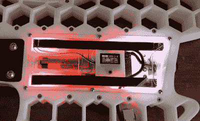

# 发光 3D 打印吉他准备摇滚

> 原文：<https://hackaday.com/2020/11/14/illuminated-3d-printed-guitar-is-ready-to-rock/>

当我们想到项目的 3D 打印部件时，我们大多数人都会想到支架和安装板之类的小东西。也许偶尔打印项目附件。但是，如果你有一台像(Joshendy)那样的大型定制打印机，再加上充足的时间，它将开启一个大规模项目的全新世界。举个例子[他最近完成的华丽 RGB LED 吉他琴身](https://www.joshendyblog.net/3d-printed-guitar-that-lights-up-as-you-play/)。

尽管他的定制 3D 打印机有相当大的 300 x 300 mm 的构建面积，但[Joshendy]仍然必须将吉他主体设计成在 ABS 中打印后可以栓接在一起的部分。它花了大约 60 个小时来运行所有的部分，其中大的中心部分花了最长的时间来打印 28 个小时。[由于大量使用热定形嵌件](https://hackaday.com/2019/02/28/threading-3d-printed-parts-how-to-use-heat-set-inserts/)，组装好的吉他应该足够结实。

The white ABS of the guitar body helps diffuse the LEDs.

虽然吉他的塑料骨架本身在视觉上很有趣，但它只占最终外观的一半。在中央空腔内，[Joshendy]嵌入了两条 RGB LEDs，一个 128×64 有机发光二极管屏幕和一个定制的 PCB，该 PCB 作为 STM32L4 微控制器的主机，该微控制器是在电池组上运行所有功能所需的适当电压调节器。

该板接入吉他产生的音频，并使用快速傅立叶变换(FFT)让 led 对节拍做出反应。如休息后的视频所示，您可以使用屏幕在乐器上实时浏览不同的照明模式。

我们报道了[同样令人印象深刻的大幅面 3D 打印机，本月早些时候【Joshendy】使用](https://hackaday.com/2020/11/04/scratch-built-3d-printer-goes-big/)生产了这把吉他，看到他已经在上面打印出这种东西令人非常兴奋。这个项目已经设定了很高的标准，我们迫不及待地想看看他接下来会想出什么。

 [https://www.youtube.com/embed/u3JaJUOe9As?version=3&rel=1&showsearch=0&showinfo=1&iv_load_policy=1&fs=1&hl=en-US&autohide=2&wmode=transparent](https://www.youtube.com/embed/u3JaJUOe9As?version=3&rel=1&showsearch=0&showinfo=1&iv_load_policy=1&fs=1&hl=en-US&autohide=2&wmode=transparent)

