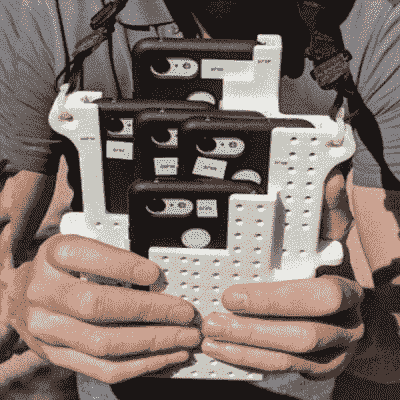

# 仅用 5 部手机提高景深

> 原文：<https://hackaday.com/2018/12/11/improving-depth-of-field-with-only-5-phones/>

摄影中最热门的新趋势是控制景深，或称 DOF。这就是你如何得到那些主体清晰、背景巧妙模糊的精彩肖像。在过去的几年里，它是通过智能使用单反胶片相机的镜头和设置来实现的，但现在，[一切都在软件中。](https://ai.googleblog.com/2018/11/learning-to-predict-depth-on-pixel-3.html)

The franken-camera rig, consisting of five Pixel 3 smartphones. The cameras are synchronised over WiFi.

对于 Pixel 2 智能手机，谷歌使用了一些复杂的相位检测自动对焦(PDAF)技巧来计算图像中的深度数据，并以此来决定图像的哪些部分应该模糊。远处的区域会变得更加模糊，而前景中的主体会变得清晰。

这很好，但对于 Pixel 3，进一步的开发是有序的。3D 打印手机壳被开发出来，可以在一个巨大的砖块中容纳五部手机。这个想法是从稍微不同的角度同时拍摄同一场景的五张照片。然后，这被用来生成深度数据，该数据被输入到神经网络中。这个神经网络是根据单张照片与场景的真实深度之间的关系来训练的。

通过训练好的神经网络，这可以用来从单个相机拍摄的照片中生成更真实的深度数据。现在，机器学习正被用来帮助你的手机决定模糊图像的哪些部分，以使你美丽的主题从背景中突出来。

对比图像显示了“学习的”深度数据相对于仅由立体 PDAF 生成的深度数据的显著改善。这是智能手机相机军备竞赛中的又一枪，没有减弱的迹象。我们只是想知道盖革计数器什么时候能出厂。

[via [AndroidPolice](https://www.androidpolice.com/2018/11/29/google-used-this-ridiculous-5-phone-case-to-fine-tune-the-pixel-3s-portrait-mode/)