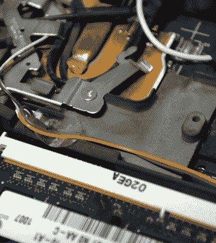
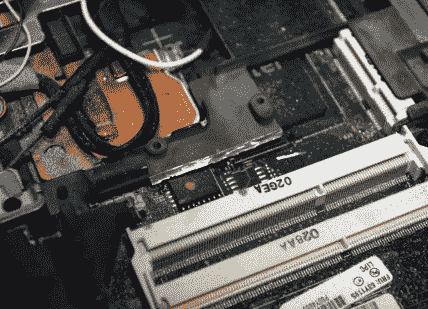
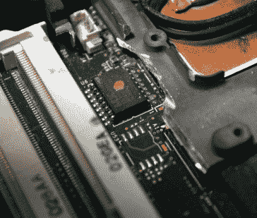

# 以(非常)懒惰的方式安装 LibreBoot

> 原文：<https://hackaday.com/2018/08/20/installing-libreboot-the-very-lazy-way/>

最近，我得到了一台看起来有点粗糙的 ThinkPad T400，如果不是因为给我它的人忘记了(或者可能从来不知道)BIOS 密码，它似乎会成为一台不错的笔记本电脑。清理机器，在里面放更多的内存，把呼哧呼哧的硬盘换成固态硬盘，这是让机器多活几年的相对便宜的方法，但如果我不能改变 BIOS 中的启动顺序，就不行。

 好吧，不完全是这样。我本来可以在我的台式机上的固态硬盘上安装一个操作系统，然后将其放入 T400，但还有其他东西在起作用。锁定的 BIOS 给了我一个完美的借口在上面安装 LibreBoot，这是我多年来一直在思考的项目之一。用完全不同的东西替换 BIOS 将解决密码问题，但只有一个问题:将 LibreBoot 刷新到 T400 上的[指令至少可以说是令人生畏的](https://libreboot.org/docs/install/t400_external.html)。

你应该把*整个*机器拆开，直到把 CPU 冷却器拉下来，并移除显示器。所有这一切都是为了让你可以翻转主板来访问 CPU 和 RAM 之间的闪存芯片，这通常是由笔记本电脑的一部分框架覆盖的。哦，我多么讨厌那块让我远离硅矿的恶魔般的镁。闪存芯片需要几分钟时间，但 YouTube 视频和来自论坛的第一手资料告诉我，拆卸电脑并在事后重新组装可能需要几个小时。

我凝视着黑暗的深处，久久地站在那里，疑惑，恐惧，怀疑。然后我有了一个想法:也许我可以把它剪掉。如果它是成功的，它将节省我几个小时的工作。如果失败了，好吧，至少电脑没花我一分钱。掷骰子的时间到了。

## 冒险的生意

切割框架而不是拉主板会快得多，但确实造成了一些令人担忧的问题。一个主要的问题是，将旋转工具带到框架上会有大量的镁尘倾倒在主板上。诚然，镁不是一种非常好的导体，但如果它进入敏感区域，仍可能对电路板造成严重破坏。说明书还提到了从电路板上断开所有组件，显然我也不会这么做。

但最重要的是，这一尝试中最大的风险是人为因素。笔记本电脑的框架和主板本身之间的空间非常小，最小的错误都可能划伤 PCB 或损坏其中的一个组件。如果切割轮只是敲击框架本身以外的任何东西，游戏就可能结束。

长话短说，你不应该走这条路，除非如果事情不顺利，你可以承受失去笔记本电脑。如果你对这个特殊的 T400 有任何强烈的感觉，或者实际上*需要*有一个工作机器毕竟是说，做，你可能只是想花时间遵循官方安装程序。

## 成功晋级

随着切割轮卡在 Dremel 上，框架材料很快就脱落了。我必须保持相当低的速度和轻的压力，否则我担心我会吹穿它，挖到主板。产生的金属粉尘到处都是，[即使你通常很有男子气概去保护眼睛](https://hackaday.com/2016/11/14/path-to-craftsmanship-dont-buy-awful-safety-gear/)，你也不会用它们来做这个。事实上，防尘口罩也是一个好主意。

右手切口很容易做，并且是一个相对宽松的开始区域。我最终还是挖到了内存插座的塑料，但幸运的是，这是少数几个可以在不造成任何损坏的情况下砸进去的东西之一。在左侧，事情变得棘手。我可以用轮子在芯片顶部切一个直的切口，但是必须用硬质合金毛刺来扩大开口，为夹子留出足够的空间。

  Horizontal cut. Note magnesium dust.  Widening area over chip.

## 清理

在确认我有足够的空间来安装夹子后，我把 T400 拿到外面，开始用压缩空气从尽可能多的角度撞击它。我轻而易举地花了很多时间把镁粉从箱子的每个角落吹出来，就像我实际切割一样。移除光驱和硬盘有助于此过程，因为这将给你另一个通风的机会。因为真的没有办法知道这一阶段是什么时候完成的，所以我基本上只是继续下去，直到我的耐心耗尽。

在将压缩空气注入电子设备的问题上，我应该提到我的压缩机上有一个聚结过滤器，在空气到达吹枪之前将水分和油类从空气中去除。未过滤的压缩机会喷出各种雾化液体和污染物，所以如果你想清洁主板之类的东西，你要非常小心你计划使用的空气源。

## 闪光书库

我们的布莱恩·科克菲尔德写了一篇关于 flashing LibreBoot 的高潮和低谷的启发性的第一手报道，这是任何想要冒险的人的必读之作，所以我在这里不再赘述。简单地说，这个过程对初学者并不友好。从给程序员接线到用你机器的 MAC 地址修改 LibreBoot ROM 文件，这是一条只有圣伊格纳丘斯的真正信徒[才能走过的路。](https://hackaday.com/2016/01/13/stallmans-one-mistake/)

也就是说，这个过程进行得相当顺利。对于我的程序员来说，我使用的是树莓派 3B+,不需要外部电源。我在将夹子安全地连接到芯片上时遇到了一点麻烦，但是一旦夹子足够紧以至于`flashrom`工具可以看到它，它就会保持连接，直到过程完成。

整个闪光用了不到 10 分钟，与我在论坛上读到的一些恐怖故事相比，这是一种解脱。

## 新生

最终，这个过程是成功的。T400 并没有因为阴险的镁颗粒而短路(至少现在还没有)，我可以启动 USB 闪存驱动器开始安装 Arch Linux。从开始到结束，只花了拆卸机器和重新组装的一小部分时间。至于使用 LibreBoot 本身的体验，肯定有一个学习曲线。对我来说，没有配置选项还是很奇怪，电脑直接启动 GRUB。

LibreBoot 爱好者会告诉你，它提高了性能，延长了电池寿命，但我不能说，因为我在安装它之前从未真正使用过电脑。有一件事我可以肯定地告诉你，如果你有一台带有锁定 BIOS 的 ThinkPad T400，一台 Dremel，并且没有什么可失去的，那么*就是*隧道尽头的一盏灯。