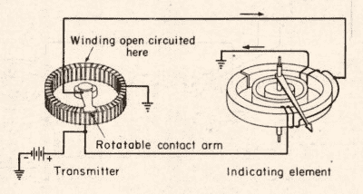

# 将旧发动机整流罩襟翼指示器连接到 USB

> 原文：<https://hackaday.com/2022/11/29/interfacing-an-old-engine-cowl-flaps-indicator-to-usb/>

[Glen Akins]把一个二战时期的飞机引擎罩盖指示器放在周围(就像你一样)，并认为它会成为一个非常好的 USB 连接指示器。该型号是通用电气公司的 8DJ4PBV DC 自动同步机，用于四引擎飞机。对于那些不熟悉这个目的的人，[格伦]在他的详细文章 的 [中解释说，那个时代的活塞发动机飞机是气冷的，在发动机功率最大的情况下——比如起飞时——发动机整流罩侧面的襟翼可以打开，以允许额外的冷却气流进入。这些指示盘与每个襟翼作动筒上的发送器相连，向飞行员提供襟翼位置的指示。](https://bikerglen.com/blog/ww2-engine-cowl-flaps-indicator/)

二战时期飞机在 DC 动力环境中的工作模式利用了可变磁场方向的概念。发送器是一个电位计，通过 24V 和地之间的导线发送电压。指示器单元有一对线圈，以 120 度围绕一个环设置，线圈串联，中心抽头连接到发送器信号。每个线圈的另一端连接到 DC 电源总线，以便随着信号电压的变化，线圈产生变化的磁场。较低的电压使磁场偏向连接到 24V 的线圈，而较高的电压则相反。中间的永久磁铁附在指示盘上，用一个小弹簧将其偏置到中间。一种非常简单但有效的布置，给出实际襟翼位置的模拟反馈。

为了将它与现代技术相结合，利用 PIC16F1459 微控制器的 USB 功能构建了一个定制 PCB，这是[Glen]已经熟悉的。四个微芯片 MCP31HV41-502 数字电位计被压入使用，直接驱动指示器单元的线圈。这似乎是一个奇怪的，如果不是可行的方式来驱动这样的事情，但[Glen]进入了一些广泛的理论和一些建模，以确定哪些设备将有足够的余量，这对于不熟悉的人来说值得一读。在将 SPI 连接与 digipots 进行位碰撞之后(尽管 PIC 有硬件 SPI) [Glen]继续描述 USB 端点如何工作，最后用一个. NET 应用程序来驱动这一切。

我们已经看到许多黑客将复古硬件带回到生活中，连接到现代计算。这是一个反其道而行之的项目，用现代部件 建造 [定制飞机仪表。](https://hackaday.com/2018/05/13/build-your-own-avionics-suite-if-you-dare/)

 [https://www.youtube.com/embed/wZpZG8vQ3OY?version=3&rel=1&showsearch=0&showinfo=1&iv_load_policy=1&fs=1&hl=en-US&autohide=2&wmode=transparent](https://www.youtube.com/embed/wZpZG8vQ3OY?version=3&rel=1&showsearch=0&showinfo=1&iv_load_policy=1&fs=1&hl=en-US&autohide=2&wmode=transparent)

