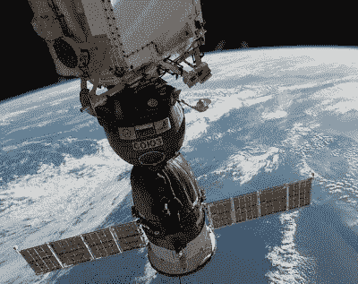
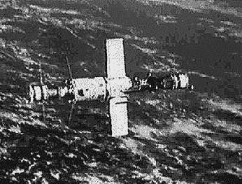

# 联盟号失败后，国际空间站正在与时间赛跑

> 原文：<https://hackaday.com/2018/10/11/international-space-station-is-racing-the-clock-after-soyuz-failure/>

谢天谢地，今天失败的联盟号发射没有造成人员伤亡，但是国际空间站的命运现在成了问题。

就在升空两分钟后，联盟 MS-10 的机组人员发现自己处于一种情况，自载人航天计划开始以来，每个宇航员都接受过训练，但很少有人不得不面对这种情况:发射过程中的失败。今天，两名机组人员，俄罗斯人阿列克谢·奥夫奇宁和美国人尼克·黑格，被迫以弹道方式重返地球大气层。这是一次疯狂的飞行，使他们经受了比预期更高的重力，并在距离拜科努尔发射场约 430 公里的地方将飞行器扔下。两人都安然无恙地从事件中走了出来，但对他们来说，苦难已经结束，而对国际空间站的工作人员来说，苦难才刚刚开始。

在俄罗斯航天局 Roscosmos 完成全面调查之前，联盟号火箭将被搁置。这是标准程序，因为他们显然不想发射另一枚火箭，并冒着遭遇同样问题的风险。但由于联盟号目前是我们将人类送入太空的唯一途径，这意味着新的船员不能被送往国际空间站，直到 Roscosmos 确信这个问题已经被确定和解决。

联盟 MS-11 将会带来三名新成员来接替已经在空间站的成员，计划于 12 月 20 日发射。虽然尚未得到官方证实，但几乎可以肯定的是，这项任务不会如期发射。在人命关天的情况下，两个月的时间根本不足以对如此重大的事件进行调查。

联盟 MS-10 的失败引发了多米诺骨牌效应，这将使国际空间站失去原定于 2018 年底登机的五名机组人员。更糟糕的是，目前的三名宇航员也必须在年底前返回地球。NASA 和 Roscosmos 现在需要做出一个前所未有的决定，这可能导致放弃国际空间站；这是自 2000 年 11 月远征 1 号任务到达以来，第一次无人驾驶。

## 过期的票

Soyuz spacecraft docked with ISS

国际空间站的工作人员每六个月轮换一次，因为这大约是联盟号太空舱在轨道上可以存活的时间。它的设计寿命只有 215 天，超过这个时间，飞行器的腐蚀性推进剂会使它们的燃料箱退化。目前国际空间站的成员谢尔盖·普罗科皮耶夫、亚历山大·格斯特和瑟琳娜·m·奥尼翁-钱塞勒于 6 月乘坐联盟号 MS-09 抵达空间站，因此他们的飞船已经快没时间了。

如果联盟号 MS-09 在超过设计寿命后仍留在空间站上，它将变得无法使用。在最坏的情况下，它甚至可能开始泄漏推进剂，危及空间站。机组人员将被迫切断飞船，让自己搁浅。NASA 和 Roscosmos 都不会考虑这个选项。在任何情况下，任何一个机构都不会故意把三个人留在太空中，没有办法把他们带回家。

如果没有任何改变，目前的船员将因此被迫离开之前，他们唯一的回家乘坐字面上吃掉自己。这将使空间站无人管理，直到联盟号能够再次飞行并带来新的机组人员。因为不知道那会是什么时候，这对国际空间站的运作将是一个毁灭性的打击。这可能会引发另一个多米诺骨牌效应，推迟未来的任务和实验，例如 SpaceX 的新龙胶囊的无人试飞，目前计划在 4 月抵达空间站。

## 派出无人驾驶救生艇

近 20 年来第一次在没有宇航员的情况下离开国际空间站，有几个潜在的替代方案，但鉴于载人航天的风险不利性质，美国宇航局或俄罗斯航天局似乎不太可能想在其中任何一个上冒险。如果这是一部好莱坞电影，我们可能会看到总统命令 SpaceX 公司夜以继日地完成他们的新龙太空舱，以进行一次大胆的救援，但实际上这根本不值得拿人命冒险。即使这意味着暂停几个月的计划，国际空间站也将幸免于难。

Salyut 6 with docked Soyuz and Progress spacecraft. [(fair use image)](https://en.wikipedia.org/wiki/File:Salyut_6.jpg)

然而，至少有一个应急计划是有历史先例的。Roscosmos 可能尝试按原计划在 12 月 20 日发射联盟 MS-11 号宇宙飞船，但没有宇航员。如果助推器再次失灵，最坏的情况是他们只会损失硬件，而不会有人丧命。但是，如果它在太空旅行中幸存下来，它可以被远程引导到国际空间站，并作为机组人员的新返回车辆。这将允许他们在空间站再呆六个月，希望有足够的时间完成事故调查和恢复正常发射。

这正是 1979 年在礼炮 6 号空间站上发生的事情。当联盟 33 号在与轨道前哨对接之前遭遇引擎故障时，它不仅使礼炮 6 号失去了额外的成员，而且也使他们自己的相同航天器的可靠性受到质疑。由于不再确定是否有安全的返回舱，机组人员被迫留在轨道上，直到遥控的联盟 34 号可以作为救生艇被送往空间站。在通过遥控命令他们原来的飞船重返大气层后，机组人员乘坐联盟 34 号离开了礼炮 6 号。最终，两艘飞船都安全着陆，没有人员或物质损失。

虽然从来不需要，但在哥伦比亚号航天飞机失事后，一个类似的应急计划开始实施。它将允许受损航天飞机的机组人员留在国际空间站，直到一架新的航天飞机被送上来接他们。他们最初的航天飞机将尝试在远程控制下进行无人驾驶着陆，以拯救昂贵的可重复使用的航天器，而不会对人类乘客造成风险。

## 不确定未来

很难相信 Roscosmos 会在预定的 12 月 20 日联盟 MS-11 发射之前匆忙完成事故调查，即使发现故障是可操作的，而不是火箭本身。当 2013 年无人驾驶质子-M 火箭由于角速度传感器安装不当而丢失时，调查仍然需要三个月才能为火箭的下一次飞行做好准备。即使俄罗斯政府满足于一项被删减的调查，联盟 MS-11 号将搭载一名美国人和一名加拿大人，所以美国国家航空航天局和加拿大航天局肯定需要时间来审查他们自己的发现。

如果国际空间站被疏散，这将打破人类自 21 世纪初以来在太空中的持续存在。另一方面，如果可以设计出一种解决方案，让空间站保持载人状态，这将是一种我们很少在科幻小说之外看到的最后关头的工程和国际合作。无论接下来发生什么，我们都将见证历史的创造。