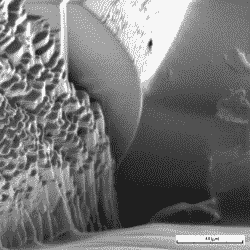

# 用一架显微镜研究回射器

> 原文：<https://hackaday.com/2019/11/04/investigating-retroreflectors-with-one-heck-of-a-microscope/>

逆反射器是一种有趣的材料，因其能将光反射回光源而闻名。例子包括街道标志、自行车反光镜和猫眼，它们如此令人难以忘怀地穿透黑夜。它们也用于 Tilt Five 桌面 AR 系统，用于全息游戏。[亚当·麦库姆斯]把他的手放在一个倾斜五游戏板上，并把它放在显微镜下观察它是如何工作的。

Using the ion beam, a trench was dug around the side of one of the spheres, revealing the interface between the adhesive and the sphere itself.

[Adam]不是在混日子，为调查准备了聚焦离子束显微镜。它将一束镓金属离子扫描过样品进行成像。与更典型的电子束相比，离子束增加了动能，可以烧蚀显微镜下的样品并对其成像。这使得[亚当]最终可以在回射器的表面上切下一片，看看它是如何制作的。

分析表明，回射球是涂有金属的玻璃。它们用粘合剂粘在一个表面上，粘合剂覆盖在球体的底部，充当蚀刻掩模。然后，从粘着层上方伸出的球体表面去除金属涂层。这使得光线通过球体的透明部分进入，然后从金属涂层反射回光源，形成一个覆盖着反光器的薄片。

[Adam]在将其与 Tilt Five AR 技术的基础联系起来之前，做了大量工作来描述所涉及的显微镜和制作技术。[这不是我们第一次听到【Adam】谈论](https://hackaday.com/2019/02/18/electron-microscopes-are-awesome-everything-you-didnt-know-you-wanted-to-know/)这个话题，我们相信这也不会是最后一次！