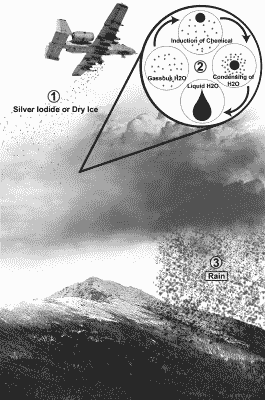
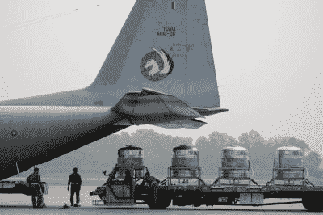
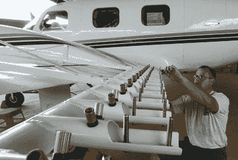

# 播云是好的、坏的还是丑陋的？

> 原文：<https://hackaday.com/2021/12/20/is-cloud-seeding-good-bad-or-ugly/>

2021 年 7 月 1 日，中国共产党迎来了百年华诞。对于这样的庆祝活动，晴朗的天空和清新的空气是最理想的。然而，对于有能力的民族国家来说，人们不必寄希望于天气的变化无常。一个人可以简单地控制它！

清华大学最近发表的一篇论文指出，中国使用人工降雨来为其百年庆典创造更好的条件。人工影响天气技术一直是一些争议的来源，所以让我们来探索它们是如何工作的，以及中国到底成功了什么。

## 什么是播云？

The basic principle of cloud seeding, using chemicals as nucleation points for precipitation in clouds. Credit: Naomi E Tesla, [CC-BA-SA-4.0](https://en.wikipedia.org/wiki/File:Cloudseedingimagecorrected.jpg)

播云是一个相对简单的过程，旨在诱导或改变从天空落下的降雨量。各种物质可以分散到云的结构中，作为冰晶或水滴形成的核心。一旦达到一定的大小和重量，它们就会以雨、雪或其他形式的降水落到地面上。

有很多种方法，碘化银是一种流行的选择。这是因为这种物质具有与水冰相似的晶体结构，使其能够作为凝结的成核点，有助于在云中形成雪花。这种材料可以通过飞机或火箭直接运送，或者从地面上的发电机释放到上升气流中。实际使用的化学品数量很少，污染影响极小。

这项技术是有用的，因为它允许对降水进行某种程度的控制。理论上，它可以用来在一个地区制造降雨，或者在需要的时候使一个地区变得更潮湿，或者从大气中去除水分，这样以后的日子就会更干燥。然而，播云确实依赖于云系中已经存在的水分；在没有大气水存在的地方，它不能引起降水。

## 中国的申请

正如《南华早报》报道的那样，最近的研究文件显示，有证据表明，在百年庆典之前的日子里，人工降雨已经被使用。在此之前，当地的空气污染水平很高，尽管有报道称中国官员努力提前关闭污染严重的工厂。该地区的低风速被认为是阻止污染清除的一个可能的复杂因素。

研究人员声称，在仪式前一天的两个小时里，发生了一次人工降雨，据报道，该地区的居民向天空发射了火箭。该论文断言，火箭将碘化银粒子散布到云层中，在事件发生前制造降雨。

该报告还指出，PM 2.5 颗粒水平有所改善，受影响地区的空气质量读数从“中等”显著改善为“良好”。这篇论文指出，除了人工降雨以外，他们几乎没有发现任何证据可以解释更好的空气。来自该地区的易于访问的在线数据很难比较，因为结果是整整 24 小时的平均值。然而，从 6 月 29 日到 7 月 1 日有小幅下降。

通常被称为“蓝天飞行”，人工影响天气的方法以前也曾以类似的方式使用过，比如 2008 年北京奥运会期间的[。事实上，中国人工降雨的历史可以追溯到 1958 年，当时是为了给中国北方的农业地区带来降雨。](https://www.technologyreview.com/2008/03/25/270084/weather-engineering-in-china/)

从那以后，中国进行了大量投资，据报道，该国的人工影响天气组织雇用了超过 35，000 人，包括从气象学家到普通农民在内的所有人，负责向大气层发射带有碘化银或其他播撒剂的炮弹的 T2。

## 那么问题出在哪里？

A Royal Malaysian Air Force plane loads up with water and sodium chloride for cloud seeding, hoping to generate rain to combat smog from forest fires. Credit: Getty Images

控制降雨有很多好处——农作物用水，帮助消除空气中的微粒污染，甚至只是在干旱时期保持河流畅通。然而，由于潜在的有意或无意的负面结果，人工降雨的实践已经引起了一些争议。

中国已经提出了大胆的计划，并希望有一天将长江流域上空的水蒸气转移到中国北方更干燥的黄河流域。希望每年能将 50 亿立方米的水转移到需要的地方。

然而，如此大规模的工程很容易影响其他地区通常会下降的水量。人们担心，如果雨水被导向最适合中国的地方，东南亚和印度可能会受到影响。像《印度时报》这样的媒体公开推测这可能会严重影响印度的降雨量，从而影响其重要的水供应。

人工降雨在过去已经有过不太纯粹的使用历史。美国军队在越南战争期间实施了臭名昭著的大力水手行动(Operation Popeye ),这是一项有直接军事目标的人工降雨行动。该项目希望在具有重要战略意义的胡志明小道上保持降雨，这样土路就会变成泥路，切断越共的补给线。该项目始于 1967 年，一直持续到 1972 年，飞行员从向空中喷出充满化学物质烟雾的罐子里撒下碘化银或碘化铅。

Cloud seeding equipment as fitted to a Piper Cheyenne II light aircraft. Credit: Getty Images

结果喜忧参半，项目的保密性意味着很难确定大力水手行动到底取得了什么成果。然而，在 20 世纪 70 年代向公众披露后，它很快导致了《改变环境公约》的制定，该公约旨在禁止将人工影响天气用于军事目的。

也有人提到，在切尔诺贝利灾难发生后，可能已经使用了人工降雨，目的是在放射性云到达莫斯科之前降雨，帮助清除大气中的核沉降物。官方一再否认这一断言，但这是天气和降雨如何被操控变好或变坏的又一个例子。

与此同时，大大小小的人工降雨项目定期在世界各地进行。有的[是为了研究](http://www.cmar.csiro.au/e-print/open/cloud.htm)，有的希望[破旱](https://www.theguardian.com/environment/2021/mar/23/us-stated-cloud-seeding-weather-modification)，有的甚至要[救火](https://www.ctif.org/news/russia-fights-siberian-forest-fires-manipulating-rain-clouds)。

## 一项有争议的技术

像许多技术一样，播云就像它的使用方式一样充满争议。然而，问题是，播云的结果是如此分散和难以量化，以至于很难监管甚至精确测量它的影响。

完全有可能向云中发射一堆化学物质，然后测量紧随其后的降雨量。无论如何，云可能已经下雨了，控制这种影响是困难的，因为云的播种首先依赖于空气中的湿度。下游的影响同样模糊不清。一个国家可能会在自己的领土上进行一些实验或项目来播云，但证明这导致了 1000 英里以外的干旱将是非常困难的。

不管怎样，人类总是希望控制他们周围的世界，而人工影响天气只是实现这一目的的另一种方式。对于任何技术来说，未来都会看到它被同等程度地使用和误用。只有当我们真正理解了这些影响，我们才能确保更多地看到前者，而不是后者。