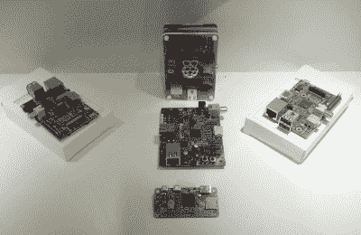
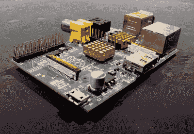
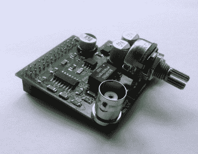

# 这是官方的！树莓派现在是 10！

> 原文：<https://hackaday.com/2022/02/28/its-official-the-raspberry-pi-is-now-10/>

在任何一个领域，都有划时代的时刻，在这些事件之后，一切都和以前不一样了。距离第一台 Raspberry Pi 单板机推出已经过去十年了。这绝不是第一个廉价的计算机主板，也不是第一个支持 GNU/Linux 操作系统的主板，但它是第一个承诺将这两者结合起来的主板。再加上一群英国 8 位校友的支持，这意味着从 2011 年初它首次获得宣传以来，它就获得了巨大的兴趣。

我们首先用一个 USB 棒样式的原型进行了测试，它演变成了一个更大的 Raspberry Pi alpha 板，最后变成了更接近十年前二月底推出的模型的预生产板。

## 如何在早上 6 点让每个英国怪胎失望

An array of Pi prototype boards pictured on display at the Cambridge University Computer Laboratory.

学究们会声称，从技术上讲，Pi 的第 10 个生日还没有到来，因为第一批 B 型主板是在 2012 年 2 月 29 日(闰日)上市的。rs 和 Farnell 这两家分销商都在销售它们，预期销售约 1 万台——这一预测被证明是可悲的不足，两个网站都在早上 6 点开门的几秒钟内在潜在 Pi 购买者的重压下崩溃了。

我在早上 6 点就准备好点菜了，但是只点了一天的一半。短暂的等待仅仅是个开始——因为他们收到的订单比预期的多得多，大部分订单直到 5 月份才完成。没人想到 Pi 董事会会如此成功。

My 2012 Chinese-manufactured Raspberry Pi Model B. The heatsinks are my addition.

我仍然保留着 2012 年的第一台 Model B，这是一台早期的 256 MB 中国制造的型号，没有 CE 标志，有一对我添加的粘贴式铜散热器。当年晚些时候，生产将转移到南威尔士的索尼工厂，并对带有 26 针扩展连接器和 RCA 视频插座的原始外形进行了一些修改，包括一对安装孔。

我记得打开它的时候，能够在我的电视上打开 LXDE 桌面并使用第一批操作系统发行版中的美岛莉浏览器在网上冲浪的新奇感觉。在对它的 GPIOs 功能进行了一系列实验后，我把它用于我当时的大项目:持续收集和处理语言数据。

它取代了一台旧的笔记本电脑来完成这项任务，尽管它没有那么快，但拥有一个连续使用 2 W 的无头 Debian box 的好处是显而易见的。很快，威尔士制造的 Model B 也加入了这项任务，这两个人一起在接下来的几年里，在我的窗台上建立了一个可搜索的英语新闻语料库。在这一段中，我们将触及是什么让 Pi 如此特别的根源，因为当我在处理语言数据时，许多其他人正在做各种有趣的项目；这个东西过去是，现在也是一个无限通用的平台，价格和功耗预算都很低。

## 一万块板成为全球现象

Even I got a piece of the add-on board action, this PCB is my HF radio receiver kit for the Raspberry PI.

《少年派的奇幻漂流》的其余部分对许多读者来说都很熟悉。在 2014 年对 B+的外形进行重大改革后，Pi 系列出现了一系列更强大的旗舰产品，还有计算模块、小型 Zero 系列、RP2040 微控制器和 Pico 板，以及相机或触摸屏等配件。

除此之外，一个由第三方插件板和配件组成的繁荣生态系统也在发展，当然还有大量的模仿者。他们把一个 UNIX 工作站做成几美元的组件(对 UNIX 的描述做了一点小小的改动)，我们已经利用了这一点。有几段是树莓派盆栽的历史，但还有更多关于他们最后十年的思考。也许值得退后一步，评估一下 Pi 人员在哪些地方做对了，在哪些地方他们可能做得更好。

## 他们做对了什么？

This is one of the nicest Pi clones I’ve seen, the Asus Tinker Board. It’s arguably better than a Pi 3, but you don’t see much of it because of very poor software support.

尽管 Raspberry Pi 系列取得了惊人的成功，但主板本身从来都不是纸面上最强大的硬件。最初的产品使用机顶盒中的 SoC，它更像是一个强大的图形芯片，附带一个应用处理器。Broadcom 不愿意公开他们的家族银牌，这意味着我们从未真正从图形芯片中获得最大利益，因此即使在最近的 Pi 修订中更新了 SoC，竞争对手也总是很容易在主板上安装快速平板电脑或手机 SoC，并声称它是 Pi beater。

Raspberry Pi 成功的种子不在于硬件本身，而在于他们为支持软件发行和围绕它的社区所做的努力。当你购买竞争产品时，在许多情况下你会得到一个不可靠的发行版，它的内核版本被破解，与芯片制造商的 SoC 二进制 blob 一起工作，并且该版本从不更新。相比之下，Pi 人员努力保持他们的软件发行版更新为新的内核版本，最新的 32 位 Raspberry Pi 操作系统仍然可以在我的 2012 Model B 上运行，这一事实使他们保持在树的顶端。

## 他们是怎么搞砸的？

我对树莓的主要不满是，当涉及到硬件开发者社区的需求时，它们可能是不透明的。很明显，我们想要的不仅仅是他们粗略的部分示意图，为较小的外围设备制造商提供一个清晰的沟通渠道将花费他们相对较少的资源，并使小规模硬件开发人员的生活变得更加容易。

我记得在 2015 年，当我经营我的套件业务时，看到另一家小型插件生产商退出了 Pi 业务，回到 Arduino 世界，当时新的 Pi Zero 的外形显然已经只与少数几家较大的生产商共享，使这些供应商拥有 Zero 的发布产品，而该领域的其他人则押注于 Model B 外形。如果我有 Eben Upton 在这个问题上的意见，我会建议为他们的第二个十年制定一个正式的硬件开发者计划，这对 Raspberry Pi 和他们的社区都有巨大的好处。

## 当你拥有了一切，下一步会去哪里？

The Raspberry Pi for which the competition have no answer.

盘点了他们的第一个十年，树莓派主要产品线的下一步是什么？旗舰单板计算机是典型的 Raspberry Pi，它们的受欢迎程度似乎没有减弱的迹象，但从某种意义上说，它们是自己成功的受害者。

自 2014 年以来，几乎每块新主板都是同一产品的升级版。虽然最新的 Pi 4 是一个快速且功能强大的主板，但它却成为了一个通用的硬件。向 64 位操作系统的转移应该会慢慢地在新旧主板之间划清界限，但由于 32 位产品将在 2010 年中期的 Pi Zero 上发挥作用，这可能需要一段时间才能实现。

也许这是最有潜力的百搭牌。Pi 400 多功能一体电脑是一款真正与众不同的产品，竞争对手无法与之抗衡。这是一台可用的台式机，未来更快的 SOC 和更大的内存只会让它更好。Compute Module 4 [感觉像更令人兴奋的 Raspberry Pi](https://hackaday.com/2021/10/14/the-compute-module-comes-of-age-say-hello-to-the-real-cutting-edge-of-raspberry-pi/) ，并且考虑到它为设计师提供了旋转他们自己的个人 Pi 的机会，不难看出为什么。我们对 Model B 未来的外形有一个很好的想法，但我们无法预见单个设计师将带着相应的计算模块走向何方。我们期待你在下一个十年创造出具有里程碑意义的基于树莓派的产品。

在过去的十年里，Raspberry Pi 已经成功地推出了一系列超便宜的 Linux 主板，催生了一个生态系统，并维持了同类产品中最受支持的软件社区之一。他们的失误相对较少，成功却很多，但他们能保持下去吗？如果他们不忽视他们的客户，并保持软件支持最新，我们认为是这样的。查看十年后的另一个十年的树莓派新闻！