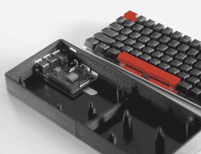

# Jazzberry 将圆周率烘焙成一个机械键盘

> 原文：<https://hackaday.com/2019/07/26/jazzberry-bakes-the-pi-into-a-mechanical-keyboard/>

如果你在 Hackaday 呆的时间足够长，很快你就会开始看到一些模式的出现。作为黑客世界中所有令人敬畏的事物的纽带，我们的首页提供了一个独特的有利位置，通过它你可以看到在这个特定的月份、年份或十年里有什么让人们兴奋。现在我们可以告诉你，黑客喜欢树莓派，3D 打印，也许最重要的是，他们不能得到足够的机械键盘。

 这使得[由【Mattis Folkestad】开发的 Jazzberry 在黑客世界](https://www.thingiverse.com/thing:3768265)掀起了一场完美风暴。该项目使用 3D 打印外壳将树莓派 3B+和 Ajazz AK33 机械键盘结合成一个单一的单元，就像旧的家用电脑一样。老实说，我们只是很高兴他没有偷偷把一个 ESP8266 放在里面；因为由此产生的组合可能足以使网站崩溃。

也就是说，我们不禁会注意到，3D 打印的外壳内有许多开放空间。现在里面除了树莓酱什么都没有，只占了内部体积的一小部分。增加电池和硬盘将是合乎逻辑的下一步，但它也可以配备一套无线电和各种其他黑客和安全研究装备。[在过去的几个月里，我们已经看到了这种产品的涌入](https://hackaday.com/2019/06/05/mobile-sigint-hacking-on-a-civilians-budget/)，Jazzberry 似乎可以非常巧妙地进入这个新兴的移动测试设备类别。

STL 文件是专门为 Mattis 使用的硬件组合而设计的，但是为了你自己的目的修改它们应该不会太难。即使你坚持使用同样的 AK33 键盘，[升级到令人印象深刻的强大的 Raspberry Pi 4](https://hackaday.com/2019/07/10/raspberry-pi-4-benchmarks-processor-and-network-performance-makes-it-a-real-desktop-contender/) 也比花时间在你选择的 CAD 工具中摆弄 STL 更值得。如果你真的想全力以赴，添加一个显示器和[你就在通往你一直想要的网络平台的路上](https://hackaday.com/2019/07/16/raspberry-pi-cyberdeck-inspired-by-rare-msx/)。