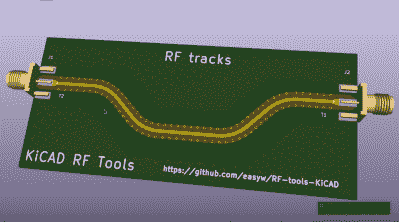

# KiCad 操作插件

> 原文：<https://hackaday.com/2019/11/19/kicad-action-plugins/>

过去的两年对 KiCad、用户、临时贡献者以及核心开发人员来说都是特别激动人心的时期。即便如此，还有许多很酷的新功能仍在开发中。复杂工具(如 KiCad)的开源开发的一个瓶颈是开发人员投入到项目中的时间有限。动作插件可以让你更容易地将自己的功能添加到已经可以扩展的工具中，从而减轻开发者的负担，加快开发速度。

大约在 4.0.7 版本的某个时候(如果我们错了，请纠正我们)，决定为 KiCad 引入“动作插件”,目的是让更大的贡献者社区可以添加那些没有出现在当前路线图上或者核心开发人员没有开发的功能。插件系统是一个使用共享库扩展 KiCad 功能的框架。如果你对创建动作插件感兴趣，可以查看 KiCad 插件系统和 Python 插件开发的文档。然后前往这个论坛帖子，在 pcbnew 中查看关于 python 脚本的[教程，并弄清楚如何](https://forum.kicad.info/t/tutorials-on-python-scripting-in-pcbnew/5333)[在 pcbnew 工具菜单](https://forum.kicad.info/t/howto-register-a-python-plugin-inside-pcbnew-tools-menu/5540)中注册一个 python 插件。

从 5.0 版本开始，我们已经看到了 KiCad 非常有用的动作插件的爆炸式增长，这些插件增加了一些非常有用的附加功能。KiCad 网站列出了一些外部工具，但是那里有很多活动，所以我们决定收集一些更有用的工具。

## KiCad 升级工具

动作插件是早期工作的结果，通过增加对除 VRML 之外的其他 Cad 格式的支持来改进 KiCad 3D 模型查看器。这样就可以在 KiCad 3D viewer 中为元件模型使用 STEP 格式，并为整个电路板提供 STEP 导出功能。如果你需要好看的渲染，VRML 格式很适合。但是如果要导入到 CAD，那么 STEP 格式效果更好。基于此，一个早期的附加功能并不是真正的动作插件，而是 FreeCAD 的工作台，它在 KiCad 和 FreeCAD 之间架起了一座桥梁。[Maurice]的[加速工具](https://github.com/easyw/kicadStepUpMod/)提供 EDA KiCad 和 Mech FreeCAD 之间的集成。在[论坛](https://forum.kicad.info/t/kicad-stepup-a-seamless-ecad-mcad-pcb-data-integration/12344)上有一个活跃的讨论 KiCad 升级工具的帖子，有很多演示视频和有用的帮助。

## KiCad 的射频工具

最近，[Maurice]发布了用于 KiCad 的 [RF 工具，其中包括一系列插件，可以满足长期以来对 RF 设计的需求。该套件包括用于设计 RF 布局的斜接弯曲、锥形走线连接器和弧形走线(半径弯曲)的封装尺寸向导。这些工具通过创建足迹来工作，因此并不完美，但这是朝着正确方向迈出的一大步。](https://github.com/easyw/RF-tools-KiCAD)

还包括一组动作插件，用于弧形轨道拐角、轨道长度测量和遮罩扩展工具。扩展工具允许您调整走线的掩模间隙，对于 RF 布局和想要在裸露的铜走线顶部堆积额外焊料的高电流应用非常方便。它也可能吸引那些想要更多控制轨道布局和视觉设计的艺术家。设计柔性 PCB 时，圆形走线也非常方便。值得指出的是，arc action 插件将创建分段弧，而 arc footprint 向导将生成平滑弧，因此两者各有利弊。如果你被困住了，论坛上有一个活跃的[主题来寻求帮助。查看下面嵌入的演示视频。](https://forum.kicad.info/t/rounded-tracks-reloaded-again-rf-tools-for-kicad/19190)

## 通过围栏和缝合

在 PCB 上布置天线走线时，走线周围最好有接地层过孔。RF 工具套件包括一个“Via Fence”发生器，可简化这一任务。它将在所选轨迹周围添加一系列过孔。您可以通过尺寸、间距和与轨道的距离进行设置。如果你遇到问题，可以在论坛上使用[这个帖子](https://forum.kicad.info/t/rounded-tracks-reloaded-again-rf-tools-for-kicad/19190/21)。

有一段时间，KiCad 有一个漂亮的过孔拼接选项，使用它您可以手动在网络或区域上放置过孔。[jsreynaud]的[通孔拼接](https://github.com/jsreynaud/kicad-action-scripts)插件提供了一种可控的方式来将通孔网格添加到一个区域，也就是铜浇注。您可以通过尺寸、间隙、间距进行设置，并创建随机或图案填充。

## 圆形区域

在同一个链接，你会发现一个非常方便的圆形区域发生器。这有点棘手，因为改变半径涉及删除旧的区域和创建一个新的区域，但同样，我们相信它会很快得到改善。它还允许您在区域内创建圆形禁止区域。

## 交互式 HTML BoM

到目前为止，最有用的插件之一必须是[qu1ck]的[交互式 HTML BoM](https://hackaday.com/2018/09/04/interactive-kicad-boms-make-hand-assembly-a-breeze/) 生成器。它不仅以漂亮的图形格式显示 BoM，而且还是一个非常方便的组装工具，可以突出显示您从 BoM 中选择的任何器件在 PCB 上的位置。一旦您安装了一个部件，您可以将其标记为“已放置”，使您的手动装配过程更容易管理。如果你有问题或功能要求，请前往[本论坛主题](https://forum.kicad.info/t/interactive-html-bom-plugin-for-kicad-5-0/11713)。

## 图形符号生成器

当你的设计使用一个还没有原理图符号的零件时，从头开始创建它显然是非常痛苦的，而且容易出错。KiSymGen 是一个图形符号生成器，它使这个过程变得直观，减少了痛苦。

## 泪滴

在早期，由于钻孔偏移，PCB 晶圆厂经常出现产量问题，尤其是在过孔和微过孔上。PCB 设计者用来缓解这个问题的一个技巧是使用“泪珠”。连接到轨道的焊盘或过孔周围的区域被做成泪珠形状，表面上是希望它能改善情况。如今，由于改进的工艺和精确的机器，晶圆厂做得相当好，所以对于泪珠的使用还没有定论，但 KiCad 确实有一个[泪珠插件](https://github.com/NilujePerchut/kicad_scripts/tree/master)，以防有人想使用它。结合光滑，圆润的轨道，我们猜测泪珠将非常有助于艺术印刷电路板部门。

## 螺旋线圈/电感发电机

如果你想做一些像[Carl Bujega]的工作，在机器人的电路板上设计微型电机，你知道你必须直接在电路板上布置电感线圈。 [SpiKi](https://github.com/in3otd/spiki) ，医生给 KiCad 开了一个螺旋感应器足迹发生器。

这绝不是一个全面的列表，所以如果你在寻找一个我们没有涉及到的插件，那么看看 KiCad 论坛主题上的这个[插件综述](https://forum.kicad.info/t/index-post-for-external-plugins-section/17129)或者 xesscorp 知识库上的这个[精选列表](https://github.com/xesscorp/kicad-3rd-party-tools)。如果你遇到一个没有列出来的，请在下面的评论中告诉我们。

 [https://www.youtube.com/embed/LDblUeaB7_s?version=3&rel=1&showsearch=0&showinfo=1&iv_load_policy=1&fs=1&hl=en-US&autohide=2&wmode=transparent](https://www.youtube.com/embed/LDblUeaB7_s?version=3&rel=1&showsearch=0&showinfo=1&iv_load_policy=1&fs=1&hl=en-US&autohide=2&wmode=transparent)

