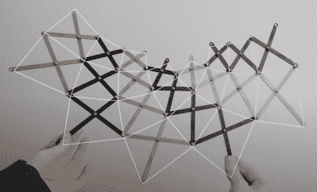

# 动态循环剪刀

> 原文：<https://hackaday.com/2022/10/26/kinetic-cyclic-scissors/>

[Henry Segerman]和[Kyle VanDeventer]将数学和力学结合在一起，用 M3 螺栓和螺母连接起来的 3D 打印棒创造了一个[动态循环剪刀雕塑](https://www.youtube.com/watch?v=76XIrm91Ra0)。

动态雕塑可以被认为是平面上无限自相似四边形镶嵌的一部分。这些自相似四边形对平面的镶嵌可以通过用杆连接每个四边形的对角点而实现为一个框架。[Henry]和[Kyle]想要回答的基本问题是，在什么条件下，镶嵌子块的已实现杆框架可以移动。令人惊讶的是，当四边形是平行四边形时，如在剪式升降机或“循环”中，当端点位于一个圆上时，杆框架可以移动。在环状结构中，调整中间长度的比例会导致不同类型的旋转对称，这可以在结构折叠时实现。

[Henry]和[Kyle]在他们的[Bridges 会议论文](https://archive.bridgesmathart.org/2022/bridges2022-313.pdf)中进行了更详细的介绍，并对通过调整约束条件而导致的对称性进行了推导和进一步的讨论。视频中展示的实际动态雕塑的细节很轻，但选择的杆框架具有镜像对称类型，电机连接到中间较低的杆之一，以驱动雕塑的运动。

bar 框架可供任何想要 3D 打印或激光切割自己的人下载。酒吧框架是有用的想法，我们已经在[艺术雕塑](https://hackaday.com/2016/08/05/art-and-creepy-mechanisms/)到 [strandbeests](https://hackaday.com/2010/03/24/theo-jansen-like-the-professor-from-gilligan/) 中看到它们的使用，所以很高兴看到在这个领域的进一步探索。

休息后的视频！

 [https://www.youtube.com/embed/76XIrm91Ra0?version=3&rel=1&showsearch=0&showinfo=1&iv_load_policy=1&fs=1&hl=en-US&autohide=2&wmode=transparent](https://www.youtube.com/embed/76XIrm91Ra0?version=3&rel=1&showsearch=0&showinfo=1&iv_load_policy=1&fs=1&hl=en-US&autohide=2&wmode=transparent)

