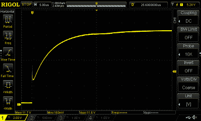
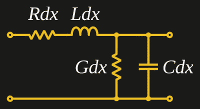
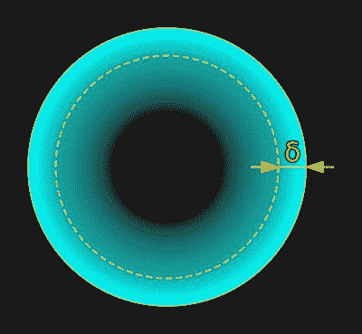
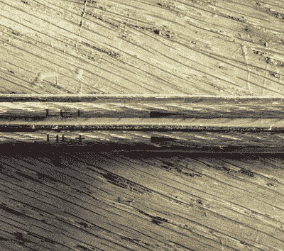
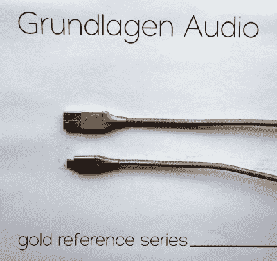

# 知道音频:一堆电缆

> 原文：<https://hackaday.com/2022/02/02/know-audio-a-mess-of-cables/>

我们已经花了几个月的时间在这个系列中探索音频世界，一路走来，我们从扬声器到音源了解了高保真系统的各个部分。这是一次充满技术细节的愉快之旅，并以同等的标准审视了高保真神话，但现在是时候进入音频再现的一个最简单但最具争议的领域了。每个音频组件，无论是数字还是模拟，都必须连接到它所属的任何系统中，这就是音频电缆的工作，有时也称为互连。它们可能是最容易受到关于其性能的空洞说法影响的单一组件，高保真音响发烧友准备花巨资购买据称能提供额外听觉性能的电缆。这里面有什么东西吗，或者它们都是相同的金属丝，昂贵的是一个骗局？是时候看看了。

## 是什么造就了一条近乎完美的电缆

在带有数字和模拟信号的典型家用音频系统中，您可能会发现两种类型的电缆，一种是可以传输模拟或数字信号的电气互连，另一种是传输数字信号的光学互连。我们在这里讨论电缆，因为它们是用于模拟信号的，所以让我们从一点传输线理论开始。

This is what happens when I hook a bike light up to a DC power supply.

也许你建造的第一个电路中有一个电池和一个手电筒灯泡，用一段双芯软线连接。当你用电线接触电池端子时，灯泡亮了，当你松开它时，灯熄灭了。这是一条 DC 赛道，有两种状态，断断续续，仅此而已。但是如果你在接上灯泡的同时，在电线上接上一个存储示波器，你可能会注意到一些有趣的事情。事实上，电压会在几微秒内向上弯曲，而不是在瞬间从关跳到开。DC 电路突然看起来不像最初认为的那样完全是双态的，那么这是怎么回事呢？

电压向上弯曲，因为电线和灯泡不完美。它们具有少量电阻、电感和电容，称为寄生电容，正是这些电容之间的相互作用导致电压在短时间内上升，而不是立即上升。它几乎是即时的，所以对于手电筒来说是没问题的，但是一旦类似的导线被用来传输信号，这个寄生 RCL 电路就会开始影响它。早期的电报和电话工程师面临这个问题，因为他们的电线延伸数百英里，因此具有相当大的 R、C 和 L 值，产生低通滤波器的效果。他们试图理解这一现象，由此产生了我们现在所称的传输线理论，任何从事射频工作的人都应该对此非常熟悉。

Equivalent circuit of a transmission line, showing the various parasitic components present. Omegatron ([CC BY-SA 3.0](https://commons.wikimedia.org/wiki/File:Transmission_line_element.svg))

话虽如此，音频互连是一种传输线路，应考虑寄生 R、C 和 L 值，但我现在要彻底改变这一点，并说在合理的范围内，互连的传输线路性能，正如我们对无线电电路的理解，在音频频率下并不重要。原因归结于音频互连的长度较短，大约几英尺(或一米)的寄生值非常小，作为低通滤波器几乎没有区别。与音频波长相比——1 kHz 下 300 千米——这是微不足道的。

回到我们的手电筒灯泡，来自电池的电线中的电流是 DC，总是朝同一个方向流动。如果我们把它们想象成单股粗铜线，我们可以进一步把它们内部的电流想象成理想管道系统中的水流，水流均匀地分布在其横截面上。我们知道电流会产生磁场，所以只要 DC 电流流动，给灯泡供电的电线就会被静电场包围。

The skin effect illustrated by a current density plot on a cross section of a conductor. δ refers to the skin depth, in which the majority of the current flows. Biezl, [Public domain](https://commons.wikimedia.org/wiki/File:Skin_depth.svg).

对于音频信号等交流电流，磁场是不同的。随着电流的变化，磁场也在变化，因为变化的磁场会在附近的导体中感应出电流，所以会在导线中感应出额外的电流。这些电流并不像线性电流那样沿着导体的长度方便地流动，而是像圆形的所谓涡流那样在导体内部流动。因为环形电流的一部分向前流动，一部分向后流动，朝向导体的中心，涡流抵消了向前的电流。

这就产生了所谓的趋肤效应，即交流电流主要流向导体外部，回到上一段，这会导致交流音频下的寄生电阻显著增加。对于音频互连来说，这可能会对其质量产生不利影响，因此音频电缆通常会通过使用许多小股电线而不是一根较大的电线来尽可能增加其表面积。如果这还不够，更高质量的电缆通过在铜上镀银或镀金来确保钢丝表面的最低电阻。

## 打破一些有线电视的神话

Direction arrows on a speaker cable. Richard Corfield, with permission.

因此，我们已经确定，好的音频电缆应该具有最小的寄生电阻、电感和电容。由于其相对较短的长度，其作为 RF 意义上的传输线的性能在很大程度上是不相关的，并且可以通过使用多股电缆来降低趋肤效应。但在购买像样的有线电视时，还有一些其他事情需要考虑，它们可能是最有趣的，因为在这里我们进入了音响发烧友吴的世界。如果你在音响发烧友目录中查找电缆，你会看到“无氧”和“定向”等术语，它们是什么意思？

无氧铜是一种非常高级的精炼铜。由于去除了杂质，它的导电性比普通铜稍好，因此音响发烧友声称它提供了明显更好的质量。事实上，音频互连的长度非常小，以至于稍好的导电性对其性能并不重要。需要数百米长电缆的应用可能会受益，因此我们预计它会出现在 CERN 等大型项目的科学仪器中，但对于短音频互连而言，它只是一种营销工具。

如果你买一个像样的互连，它可能会使用无氧铜，但它的性能将来自于使用大截面的细导线，也许是镀银导线，而不是超纯铜。定向电缆是另一回事，你会发现许多音频电缆上有小箭头指示电流流动的方向。网上搜索会发现对此的各种解释，这些解释通常取决于铜块中单个颗粒之间的寄生二极管作用，其中一些甚至表明方向性会随着使用而增加。对于容易受骗的音响发烧友来说，这是另一个很好的营销工具，但与无氧铜的导电性不同，它没有事实依据。音频电缆或任何其他电缆都不具有方向性，无论插入哪种方式，它们都能正常工作。抱歉，发烧友们，你们上当了。

## 任何白痴电缆都能数到一

Gold USB cables: [not what they seem](https://hackaday.com/2020/04/01/gold-cables-really-do-work-the-best/).

到目前为止，我们只在这篇文章中看到了模拟音频电缆，但当然它们不是唯一出售给音响发烧友的电缆。例如，你可以以惊人的价格购买“特殊”的 IEC 电源电缆，或者用于以太网、USB、TOSlink 或 HDMI 的高保真质量的数字电缆。

电源电缆就是电源电缆，只要它的导线额定电流合适。数字电缆几乎和 T1 一样简单。

与数字有线电视神话一样，这也是事实的一部分，但它不会让你花费数百美元。数字电缆不同于模拟音频电缆，因为比特率的频率远高于以比特编码的信号的频率。因此，它们的传输线路性能成为一个重要问题，这有时会体现在电缆的选择上。

找到市场上最便宜的低于 5 美元的 HDMI 电缆，有可能它可以处理 1080p 信号，但不能处理 4K 信号，这是因为它的传输线带宽达不到 4K 比特流的额外要求。但在 1000 美元的 HDMI 电缆下架之前，尝试用 10 美元的电缆取代 2 美元的电缆，你可能会感到惊喜。

即使是最便宜的 HDMI 电缆也可以每秒传输数千兆比特，并嘲笑你的数字音频比特率低至兆比特。只要 1 和 0 完好无损地到达电缆的另一端，就没有必要花更多的钱——没有比 1 或 0 更好听的了。

可能会有一些音响发烧友阅读这篇文章并变得愤怒，因为很明显，当谈到方向性或无氧铜时，我不知道我在说什么，尤其是 1000 美元的电源引线或以太网电缆。对于他们，我会提出这样的提议:在牛津的一家酒吧里有一品脱的老胡克酒给第一个证明我错了的人。但证据的标准相当高，我不会接受“无氧镀金 USB 线给更广阔的声场带来丰富的巧克力音”这样的废话。相反，我会用高端专业音频分析仪进行并排测试。让我们看看音频精度是怎么说的，好吗？我讨厌否认最优秀的胡克诺顿酿酒厂的销售，但有些事情告诉我，我不会买那品脱很快。

我们将带着这个系列的另一个回来，在全面探索了家用音频系统的组件之后，现在是时候以另一种方式来看待它了。我们如何衡量音频性能？