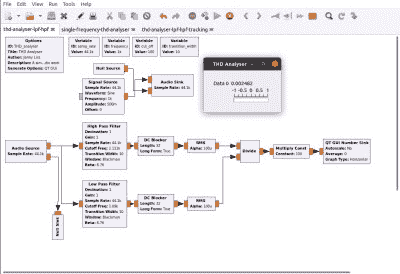
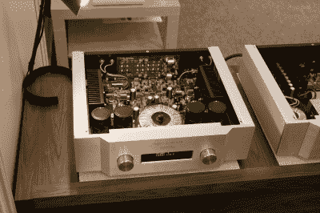

# 了解音频:放大器和失真

> 原文：<https://hackaday.com/2021/07/29/know-audio-amplifiers-and-distortion/>

当我们在高保真音频的世界中追寻严肃的道路时，我们从听众开始，理解了人耳的局限性，然后转向扬声器。我们已经了解了一些扬声器音箱及其设计，现在是时候进一步探索驱动这些扬声器的放大器了。

眼尖的人会指出，扬声器电缆也位于这条路径上，但由于我们将在稍后研究互连，因此我们现在将做出可疑而简单的假设，即扬声器和放大器之间的电线是理想导体，对收听质量没有影响。我们将详细讨论放大器，这足以保证不止一篇文章讨论这个问题，因此，今天我们将从略微抽象的方式开始，考虑放大器的作用以及它在任务中的不足之处。我们将介绍可能是任何音频系统中最重要的考虑因素，即失真。

音频放大器的工作是在其输入端接收音频信号，并在其输出端以更大的幅度呈现相同的信号。在前置放大器的情况下，它通常设计为在 50kω左右的高阻抗下工作，而在设计为驱动扬声器或耳机的功率放大器中，它将驱动低得多的阻抗。通常，扬声器为 4ω或 8ω，耳机为 32ω。

## 所有放大器(轻微)损坏

在理想的放大器中，输出端出现的应该是输入端出现的完全忠实的复制品。事实上，由于电子元件的缺陷，这种完美的线性装置并不存在。虽然我们可以制造出非常好的放大器，但输出信号和输入信号之间总会有微小的差异，不仅仅是幅度上的差异。

Measuring single-frequency THD+N through a flowgraph in GNU Radio

如果我们想象一个极其非线性的放大器，当输入一个纯正弦波时，其输出会返回一个方波，我们大多数人可能都知道[方波是原始正弦波和一系列其倍数或谐波的总和](https://hackaday.com/2015/09/17/visualizing-the-fourier-transform/)。我们可能遇到的任何音频放大器都更接近完美的线性放大器，但即使是最小的非线性也会在输出端产生可检测的谐波电平。

放大器内产生的这些谐波被称为谐波失真，通过向设备中输入一个纯正弦波并测量输出端基频与谐波的比率来测量谐波失真([我们的 2020 年愚人节](https://hackaday.com/2020/04/01/gold-cables-really-do-work-the-best/)可能一直在取笑高端电缆，但包括了[一种通过 GNU Radio 实现这一点的方法。](https://github.com/JennyList/GnuRadioAudioAnalysers))这被表示为总谐波失真，通常是由谐波组成的输出的百分比。一个高质量的高保真放大器的总谐波失真率通常为百分之几。THD 在任何时候都是在单个频率下测量的，引用的数字通常为 1 kHz，但值得考虑多个频率的影响。例如，放大器在较高频率下的 THD 通常会稍差。

The power supply transformer and capacitors at the front of this amplifier are the largest of its components. Christian Herzog, [CC BY 2.0](https://commons.wikimedia.org/wiki/File:Audio_Analogue_Maestro_amplifier_at_HighEnd-2009_(3557030278).jpg).

当我们想到失真时，首先想到的是谐波失真，但 THD 并不是影响输出的唯一放大器缺点。例如，如果您解构音频功率放大器执行的任务，从一个角度来看，它放大输入以驱动扬声器，但从另一个角度来看，它在其电源和通过扬声器电缆的扬声器之间形成桥梁。

简单地说，它的任务是将电源中的高功率 DC 转换成扬声器的高功率交流电。因此，放大器只是电路的一部分，扬声器、放大器和电源必须在功能上相匹配，以满足手头的任务。

如果你打开一个高端线性高保真放大器，你会发现它的外壳大部分都是电源元件；一个非常大的主变压器和一组平滑电容器。这是因为电源被设计为能够提供比其正常恒定负载高得多的瞬时负载，以充分处理音频流中的峰值，例如鼓声。探索这一途径的目的在于了解放大器的失真不仅取决于放大器本身，还取决于其周围元件的质量，因为看似无失真的放大器在电源不足的情况下仍有可能出现失真。

另一个意想不到的失真例子可以在[立体声电子管放大器中找到，那是我年轻时做的蠢事](https://hackaday.com/2017/08/16/the-best-stereo-valve-amp-in-the-world/)。它遭受了令人震惊的相位响应，给出了一个惊人的羊毛般的声音，但它仍然有一个相当不错的频率响应和总谐波失真，否则会被标记为一个良好的放大器。幸运的是，在任何合理的放大器中，您都不太可能受到这一问题的困扰，但我们希望表明，在放大器设计中，除了简单的放大器模块本身的 THD 测量之外，还有许多潜在的失真源。

Is this [£10 Chinese audio kit](https://hackaday.com/2020/09/01/that-elusive-valve-amp-sound-for-not-a-lot-there-has-to-be-a-catch/) better than any transistor amp simply because it has a couple of tubes? We don’t think so.

还有一个时刻，你会听到在讨论高保真时提到的失真，这是值得探讨的，而且出乎意料地是积极的，即使是在非常主观的背景下。

关于电子管放大器是否比晶体管放大器更好，这是发烧友圈子里的一个长期问题，为电子管放大器辩护的一个论点是，在大肆吹嘘的“电子管声音”背后，电子管产生更多的偶次谐波失真，而晶体管产生更多的奇次谐波。

这是那些几乎可以肯定与传说比现实关系更大的事情之一，可能起源于晶体管高保真处于婴儿期和电子管放大器是一项成熟技术的时候。20 世纪 60 年代的许多晶体管放大器都有明显的缺陷，几十年来，它们的一些遗产可能已经被磨掉了。尽管可以肯定地说，制造一个非常好的晶体管放大器的艺术在很久以前就被破解了，除了吹牛的权利之外，在 2021 年应该没有什么理由支持一个而不是另一个同等质量的产品。

## 只信任你的乐器

在前一段中，我们已经接近了这个系列的最初动机和失真概述的结论。说一个好的电子管放大器不比一个好的晶体管放大器好，无疑会让一些音响发烧友不相信地惊呼，我显然不知道我在说什么，这种差异在听力上是显而易见的，对此我想提醒他们这个系列的第一篇关于人耳的文章。假设在人耳的主观评估和校准仪器的可再现测量之间进行选择，唯一可信的信息来自仪器。音响发烧友写作的一个标志是经常对音频组件提出荒谬的主张，所以这个系列介绍了基于真实工程的音频。因此，任何关于失真的讨论都应该以此结束:只注意来自可信仪器的可证实的读数。

我们将在下一期更详细地讨论失真的测量时，再回到失真这个主题上来。与此同时，我们将在本系列的下一篇文章中详细讨论放大器本身。我们将讨论它们的不同类型，以及它们的相对优缺点。