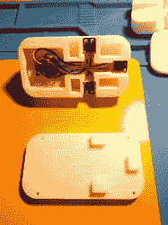

# KVM 脚踏开关几个步骤

> 原文：<https://hackaday.com/2019/08/12/kvm-foot-switch-in-a-few-steps/>

尽管有手柄，Radishmouse 并不是一个鼠标玩家。给他一个键盘，他就能在任何操作系统或程序中自如地工作。事实上，他有几台 ThinkPads，每台都运行不同的操作系统。他希望能够在两台笔记本电脑之间切换他漂亮的机械键盘，而不需要拔插头和重新插插头的麻烦。他的解决方案:[一个 DIY KVM 脚踏开关](https://radishmouse.com/usb-footswitch.html)。

 他一直在学习电子学和 3D 设计，这个问题是深入研究和动手实践的绝佳机会。在对 USB 协议和开关有了足够的了解之后，他用一个浴缸做了一个原型。虽然不可否认是经典的，但这艘船永远无法在猫科动物的领地经受住严酷的践踏。幸运的是，[radishmouse]也一直在学习 3D 设计。经过反复试验，他设计出了一个坚固、弯曲的 3D 打印两件式外壳。我们特别喜欢底部支撑 USB 端口的模块。

有很多理由为那些未被充分利用的肢体建立输入控件。你可以用两只手各拿一个探针来控制你的瞄准镜，或者用脚踏开关来重新定位一个不方便的电源按钮。

通过[ [r/functionalprint](https://www.reddit.com/r/functionalprint/comments/cnn252/usb_footswitch/) ]