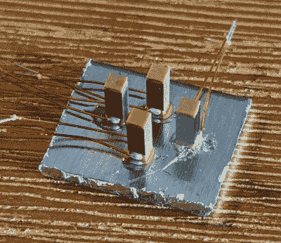

# 激光增强现实眼镜为您指路

> 原文：<https://hackaday.com/2021/07/08/laser-augmented-reality-glasses-show-you-the-way/>

谷歌和微软等科技公司一直在研究增强现实(AR)可穿戴设备，这些设备可以在你的视野中叠加图像，模糊现实和虚拟之间的界限。不幸的是，对于那些希望尝试这项技术的人来说，目前发布的设备都过于昂贵。

虽然他们可能无法与最新的微软 HoloLens 竞争，但这些来自[Joel]的激光 AR 课程有望便宜得多，并且对黑客来说更容易接近。通过从压电驱动的镜子上反弹低功率激光，这种眼镜有望将简单的矢量图形投影到一块通常用于售后汽车平视显示器(hud)的反射膜上。

Piezo actuators are used to steer the mirror.

[Joel]已经制作了一个镜子系统的原型，但他说驱动高压压电致动器带来了一些独特的挑战。暂定计划是用智能手机应用程序生成矢量数据，将其发送到眼镜内的 ESP32 微控制器，然后将生成的模拟信号通过 100 V DC-DC 升压转换器，使镜子移动。

[我们已经看到 ESP32 驱动激光电流计玩*小行星*](https://hackaday.com/2021/02/18/laser-galvos-and-an-esp32-recreate-old-school-asteroids/) 的游戏，但是在一个足够小的包装中重现这样的设置以适合一副眼镜肯定会是一个令人印象深刻的成就。早期测试看起来很有希望，但显然[Joel]还有很多工作要做。[作为 2021 年 Hackaday 奖](https://hackaday.com/2021/06/28/ten-projects-won-the-rethink-displays-round-of-the-hackaday-prize/)的 *Rethink Displays* 挑战赛的决赛入围者，我们期待看到该项目在未来几个月的发展。

The [HackadayPrize2021](https://prize.supplyframe.com) is Sponsored by: