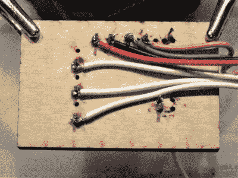

# 激光切割木制弹簧针测试夹具

> 原文：<https://hackaday.com/2019/06/25/laser-cutting-wooden-pogo-pin-test-jigs/>

现在，就问题而言，在 Tindie 上销售如此多的产品，以至于你需要想出一种更快的方法来测试它们，这是一个非常好的方法。但这仍然是一个需要解决的问题。对于[Eric Gunnerson]来说，解决方案包括[找到一种快速简单的方法，在他的激光切割机](http://www.riderx.info/pogo-pins-laser-cutter-test-fixture/)上生产木制 pogo 测试夹具，我们有一种感觉，他不是唯一一个从中受益的人。

 第一步是将 PCB 设计从 KiCad 导出到 SVG，然后[Eric]将其导入 Inkscape 进行编辑。他删除了所有他不感兴趣的痕迹，只留下了他希望最终用弹簧针触及的痕迹。然后，他使用圆形工具在每个焊盘的中心放置一个 0.85 毫米的红点。

您可能想知道这些特定的参数是从哪里来的。颜色很容易解释:他的 GlowForge 激光切割机允许他根据颜色进行选择，所以[Eric]可以很容易地告诉机器切掉任何红色的东西。至于尺寸，他在一块木头上做了一次测试，发现 0.85 毫米是用摩擦力抓住弹簧针的完美尺寸。

[埃里克]跑了三个相同的桦木胶合板，加上一个垫片。弹簧针插入第一片，导线焊接在背面，最后用垫片固定。然后用剩下的两块把整个东西盖上，用胶带把它包起来。

无论你是 3D 打印你自己的设计还是[修改一个流行的开发板来满足你的要求](https://hackaday.com/2019/05/18/breakout-board-becomes-pogo-pin-programmer/)，测试夹具[在你进行小规模生产](https://hackaday.com/2016/08/24/tools-of-the-trade-test-and-programming/)时都是无价的。