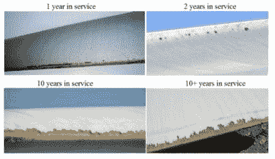
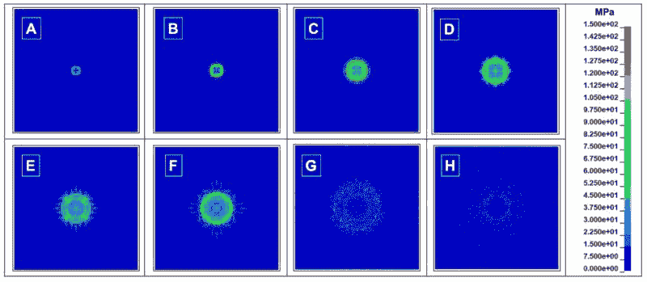
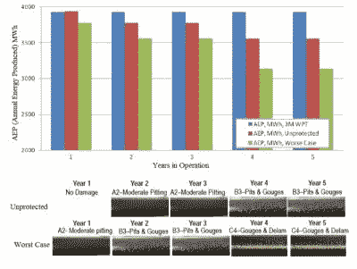

# 前缘侵蚀:当降水破坏风力涡轮机叶片时

> 原文：<https://hackaday.com/2022/10/05/leading-edge-erosion-when-precipitation-destroys-wind-turbine-blades/>

侵蚀就在我们身边，从蜿蜒的河流和其他水道，到逐渐在最坚硬的山上雕刻出通道，以及雕像特征的软化。然而，一般来说，我们认为降水造成的侵蚀是逐渐的、温和的，需要几十年的时间才能产生明显的影响。这当然考虑到了温和的水流和雨点打在石头上的柔和的噼啪声，而不是涡轮叶片以数倍于雨滴最高 9 米/秒的最终速度在空气中穿行

随着风力涡轮机叶片的尺寸和直径的增加，这显著地增加了速度，尤其是叶尖的速度。随着越来越多的风力涡轮机叶片尖端现在超过 100 米/秒的速度，这也意味着雨滴、冰雹和其他微粒对这些涡轮机叶片的寿命的影响显著增加。相比之下，100 米/秒相当于 360 公里/小时(224 英里/小时)，仅比一级方程式赛车的最高速度略慢。

涡轮叶片前缘侵蚀(LEE)的影响不仅会降低气动效率，还会导致过早失效。在过去的几年里，特殊的涂层和前缘胶带已经被开发出来作为牺牲表面，但是随着风力涡轮机越来越大，LEE 的影响也越来越大。除了每年更换每台涡轮机上的 LE 胶带之外，还有其他选择吗？

## 日益严重的问题

Examples of leading edge erosion in the field across a range of years in service. (Credit: 3M)

虽然 LEE 不是风力涡轮机叶片的独特问题，但它们处于一个相当独特的位置，因为与工业设备或喷气发动机中的螺旋桨叶片和涡轮机叶片不同，它们经常暴露于自然环境中。此外，它们的绝对尺寸超过了这些其他叶片，这使得检查和维护变得复杂。

在 [Keegan 等人](https://iopscience.iop.org/article/10.1088/0022-3727/46/38/383001/meta) (2013， [PDF](https://strathprints.strath.ac.uk/43836/4/Keegan_MH_et_al_Pure_On_erosion_issues_associated_with_the_leading_edge_of_wind_turbine_blades_Aug_2013.pdf) 的一篇综述中，确定了 LEE 的多种原因。这些可以大致分为以下几类:

1.  雨滴。
2.  万岁。
3.  海浪。
4.  沙尘。

具体的风力涡轮机暴露于哪种环境取决于其安装的位置。对于一些离岸风力涡轮机，所有这四个因素都可能是一个因素，而对于其他风力涡轮机，只有沙子或雨水可能是相关的。不管怎样，结果基本上是一样的。随着雨滴或固体颗粒的冲击，叶片的前缘将经历动能的转移，随着时间的推移，动能将削弱和侵蚀其结构。在阵雨和现代风力涡轮机的情况下，这涉及直径为 0.5 毫米至 5 毫米的水滴以大约 100 米/秒的速度持续撞击

Rayleigh surface stress contour plot at leading edge coating system at various stages of contact force history by a droplet. (Credit: Verma et al., 2020)

在[维尔马等人](https://www.sciencedirect.com/science/article/pii/S0263822319329794?via%3Dihub) (2020)在*复合结构*中的一项研究中，检验了海上风力涡轮机叶片的雨滴力分布。使用一系列建模技术，发现通过将叶片尖端速度从超过 100 米/秒降低到大约 80 米/秒，可以在强降水期间避免大部分冲击损坏。相比之下，当叶尖速度为 140 米/秒时，最大冲击力为 181 牛顿，而当叶尖速度为 80 米/秒时，最大冲击力降低到 70 牛顿以下，大约降低了 70%。

随着风力涡轮机的轮毂高度和相应的涡轮机叶片长度不断增长，这种极端的叶尖速度可能会变得越来越普遍，尤其是对于往往比其陆上同类风力涡轮机大得多的海上风力涡轮机。通过部分地使叶片顺桨或使用制动系统，在强降水或具有严重海浪喷射的风暴期间降低叶片速度，至少可以避免部分背风损害。

## 不可避免的维护

Calculated effects of varying levels of leading edge erosion
on the Annual Energy Production of a 1.5MW wind turbine. (Credit: 3M)

具体来说，背风的影响是这样的，它可以在短短一年后将风力涡轮机的输出减少几个百分点，即使轻微的点蚀也会通过扰乱涡轮机叶片表面的气流来影响涡轮机叶片的效率。1976 年，G.S. Springer 在*液体冲击侵蚀*中创建了与涡轮叶片和螺旋桨相关的 LEE 通用模型。该模型使用水锤原理，并通过[霍克斯比尔根等人](https://www.mdpi.com/1996-1944/15/3/1170/htm) (2022)在*资料*中提出的改进进行了严格的检验。

在由 [Law 等人](https://onlinelibrary.wiley.com/doi/full/10.1002/we.2540) (2020)进行的一项研究中，分析了来自英国各地风电场的数据。已经发现，预计每个风力涡轮机每年的平均输出损失约为 1.8%，受影响最严重的风力涡轮机经历了 4.9%的损失。

关于 Law 等人的研究，最有趣的是发现应用前缘修复带(前缘保护，或 LEP)来修复涡轮机 3 年旧叶片的背风面损伤导致额外 1.29%的输出下降。这显示了涡轮叶片的形状对于获得最佳性能的重要性，并举例说明了使用 LEP 胶带进行现场维修的问题。

虽然有一个论点是，让背风面继续不受检查会导致性能随着时间的推移甚至更差，但不应该期望在受损涡轮叶片的前缘贴上胶带会使其恢复昔日的辉煌。 [Major 等人](https://journals.sagepub.com/doi/10.1177/0309524X20975446) (2020)也报告称，由于使用 LEP 胶带，年发电量(AEP)下降了 2%-3%。

2019 年由 [Herring 等人](https://www.sciencedirect.com/science/article/pii/S1364032119305908)在《可再生和可持续能源评论》上发表的一篇文章进一步阐述了涡轮机叶片现场维护的复杂性。除非正确使用胶带，否则胶带可能会剥落、起皱或出现气穴。本文还介绍了在前缘应用金属防腐蚀罩的选择。这将提供良好的防腐蚀保护，但是增加了具有不同刚度的混合复合材料和金属叶片结构的复杂性。

最后，正在进行的研究( [McGugan 等人](https://www.mdpi.com/2079-6412/10/12/1223/htm)，2020)是在风力涡轮机叶片上增加传感器，以监测振动和其他可以指示叶片损坏的参数，包括背风损坏。

## 微小的水滴，巨大的后果

最终，从减少叶片维护需求和提高效率的角度来看，减少 LEE 是一种双赢，但解决方案绝不简单。即使是像 LEP 胶带厚度这样的小变化，当它们放大到巨型风力涡轮机叶片的尺寸时，也会有影响，效率降低会带来重大的财务影响。随着叶片尖端速度随着风力涡轮机叶片越来越大而增加，开发更好的方法来保护叶片表面也变得越来越重要。