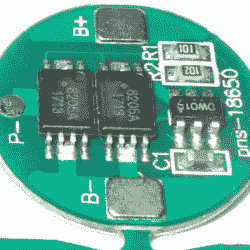
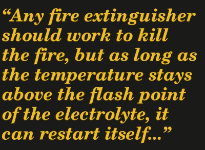

# 锂离子安全的教训

> 原文：<https://hackaday.com/2019/11/13/lessons-in-li-ion-safety/>

如果你从网上搜索到这里，因为你的电池刚刚爆炸，你不知道如何灭火，那么使用普通灭火器，如果它插在插座上，或者使用灭火器或水，如果它没有插在插座上。如果有很多烟，就出去。对于其他人，请继续阅读。

我最近开发了一个产品，用了三个 18650 细胞。这个电池组有自己的过压、欠压和过流保护电路。除此之外，我的设计还集成了一个 PTC 保险丝，此外，我还有一个由控制电路板的微控制器监控的电流检测电路。说到锂离子电池，你可不想乱来。它们携带大量能量，如果出现问题，它们可能会经历热失控，这是爆炸和蔓延火焰和有毒气体的另一种说法。那么你是如何照顾他们的，当事情变糟时你会怎么做？

## 形势的严重性

[这段视频发生在 2019/10/20，中国汕头，展示了一辆充电电动滑板车经历了一些快速的计划外拆卸](https://www.newsflare.com/video/319300/crime-accidents/electric-scooter-lets-out-around-30-balls-of-fire-while-charging-in-china)。播放声音，但可能会调低一点。还要注意右下角的灭火器，好像这不是一个意外事件。

正在发生的是热失控，电池变得太热，所以它开始自毁，点燃电解质，然后释放能量，产生更多的热量，这导致附近电池的更多自毁。这可能以多种方式发生:

*   **短路:**无论是通过冲击造成的损坏还是用刀刺穿，如果层失去分离，就会产生短路，使大量能量快速移动，并在此过程中产生大量热量。随着时间的推移，电池也有可能形成树枝状晶体，这是一种类似于洞穴中钟乳石的尖锐晶体，可以穿透隔离层，造成内部短路。
*   **过度充电:**当电池充电超过其最大电压时，会产生热量。
*   **电流过大:**充电或放电时。

这三者都来自大量快速移动的能量，并产生过多的热量。如果你对锂电池内部到底发生了什么感兴趣，我们已经在过去的的[更多科学细节中对此进行了报道。但即使不了解化学反应，我们也已经通过一些值得注意的事件看到了后果，比如几年前【Note 7 电池故障引发问题](https://hackaday.com/2017/09/18/the-science-behind-lithium-cell-characteristics-and-safety/)，并导致航空公司对某些设备的政策发生变化。

除了火灾的威胁之外，在这种暴发期间还会释放有毒气体。细胞含有一定量的氟，氟反应生成大量的氟化氢，使事件产生的烟雾对生命或健康构成直接威胁，特别是在密闭空间。

## 安全预防措施:通风、电池保护和监控

电动汽车已经以越来越快的速度从装配线上下线，进入车库。每辆车的能量潜力都是巨大的，有很多针对锂离子电池化学的研究，旨在显著提高电池的寿命和完整性。也有很多关于电池充电和储存水平的研究。它不应该一直充电到 100%,长期储存时建议充电 50-70%。

知道了电池如何引爆，我们可以做一些事情来阻止它们，并将其设计到电池和电池组中。在电池层面，第一道保护是在隔膜本身，它防止阳极和阴极相互接触。这种绝缘层的设计是多孔的，足以吸收电解质并允许锂离子通过，当热量积累时，甚至可以关闭孔隙以关闭传输。但它的主要工作是保持阳极和阴极之间的和平。

在化学物质之外，电池通常被一些保护层所覆盖，这些保护层可以是用于恰当命名的袋式电池的金属袋或用于圆柱形电池的金属罐。两者都试图避免穿刺，并包含任何可能产生的气体。如果压力过大，他们可能需要排出气体，因此外壳应该能够稍微膨胀以容纳膨胀的电池，并在压力足够大时提供安全排出气体的方法。如果气体不排出，就会爆炸。不管怎样都会有结果的。

A DIY lithium-ion battery protection circuit.

另一个安全预防措施是保护电路，它可以应用于单个电池以获得最大的安全性，或者应用于多个电池(如果它们是平衡的)。几年前，我们报道过一个 DIY 电池保护器。这些电路可以监控温度、电流和电压，如果其中任何一项超出安全范围，就会关闭电池。默认情况下，大多数电池组都会内置这些电路；如果你真的想要一个，你必须指定一个无保护的包。

在电池组本身之外，通常明智的做法是增加额外的保护电路，以防止电池组达到需要自我关闭的程度。如果设备可以在电池组关闭电源之前检测到问题，它可以纠正问题，并仍然向用户提供界面，然后优雅地关闭。监控主板上的电流、温度和电压有助于解决这一问题。

## 小心对待它们，并知道如何处理它们

当然，它们不应该以暴露在高温下的方式使用或储存。应保护它们免受冲击，尤其是尖锐的传导冲击。它们应该在可靠充电器的监督下小心充电。对于较大的电池组，它们可能甚至不应该在住宅内充电，以防出现与上述视频完全相同的情况。膨化的小袋不再安全，应该处理掉。旧的不再工作的电池仍然是危险的。

当一个袋状电池被切断时会发生什么。这是一个极端的例子；即使用刀划开它也会损坏隔膜层，这可能最终使阳极和阴极接触并导致内部短路。在这个视频中，他们只是大大加快了这个过程，并在这个过程中释放出一些有毒气体。

 [https://www.youtube.com/embed/BLc74Qpvweg?version=3&rel=1&showsearch=0&showinfo=1&iv_load_policy=1&fs=1&hl=en-US&autohide=2&wmode=transparent](https://www.youtube.com/embed/BLc74Qpvweg?version=3&rel=1&showsearch=0&showinfo=1&iv_load_policy=1&fs=1&hl=en-US&autohide=2&wmode=transparent)

处理锂离子电池并不难，但大多数人并没有做他们应该做的事情。电池应该以尽可能安全的方式与设备的其他部分分开。(扔掉电动工具，但不要扔掉电池组，但不要为了取出电池而将手机摔成两半。)然后，应该用胶带将引线粘住，这样它们就不会相互接触或在其他导体上短路。把它们带到一个可以回收的地方，比如很多家装店或者电子产品回收商。把它们扔进垃圾箱可能真的很糟糕，因为垃圾压实机和其他过程可能会损坏它们并引起垃圾火灾。另外，我们希望避免所有有害的化学物质进入垃圾填埋场。

## 锂离子电池的应急程序

这里有一些矛盾的想法。一方面，你和他人的安全是最重要的，燃烧的背包释放的气体是危险的，可能是有毒的，尤其是在狭窄的空间里。如果事情很糟糕，你应该走出去，并提醒他人和当局。另一方面，如果你有战斗的机会，你不想失去一切，快速行动可以解决问题，你可以自己做决定，或者也许你在飞机上，你真的无法逃脱。

锂离子电池火灾可分为 A 类、B 类或 C 类火灾。它们会自行燃烧，由可燃材料制成，有易燃液体和溶剂。当它们涉及通电的电气设备(充电器)时，它们达到 c 级。对于插在墙上的东西，你不希望使用水，因为这只会使电气火灾更加危险。然而，对于单独的包装和没有外部能量的包装，水是一种有效的解决方案。它扑灭了火，降低了背包的温度，这样背包就不会再次着火了。任何灭火器都应该能够灭火，但只要温度保持在电解质的闪点以上，它就可以自动重启，可能需要几个小时，对于电动汽车来说，可能需要几天。

你可能会奇怪为什么不是 D 级火，是可燃金属火。如果我们谈论的是不可充电的一次锂电池，那么这将是 D 级火灾，需要干粉灭火器(或用沙子或其他非水的不可燃材料窒息)。但是，锂离子电池中的锂含量真的不够高或不够集中，它永远不会达到锂本身着火的程度。

在您担心电池可能处于危险状态的情况下，处理电池的最佳方式可能是首先将其倒入一个容器中，然后将容器带到安全的地方，然后在不危及您自己或任何建筑物的情况下灭火。

前面提到的电动自行车大火的视频，反应出奇的好。这个人首先拔掉包，给他们更多的选择，并减少火灾加剧的可能性。你可以看到他们在撤退时抓起灭火器，可能是为了安全起见。然后他们回来灭火。它重新点燃，他们再次击中它。有人打开门，以获得一些通风和消除烟雾。

事后，他们应该把自行车和自己带到没有易燃物的地方，背包可以排出剩余的任何烟雾。他们应该在入口处通风，不要在里面呆太久。他们应该将电池长时间浸泡在水中以冷却它。

关于[锂离子电池火灾危险和安全策略](https://www.mdpi.com/1996-1073/11/9/2191/pdf)的文章中有更详细的指南。随着我们继续被锂电池供电的设备包围，对治疗、警告信号和适当的反应有一个工作理解对每个人来说都是一个好主意。