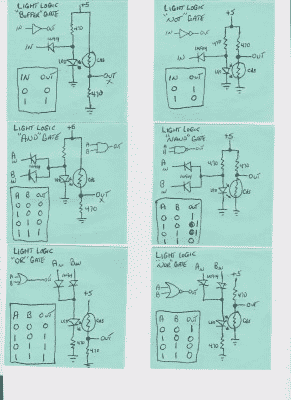

# 从零开始构建的发光逻辑门

> 原文：<https://hackaday.com/2019/10/24/light-emitting-logic-gates-built-from-scratch/>

你能想到的最怪异的电脑是什么？这个更奇怪。

[蟑螂博士]想出了一种方法，只用一个 LED 和两个电阻(其中一个是光敏电阻)来创建一个反相非门。从那以后，博士已经建造了与门、与非门、或非门、异或门和 XNOR 门，以及一个缓冲器，将光整合到每个逻辑门中。

传统的反相器——而不是门——已经由二极管(通常不发光)、电阻(通常不依赖于光)和双极晶体管制成。挑战在于减少晶体管的数量。第一次测试的[示意图](https://www.youtube.com/watch?v=cG1VyLEl2kk)显示了【蟑螂博士】使用 910 欧姆的输出 LED 以及并联的 LED 和 LDR 将光并入逻辑门的微小修改。

逻辑 1 的初始输出为 4.5V，逻辑 0 的初始输出为 1.5V。在反相器之前添加两个 1N914 二极管和一个与门，就构成了一个双输入与非门。将两个二极管反向，去掉一个 910 欧姆的电阻，就形成了一个或非门。

下一步是使用与非门和反相器构建一个 S-R 锁存器，其中包含一些基本的内存。在此基础上，通过缩小尺寸，可以构建一个主从 J-K 触发器，同样使用与非门和反相器。项目的当前状态是一个工作的序列器和计数器。你甚至可以看到一个平滑的正弦波通过 [LED 追赶器](https://www.youtube.com/watch?v=prZrw3je__g)传播，它通常由 IC 或晶体管构成，但在这种情况下，它只是由 LED、ldr、电阻和电容构成。

即将到来的计划是使用这些门来构建一个只使用二极管、电阻和电容的处理器。虽然它可能不会像我们今天拥有的任何处理器一样快，但它应该是有趣的(而且有教育意义！)能够可视地跟踪从一个逻辑门到下一个逻辑门的数据流。

 [https://www.youtube.com/embed/rdXP474QkMU?version=3&rel=1&showsearch=0&showinfo=1&iv_load_policy=1&fs=1&hl=en-US&autohide=2&wmode=transparent](https://www.youtube.com/embed/rdXP474QkMU?version=3&rel=1&showsearch=0&showinfo=1&iv_load_policy=1&fs=1&hl=en-US&autohide=2&wmode=transparent)

The [HackadayPrize2019](https://prize.supplyframe.com) is Sponsored by:     