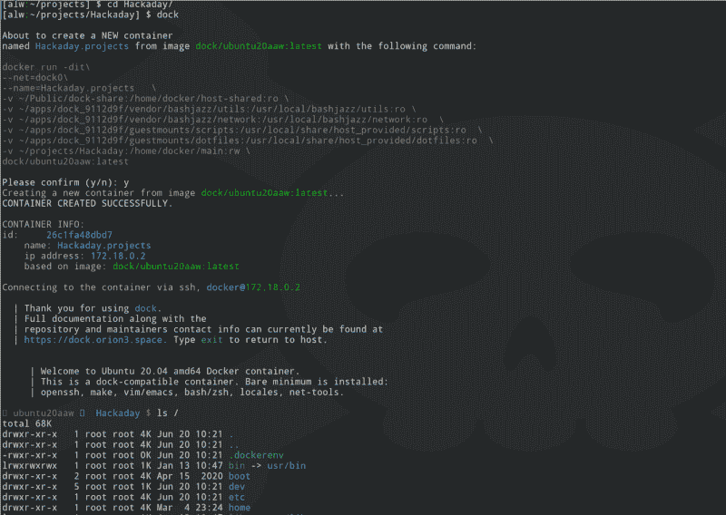

# Linux Fu:对接变得容易

> 原文：<https://hackaday.com/2022/06/21/linux-fu-docking-made-easy/>

大多数计算机操作系统都遭受着某种版本的“DLL 地狱”——一个明显的 Windows 术语，但这个概念适用于所有领域。考虑做嵌入式开发，这通常需要一些专门的工具。你写下你的嵌入式系统代码，把它发送出去，几年后就忘了它。然后，最终用户希望有所改变。糟糕的是你使用的编译器需要一些已经改变的库，所以它不再工作了。哦，设备程序员需要一个旧版本的 USB 库。Python 构建工具使用 Python 2，但是您的系统已经向前发展了。如果您需要的工具不在电脑上，您可能很难找到安装媒体并让它工作。更糟糕的是，如果你甚至没有合适的电脑。

解决这个问题的一个方法是将所有的开发项目封装在一个虚拟机中。然后，您可以保存虚拟机，它包括一个操作系统，所有正确的库，基本上是项目的快照，您可以随时在几乎任何计算机上重新构建。

理论上，这很好，但是需要大量的工作和存储。你需要安装一个操作系统和所有的工具。当然，你可以得到一个设备映像，但是如果你在很多项目上工作，你会有一堆完全相同的东西的副本把事情弄乱。如果你需要更新某些东西，你也需要保持所有的副本都是最新的，当然，这是你可能试图避免的，但有时你必须这样做。

Docker 的重量比虚拟机轻一点。您仍然运行系统的普通内核，但本质上，您可以在内核上即时运行一个虚拟环境。更何况 Docker 只存储事物之间的差异。因此，如果您有一个操作系统的十个副本，您将只存储它一次，加上每个实例的小差异。

缺点是配置起来有点困难。除了其他事情之外，您还需要映射存储和设置网络。我最近遇到了一个名为 Dock 的项目，它试图让常见的情况变得更简单，这样你就可以快速启动一个 docker 实例来做一些工作，而不需要任何真正的配置。我对它做了一些小的改动，然后[分叉了项目](https://github.com/wd5gnr/dock)，但是，现在，原点已经和我的分叉同步了，所以你可以坚持原来的链接。

## 证明文件

[](https://hackaday.com/wp-content/uploads/2022/06/dock-1.png)GitHub 页面上的文档有点稀疏，但是作者有[一页很好的说明和视频](https://dock.orion3.space)。另一方面，非常容易上手。创建一个目录并进入其中(或进入一个现有的目录)。运行“dock ”,你会得到一个以目录命名的快速启动的 Docker 容器。目录本身将安装在容器中，您将有一个到容器的 ssh 连接。

默认情况下，该容器中会有一些不错的工具，但我想要不同的工具。没问题；你可以安装你想要的。您还可以提交一个您喜欢的映像设置，并在配置文件中将其命名为默认值。如果您愿意，也可以在命令行上命名特定的图像文件。这意味着新机器可以有多种设置。例如，您可能会说您希望这个目录有一个为 Linux 开发配置的映像和另一个为 ARM 开发配置的映像。最后，如果您不想将容器绑定到当前目录，您也可以命名它。

## 形象

这需要一些系统知道如何自动安装的特殊 Docker 映像。有针对 Ubuntu、Python、Perl、Ruby、Rust 以及一些网络和数据库开发环境的设置。当然，您可以定制其中的任何一个并将它们提交给一个新的映像，只要您不弄乱该工具所依赖的东西(例如，一个 SSH 服务器)，就可以使用这个新的映像。

如果你想改变默认的图像，你可以在~/.dockrc 中完成。这个文件还包含一个前缀，系统会从容器名中删除这个前缀。这样，名为 Hackaday 的目录不会以名为 Hackaday.alw.home 的容器结束，而只是 Hackaday。例如，因为我的所有工作都在/home/alw/projects 中，所以我应该使用它作为前缀，这样我就不会在每个容器名称中使用 projects 这个词，但是——正如您在附带的截图中所看到的——我没有这样做，所以这个容器最终变成了 Hackaday.projects。

## 选项和别名

您可以在帮助页面上看到可用的选项。您可以选择一个用户，装载附加存储卷，设置一些容器选项，等等。我没有尝试过，但看起来也有一个`$DEFAULT_MOUNT_OPTIONS`变量可以将其他目录添加到所有容器中。

我的 fork 增加了一些额外的选项，这些选项并不是绝对必要的。首先，-h 会给你一个简短的帮助屏幕，而-U 会给你一个较长的帮助屏幕。此外，未知选项会触发帮助消息。我还添加了-I 选项来写出适合添加到您的 shell 配置文件中的源代码行，以获得可选的别名。

这些可选替身对您很有用，但 Dock 不使用它们，所以您不必安装它们。这些函数做一些事情，比如列出 docker 图像或者提交，而不需要记住完整的 Docker 语法。当然，如果您愿意，您仍然可以使用常规的 Docker 命令。

## 试试看！

首先，你需要安装 Docker。通常，默认情况下，只有 root 用户可以使用 Docker。一些设置有一个特殊的组，如果你想用你自己的用户 ID 使用它，你可以加入。如果你愿意，这很容易设置。例如:

```
sudo usermod -aG docker $(whoami)
newgrp docker
sudo systemctl unmask docker.service
sudo systemctl unmask docker.socket
sudo systemctl start docker.service
```

在那里，按照项目页面上的设置进行操作，并确保编辑您的~/。dockrc 文件。你需要确保`DOCK_PATH`、`IGNORED_PREFIX_PATH`和`DEFAULT_IMAGE_NAME`变量设置正确，还有其他事情。

设置完成后，创建一个测试目录，输入`dock`，享受你的新虚拟机。如果您已经设置了别名，使用`dc`显示您拥有的容器。您可以使用`dcs`或`dcr`来关闭或移除一个“虚拟机”如果你想保存当前的容器为图像，尝试`dcom`提交容器。

有时候想以 root 身份进入假机。假设您安装了别名，您可以使用`dock-r`作为`dock -u root`的简写。

很难想象这有多容易。因为整个事情是作为 Bash 脚本编写的，所以很容易添加选项(像我一样)。看起来很容易调整现有的 Docker 图像，使其与 Dock 兼容。不要忘记，您可以提交一个容器，将其用作未来容器的模板。

如果你想了解更多关于 Docker 的背景，本·詹姆斯有一篇很好的报道。你甚至可以使用 Docker 来[简化逆向计算](https://hackaday.com/2022/06/19/your-own-ibm-mainframe-or-vax-or-cray-the-easy-way/)。