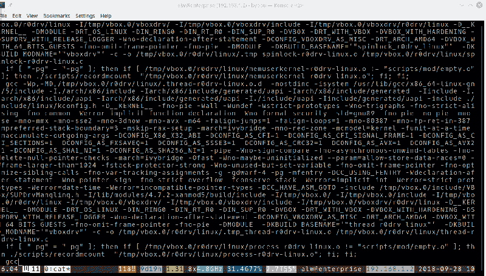
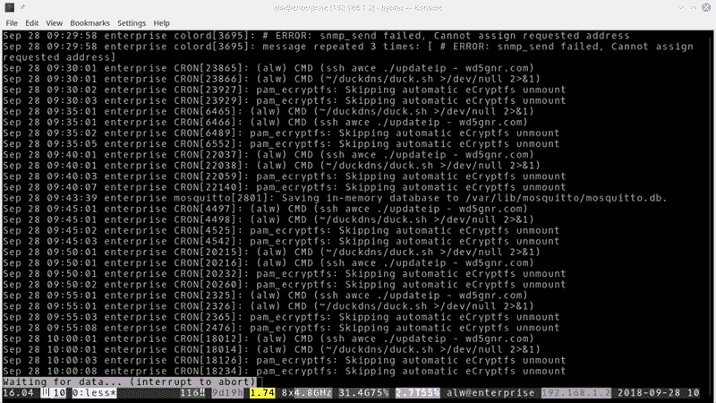

# Linux Fu:留意那个文件

> 原文：<https://hackaday.com/2018/10/04/linux-fu-keep-an-eye-on-that-file/>

与许多其他操作系统相比，Linux 或 Unix 的一个优点是 Linux 程序很有可能将信息性消息输出到某个日志中。许多命令甚至有办法打开更多的日志。我知道 Windows 有事件查看器，但许多程序没有太多要说的，这使得当事情出错时很难知道发生了什么。

问题是，有时候程序告诉你太多信息。你如何找到你想知道的东西？在电影中，黑客在终端前每秒滚动 500 行日志文件，这看起来很酷，但在现实生活中，很难阅读移动的屏幕，尽管通过一些练习，你有时可以——不可靠地——在关键字呼啸而过时挑出它。

像大多数 Unix 事物一样，有一个工具可以做到这一点。事实上，毫不奇怪，有很多工具可以做到这一点。如果你正在使用`tail`命令，那肯定是其中之一。但是你应该考虑其他人。

作为一个例子，考虑所有日志的母亲:`/var/log/syslog`。使用`cat`或`less`转储那个(我在我的系统上总是别名`more`来使用`less`，所以如果你听到我说`more`，我真的是指`less`)。它可能很大，而且还在增长。在普通的桌面系统上，它通常是相当安静的，但是在一些旧的系统或服务器上，你可能会看到它有很多活动。但是不管怎样，除非你刚开机，否则你可能有好几页的信息在里面。

[](https://hackaday.com/wp-content/uploads/2018/09/out2.gif)

找到已经存在的信息很容易。使用`grep`或将副本加载到您最喜欢的编辑器中。问题是新的信息。将 USB 设备插入(或拔出)您的系统。您将会看到，这可能会向您的 syslog 文件添加一条消息。如果你一直收到几十条这样的信息，你会怎么做？

它也不仅仅是 syslog。长时间编译后的清单文件可能很有意思。RAID 驱动器重建后的状态。总有一些越来越大的文件需要阅读。

## 尾端

传统的方法是使用`tail`命令。它获取一个大文件，并从文件末尾返回“一些”。您可以添加-f 选项，让命令等待更多数据并输出。非常适合不断增长的文件。F 选项非常相似，但是如果它不能打开文件，它将继续尝试。您可以控制显示多少行(-m)或多少字节(-c)。s 选项允许您选择检查文件是否更改的频率。

很好，对吧？试试这个:

```
tail -f /var/log/syslog
```

你会在日志的末尾看到几行，现在当你插入或拔出 USB 设备时，你几乎马上就能看到，而不需要重新发出命令。

你可能以前做过这个。它工作良好，是一个非常常见的习语。但是有一些其他的方法你可能没有用到。

## 少即是多

`less`命令有一个选项+F，可以很好地替代`tail`。事实上，如果你用下面的命令行试一下，你可能会奇怪为什么它和`tail`有什么不同:

```
less +F /var/log/syslog
```

在我的系统上看起来是这样的:

[](https://hackaday.com/wp-content/uploads/2018/09/ss1.png)

看到最后是怎么写的“等待数据…”？现在它的行为几乎和`tail.`一样，但是如果你按下^C，有趣的事情就会发生。嗯……也许会发生一些事情。如果`less`进入命令模式，试着按下^C.，你就没事了。现在你可以用`less`做你平时看东西时会做的所有事情。但是如果您退出`less`，那么您的 Linux 发行版会通过使用`LESS`环境变量设置一些缺省选项来帮助您。试试这个:

```
set | grep LESS
```

如果你看到一个包含`--quit-on-intr`的选项字符串，那就是你的问题了。它必须消失。然后您可以使用^C.切换回命令模式，这意味着您需要记住使用 q 命令来退出`less`。如果你退出这个模式，并想回到刚才按下 f。

如果你处于正常的`less`模式(也就是说，你没有使用+F 来开始)，你可以按 F 来启动这个“尾巴模式”。更有趣的是，你可以搜索一些东西，按下 ESC-F 键，当你的搜索与进来的东西匹配时，模式将停止，并发出铃声。

您还可以添加`--follow-name`来获得与`tail`的-F 选项相同的行为。

## 注意

有时，您想要查看的文件并没有添加新数据，而是经常发生变化。例如，考虑`/proc/loadavg`或许多其他的`/proc`条目。在这些上使用`tail`或`less`不是很令人满意。然而，有了`watch`的命令:

```
watch -n 5 cat /proc/loadavg
```

[](https://hackaday.com/wp-content/uploads/2018/09/ss11.png) 这将每 5 秒对文件执行一次`cat`命令，并很好地显示结果，如您所见。有很多好的选项，比如-d 突出显示差异，或者-p 使用高分辨率计时器。-c 选项使事物与颜色一起工作。

## 你的编辑

你的编辑器可能有一个尾巴模式。对于`emacs`，有几种方法可以做到这一点，而不是告诉你，我会给你指出[一个伟大的写](https://writequit.org/articles/working-with-logs-in-emacs.html)。我不是 vim 专家，但是看起来你需要[一个插件](https://www.vim.org/scripts/script.php?script_id=1714)来做同样的事情。如果有更好的方法，我相信我们会在评论中听到。

如果你是一个铁杆日志阅读者，你可能需要一个像[、 inav lnav](https://github.com/tstack/lnav) 这样专门用来查看日志的工具。KDE 和 Gnome 都有专门的日志查看器。

## 包裹

像往常一样，在 Linux 或 Unix 中，有许多方法可以做任何事情。哪一个是“最好的？”每个人都有自己的看法，这也是为什么它对高级用户来说是一个有吸引力的操作系统。你可以选择最适合你的。

如果您在桌面上、服务器上或 Raspberry Pi 上使用 Linux，那么您的工具箱中会需要一些命令。一定要看看所有的 Linux Fu 帖子(见下文),以了解我们过去讨论过的其他工具。