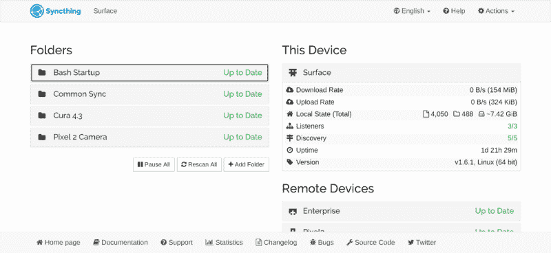
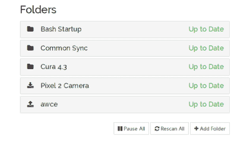

# Linux Fu:保持同步

> 原文：<https://hackaday.com/2020/07/23/linux-fu-keep-in-sync/>

曾几何时，计算机非常昂贵，你很幸运可以共享一台计算机。虽然这似乎是一个问题，但它确实有一个很大的优势:你所有的文件都在那台电脑上。

今天，我们可能都至少有一台台式机和一台笔记本电脑。从大多数标准来看，你的手机可能是一台相当不错的电脑。你可能有多台电脑和一些平板电脑。那么，您如何保持您的文件随处可访问呢？为什么不运行自己的点对点同步服务呢？您的文件始终在您的控制之下，并在移动中加密。没有失败的中心点。你可以用一个非常精巧的开源软件来做这件事，这个软件叫做 [syncthing](https://syncthing.net/) 。它可以在 Windows、Linux、Mac、BSD 和 Solaris 上运行。还有安卓客户端。我们还没有测试它，但有一个警告是，非官方的 iOS 支持听起来有点参差不齐。

关于云的笑话——它只是别人的服务器——就在这里。有些人不喜欢他们的文件放在第三方服务器上。即使你的文件被加密或者你不在乎，你仍然会遇到这样的问题:如果你无法到达服务器(可能是在没有 WiFi 的飞机上)，或者服务器出现故障，会发生什么情况。当然，谷歌和微软并不经常销声匿迹，但他们可以也确实这样做了。即使你建立了自己的云，它也运行在你的服务器上。Syncthing 是无服务器的:它只是确保所有终端设备上的所有文件都是最新的。

## 输入 Syncthing

Syncthing 是用 Go 编写的——这不是你所关心的——它可以通过许多选项在许多设备之间有效地同步目录。最简单的设置是同步所有机器上一个文件夹中的所有文件，没有版本控制。但是有几种版本控制可供选择，您也可以创建只发布更改或更改不会传播到其他设备的文件夹。默认情况下，数据在同步时会被加密，也可以选择压缩。此外，当您添加设备时，块交换协议会提高效率——可以将其视为设备之间的私有 BitTorrent。

## 设置

设置 Syncthing 很容易。对于 Debian 类型的 Linux，您可以按照他们的说明添加一个存储库，并使用`apt`进行安装。其他操作系统还有其他选项。安装的唯一缺点是它没有将 Syncthing 设置为服务，而这可能是您想要的。

他们确实在 [GitHub](https://github.com/syncthing/syncthing/tree/main/etc) 上提供了如何做到这一点的例子。在我的例子中，我必须使用`linux-systemd`文件并将它们放在我的`/etc/system.d/system`目录中。文件 syncthing@。service 表示服务将代表用户运行。您可以像这样启用该服务:

`systemctl --user enable syncthing.service`

这个程序在穿越 NAT 和防火墙方面做得很好，所以我不需要设置任何东西。说到安装，运行安装程序的默认方法是在本地主机上打开一个 web 浏览器。默认情况下，您必须在本地机器上才能访问网页，但是如果您想要远程配置系统，您可以更改这一点。您也可以使用一个`ssh`隧道在本地机器上弹出。有一些第三方 GUI 和程序可以通过它的 API 控制 syncthing。

## 耦合设备

设备必须相互了解。该程序会生成一个长 ID 或二维码，你可以用它在一台机器上设置另一台机器。您确实需要在两端都这样做—也就是说，您必须将计算机 B 的代码提供给计算机 A，并将计算机 A 的代码提供给计算机 B。当您接受另一台计算机进入您的设备列表时，您可以将其标记为“介绍者”。这将把他们知道并信任的所有计算机也添加到您的列表中。

这种方案意味着您需要对两台计算机进行某种访问，这对安全性来说是一件好事。但是，如果您在一个无头服务器上设置，您可能需要使用一个`ssh`隧道。我是这样做的:

`ssh -L 9876:localhost:8384 my-remote-host`

现在，一个指向端口 9876 上的本地主机的浏览器将出现在远程服务器上的 syncthing 管理端口(8384)上。我没有在本地使用 8384，因为，当然，我已经在那里运行 syncthing 了。

## 共享文件夹

创建文件夹时，您可以给它一个显示名称和位置。这些在每台机器上可能不同，也可能相同。将它们联系在一起的是文件夹 ID。两台计算机之间共享的具有相同 ID 的任何文件夹都将同步。因此，例如，您可以让您的本地`~/Documents`目录与名为 Desktop-Backups 的服务器目录同步。

设置文件夹时，您可以打开版本控制。当远程计算机对文件进行更改时，它会保留文件的版本。它不为本地更改制作版本。版本控制有几个选项。垃圾桶模型只保留旧文件的一个副本。简单版本控制保留可配置数量的带有时间戳的旧副本。还有其他几种选择，但这些是最简单的。

另一个功能允许您设置文件夹，只发送更改到远程计算机或只接收它们。当然，默认情况下，文件夹会发送和接收更改。例如，您可能有一组主要的配置文件，您只想在本地进行更改，但您希望其他计算机也能进行这些更改:将文件夹设置为“仅发送”。您会注意到文件夹图标会根据您的选择而变化，包括一个根据您的选择向上或向下的箭头。

## 要同步什么

一旦你设置好了，开始同步目录是很容易上瘾的。当然，图片和其他文件是显而易见的。但是 3D 打印机配置呢？或者甚至是您的系统启动脚本。诚然，该系统不一定是备份的最佳解决方案，但您也可以这样使用它。

当我们向人们提到 Syncthing 时，他们通常会回答说他们会使用 OwnCloud 或 NextCloud。当然，各有各的优势。虽然设置您的私有云使您能够安装应用程序，但您现在依赖于中央服务器，即使它是您自己的。

说到启动脚本，我写了一些东西来做这件事，它使用 Git 来同步和版本控制你的 bash 启动。该系统将与 syncthing 而不是 Git 一起很好地工作。如果你对这些感兴趣，你可能也想看看 [chezmoi](https://hackaday.com/2019/01/10/linux-fu-the-kitchen-sync/) 。