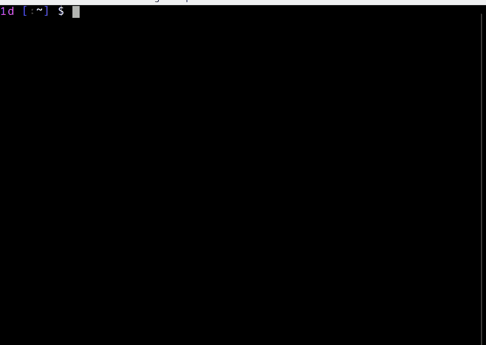

# Marker 是一个命令行菜单

> 原文：<https://hackaday.com/2018/10/24/linux-fu-marker-is-a-command-line-menu/>

命令行。你要么喜欢它，要么讨厌它，但是如果你用类似 Unix 的系统做任何事情，你最终将不得不使用它。你可能会发现[标记](https://github.com/pindexis/marker)——一个被宣传为“终端命令面板”的系统——一个安装起来很有用的程序。我们不能确定它是像类固醇上的命令历史还是更多的书签系统。在某种程度上，两者都有一点。

您的历史最终会消失，并且还包含许多小命令(尽管您可以使用 HISTIGNORE 变量来忽略特定的命令)。使用标记，您可以保存特定的命令，并且它们会一直保存。没有额外的命令，您保存的命令也不会自动执行。

当然，如果只是这样的话，您也可以创建一个 shell 脚本或别名。标记允许您向命令添加描述，然后您可以使用模糊增量搜索来搜索命令和描述。此外，您可以在命令行中放置易于替换的占位符。有一些内置命令可以帮助您入门，如果您同时使用 bash 和 zsh，同样的书签也可以工作。

## 安装标记

Marker 是一个独立的项目，可以从它的 Github repo 安装。安装很容易，不需要根。然而，您仍然需要在您的 shell 初始化文件中添加一行，尽管它会在安装之后给出一些说明。但是，由于默认的键绑定可能不适合您，您可能想先手动地获取它，直到您满意为止。然后对初始化文件进行修改。换句话说，您可能希望在发出最后两个命令之前等待。

```
git clone --depth=1 https://github.com/pindexis/marker ~/.marker &amp;&amp; ~/.marker/install.py
cp ~/.bashrc ~/.bashrc_backup
echo '[[ -s &quot;$HOME/.local/share/marker/marker.sh&quot; ]] &amp;&amp; source &quot;$HOME/.local/share/marker/marker.sh&quot;' &gt;&gt; ~/.bashrc

```

根据您的 Linux 发行版，可能有一个您也需要解决的问题。如果输入命令的一部分并按 CTRL-Space 键会抛出错误`bash: bash_execute_unix_command: cannot find keymap for command`,那么你遇到了一个已知的 bug。根据[这些指令](https://github.com/pindexis/marker/issues/45#issuecomment-363795526)通过编辑`~/.marker/bin/marker.sh`解决了。事实上，许多键绑定在某些系统上可能会有问题。更简单的方法是在 shell 中发出“source”命令来激活该 shell 的 marker，直到您确定想要一直使用它:

```
source ~/.local/share/marker/marker.sh
```

然后，如果你卡住了，你可以退出那个外壳，打开另一个来恢复。一旦你对你的设置感到满意，你可以按照说明对你的. bashrc 进行修改。bashrc_backup 到。如果你按照上面的指示。

## 如何使用记号笔

用马克笔来搜索你的命令历史。如果你习惯使用 CTRL-R 进行反向搜索，你会发现这很方便。默认情况下，您可以键入命令的一部分，然后按 CTRL-Space 来搜索命令。不用重复击键，一次只看到一行(像反向搜索一样)，你会得到一个漂亮的彩色编码列表供你选择！

当重用命令时，您通常需要回溯到输入和输出文件并根据需要进行更改，Marker 将允许您使用 CTRL-T 来完成此操作。每次按下它时，光标都会移动到下一个占位符(显示在双花括号中),自动移除占位符，以便您可以开始键入。

您还可以编写自己的命令和占位符，并使用 CTRL-K 将它们标记为书签。这就是 Marker 比反向搜索更强大的地方。

[](https://hackaday.com/wp-content/uploads/2018/10/markerdemo.gif)

您可以在上面看到一个演示，展示了占位符(如示例中的{{url}})方案是如何工作的。默认情况下，这些键是 Control+Space、Control+K 和 Control+T，但是这些键会干扰系统上的其他绑定，所以我在脚本中将它们更改为 Alt-。、Alt-M 和 Alt-P(稍后将详细介绍)。您也可以通过在编写脚本~/之前设置环境变量来覆盖它们。marker/marker.sh。

## 问题

您可以使用标记命令而不是击键来控制一切。然而，有时很难挑选物品。例如，我从来没有得到“标记更新”命令的工作。您可以使用“移除标记”来移除命令

我发现的唯一重大问题是有许多内置规则，其中许多是我不会使用的规则。然而，没有简单的方法删除它们。我确信我可以找到他们在代码中的位置，然后用核武器摧毁他们，当然，但是如果你可以像删除你自己的规则一样删除他们，那就更好了。

这里有一个提示:代码加载文件~/。marker/tldr/common.txt 和另一个特定于操作系统的文件(例如 linux.txt)。通过编辑这些文件，您可以很容易地改变默认规则。更好的是，想复制什么就复制什么~/。local/share/marker/user _ commands . txt，然后将旧文件移开，这样您想要的默认文件就在那里了，您可以更改或删除它们。

我之前提到过，击键设置对于使用 emacs 风格的按键绑定的用户来说并不好。没有太多的文档，但是在 marker.sh 的顶部，脚本从环境中设置了三个键并提供了默认值。我就是在那里换的捆绑。显然，您也可以设置环境变量。下面是有问题的代码(包含我的更改):

```
# default key bindings
marker_key_mark="${MARKER_KEY_MARK:-\em}"
marker_key_get="${MARKER_KEY_GET:-\e.}"
marker_key_next_placeholder="${MARKER_KEY_NEXT_PLACEHOLDER:-\ep}"
```

键名是 bind 需要的，这在一般情况下很少被记录。最简单的方法是做一个“bind -P ”,看看其他键是如何工作的。一般来说，您可以使用控制键，如\C-t 或带有\e 前缀的键(通常是 Alt ),就像我上面做的那样。关于这个的文档在 bash 手册[的 builtins](https://www.gnu.org/software/bash/manual/html_node/Bash-Builtins.html) 下面。

## 在实践中

如果您不经常使用 shell 或者您需要处理非常复杂的命令行，这可能会很有用。我们在 Linux Fu 的早期文章中介绍了一些其他的增强功能。顺便说一下，如果您在 bash 启动时添加了很多东西，并且有多台计算机，您可能会喜欢我的解决方案，使用 [Git 来管理和复制您的 bash 文件](https://hackaday.com/2017/05/23/stupid-git-tricks/)。