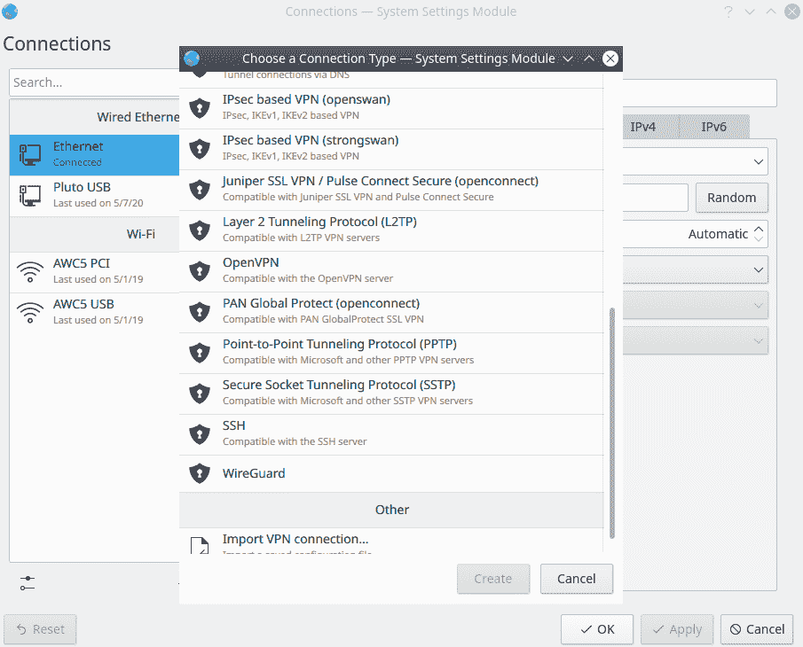
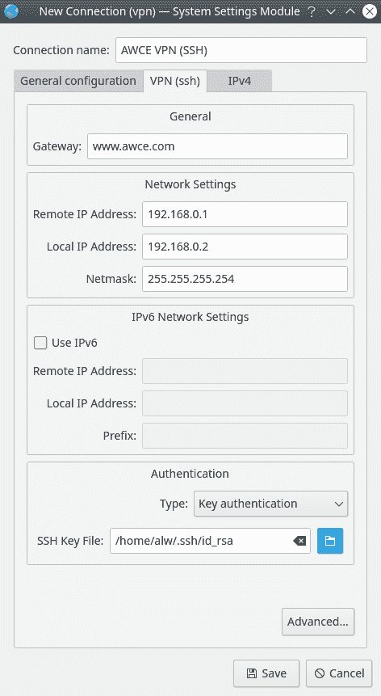

# Linux Fu:带 SSH 的免费 VPN

> 原文：<https://hackaday.com/2020/11/23/linux-fu-vpn-for-free-with-ssh/>

如果你在某些网站上看到很多横幅广告，你就知道如果没有虚拟专用网(VPN)，黑客会迅速蹂躏你的电脑，烧毁你的房子。嗯，这似乎是他们的意思。然而，实际上，您可能需要 VPN 连接有两个主要原因。当然，你可以付费使用某项服务，但是如果你可以通过 ssh 访问公共互联网上的某台电脑，你就可以免费建立自己的 VPN 服务。

基本的想法是，你连接到另一个网络上的远程计算机，它使它看起来像你所有的网络流量是本地的网络。第一种情况是回避或增强安全性。例如，您可能希望打印到网络打印机，而不将该打印机暴露给公共 Internet。当你在咖啡店时，你可以通过 VPN 连接到你的网络并打印，就像你离办公桌上的打印机只有一米远一样。你在店铺 WiFi 上的流量也会被加密。

第二个原因是隐藏你的位置，以免被人窥探。例如，如果你喜欢看英国广播公司的视频，但你住在厄瓜多尔，你可能想虚拟专用网络在英国的网络，使视频不被封锁。如果你的地方当局监控和审查你的互联网，你可能也希望你的流量来自其他地方。

对 VPN 使用 SSH 对这两种情况都适用，尽管如果您对第一种情况感兴趣，您可能会更乐意使用专用路由器或专用于该任务的小型计算机，如 Raspberry Pi。然而，如果你在某个地方租赁服务器，这个选项就不适合你了。

## 先决条件

[](https://hackaday.com/wp-content/uploads/2020/10/map-1.jpg) 你真的只需要超级用户访问机器和远程机器上的 SSH 服务器以及 SSH 客户端。双方都需要一些配置。我使用 KDE，所以我使用网络管理器来设置，虽然这不是必要的。这只会让事情变得更简单。

服务器需要设置一些特殊的项目，但这些项目可能已经存在。在`/etc/ssh/sshd_config`中，你会想要`PermitTunnel=yes`，你可能也需要将`AllowTCPForwarding`设置为是。防火墙可能也需要一些调整。[网络管理器插件](https://github.com/danfruehauf/NetworkManager-ssh)的安装说明会很有用，即使你不想使用它。

## 客户端

如果您使用的是 NetworkManager，您将需要该插件。对于 Neon 和其他 Debian 类型的发行版，您可以找到`network-manager-ssh`包，这就是您所需要的。如果不想用，可以用插件作者[博客](https://bashinglinux.wordpress.com/2013/03/23/networkmanager-ssh/)里的这句话:

```

ssh -f -v -o Tunnel=point-to-point -o ServerAliveInterval=10 -o TCPKeepAlive=yes -w 100:100 root@YOUR_SSH_SERVER \
'/sbin/ifconfig tun100 172.16.40.1 netmask 255.255.255.252 pointopoint 172.16.40.2' && \
/sbin/ifconfig tun100 172.16.40.2 netmask 255.255.255.252 pointopoint 172.16.40.1

```

您需要在两端都是 root 用户，因为您正在创建一个隧道设备。这导致了一些问题，即使您使用了插件。显然，你不希望 SSH 打扰你的密码和主机密钥验证，但如果你手动建立 VPN，你可以处理。

## 问题

然而，大多数现代系统不允许带密码的 root 登录，甚至根本不允许。所以你需要先解决这个问题。此外，当网络管理器运行 SSH 时，它将寻找主机密钥和 root 等，而不是作为您的用户。如果它找不到东西，它只会死去。因此，您需要确保 root 用户可以在没有干预的情况下登录。

要允许 root 登录到服务器，您需要编辑`/etc/ssh/sshd_config`并将`PermitRootLogin`更改为 yes。我建议你这样做的时间只够完成接下来的几个步骤。您需要重启`sshd`服务器，这意味着:

```
systemctl restart sshd
```

或者

```
/etc/init.d/ssh restart
```

然后，在本地机器上以普通用户身份登录，使用`ssh-copy-id`将您的证书安装到主机上。一旦成功，你应该返回并把`/etc/ssh/sshd_config`改为使用`PermitRootLogin prohibit-password`这样，您可以使用证书而不是密码作为 root 用户登录。

如果您已经从 root 帐户登录过一次，SSH 可能会询问您是否要接受服务器密钥。如果没有，这将是一个问题。如果可以，登录并回答“是”,这样它就不会再问了。不过，如果不行，我们也可以关掉`StrictHostKeyChecking`。

理论上，您可以将额外的 ssh 选项传递给 NetworkManager 插件，但是由于某种原因，这在存储库中的版本上不起作用。如果是手动启动，当然可以添加自己想要的。但是，也可以在`/root/.ssh/config`设置 root 的 SSH 配置，或者在`/etc/ssh/ssh_config`设置全局配置。

如果你确实改变了全局，考虑使用`/etc/ssh/ssh_config.d`，如果你的系统支持的话。这让你可以为一个特定的主机放入在系统升级时不会被改写的代码片段。例如，您可以在这个目录中创建一个名为`hackaday.conf`的文件:

```

Host *.hackaday.com hackaday.com
StrictHostKeyChecking no
Tunnel yes

```

同样，如果您反对主机密钥检查，那么只需从您的 root 帐户登录一次，并手动接受远程密钥。或者，如果你够勇敢，手动编辑`/root/.ssh/known_hosts`。

## 成功

应该可以了。如果您使用的是 NetworkManager 插件，只需建立一个新的连接。从那里，选择 VPN 连接部分并选择 SSH。

[](https://hackaday.com/wp-content/uploads/2020/10/vpn0.png)

您必须输入一些参数，包括您想要用来登录远程机器的证书:

[](https://hackaday.com/wp-content/uploads/2020/10/vpn1.png)

保存连接后，您可以像激活任何其他网络接口一样激活它。如果你想看看它是否有效，向一个网站要一个你的 IP 地址。然后激活 VPN 再来一遍。如果您在连接 VPN 时遇到问题，您可以查看系统日志，找出 SSH 抛出的错误。

## 当然…

还有其他的 VPN 解决方案。然而，由于几乎可以肯定您的远程计算机上有一个 SSH 服务器，所以设置起来非常简单，几乎不需要什么计划。

如果你知道诀窍的话，你可以用 SSH 做很多事情。我们特别喜欢用它来[挂载文件](https://hackaday.com/2020/09/21/linux-fu-simple-ssh-file-sharing/)。