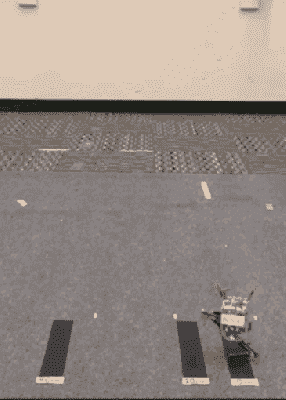

# 小跳跃机器人现在可以完美着陆了

> 原文：<https://hackaday.com/2020/08/02/little-jumping-bot-can-now-stick-the-perfect-landing/>

对于一个人类体操运动员来说，坚持完美的落地可能需要多年的练习，对于小型单脚跳跃机器人来说似乎也是如此。Salto-1P 是 Hackaday 上的一个老熟人，他总是需要不停地跳跃才能保持直立。通过一些巧妙的控制软件改进，它现在可以可靠地降落在硬币大小的区域，然后停留在那里。(休息后的视频)

来自加州大学伯克利分校仿生学实验室的贾斯汀·伊姆在过去的四年里一直致力于 Salto 的研究，我们之前已经[报道过](https://hackaday.com/2019/05/25/one-legged-robot-does-the-hop/)它[两次](https://hackaday.com/2018/10/09/one-legged-jumping-robot-shows-that-control-is-everything/)。姿态控制由一组用于滚动和偏航的螺旋桨推进器和一个用于俯仰的反作用轮来控制。虽然它之前已经令人印象深刻，但它有一个大约餐盘大小的可预测的着陆区域。

完美着陆的诀窍是结合着陆角度、角速度和角动量。Salto 只能校正 2.3°的着陆角度误差，因为当出现问题时，它没有第二只脚来抓住自己。理想情况下，机器人的角速度和动量在起飞时应该尽可能接近 0，这使得反作用轮在飞行和着陆时具有最大的控制权限。基本上，一次成功的起飞直接影响着一次成功着陆的机会。[Justin]在[项目的演示视频中出色地解释了这一切以及更多内容。](https://www.youtube.com/watch?v=wL_3EWDHA6M)

你可能会问，Salto 的实际应用是什么？[搜救](https://xkcd.com/2128/)当然。

成功地控制一个像 Salto 这样的机器人完全取决于控制理论。如果你想更多地了解这个领域，你可以查看一些关于基础知识的在线讲座，或者尝试一下 T2 的自动平衡机器人。

感谢[Qes]的提示！

 [https://www.youtube.com/embed/_EhVY65e7W0?version=3&rel=1&showsearch=0&showinfo=1&iv_load_policy=1&fs=1&hl=en-US&autohide=2&wmode=transparent](https://www.youtube.com/embed/_EhVY65e7W0?version=3&rel=1&showsearch=0&showinfo=1&iv_load_policy=1&fs=1&hl=en-US&autohide=2&wmode=transparent)

