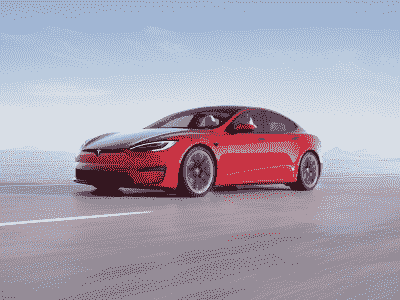
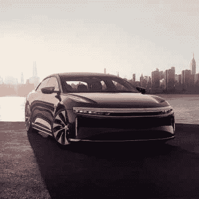
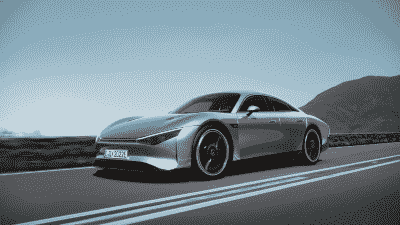
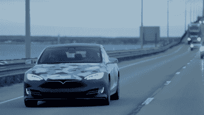

# 远程电动汽车即将问世

> 原文：<https://hackaday.com/2022/01/19/longer-range-evs-are-on-the-horizon/>

十多年前，当电动汽车首次成为主流时，大多数批评都集中在有限的续航里程和充电时间上。自那以后，汽车制造商一直在削减，在这里提高效率，在那里增加产能，年复一年地慢慢推高数字。

现在市场上的车型提供的充电间隔超过 400 英里，但潜伏在地平线上的是更大范围的汽车。这项技术处于一个临界点，电动汽车充电后的行驶里程将轻松超过普通司机一天的合理行驶里程。让我们探索一下即将发生的事情。

## 更进一步…

The longest-range version of the Tesla Model S has an EPA-rated range of 402 miles. Something as simple as choosing a different wheel size can cut that by tens of miles, however. Credit: Tesla

市场上最新的电动汽车比以往任何时候都有更多的范围。在 EPA 范围测试中，最新的特斯拉 Model S 可以达到 402 英里，而尖端的梅赛德斯 EQS450+在相同的测试制度下可以达到 350 英里。这些长腿汽车装有电池，容量分别为 100 千瓦时和 107.8 千瓦时，工作电压分别为 450 伏和 400 伏。

这两款车是目前可获得的最长距离的主流电动车。在合适的条件下，两者都能够在 20 分钟内快速充电 200 英里。以每小时 75 英里的连续平均速度驾驶，这两款车都可以轻松应对一天八小时的驾驶，只需短暂停下来充电。有趣的是，私人测试显示梅赛德斯本身能够远远超过其 EPA 测试结果，埃德蒙兹发现它是有史以来测试过的最长里程的汽车，一次充电在现实世界中行驶了 422 英里[。](https://www.edmunds.com/car-news/tested-2022-mercedes-benz-eqs-beats-epa-range-by-72-miles.html)

尽管如此，令人厌烦的少数人继续抗议电动汽车根本无法进行长途旅行。随着高档车的行驶里程已经达到 400 英里以上，以及各种能够行驶 300 英里或更远的较低型号，这正成为一个越来越难以防守的阵地。

然而，新车只会通过再次张贴更大的数字来进一步摧毁这一论点。准备好登场的主要例子是 Lucid Air，这是电动汽车初创公司 Lucid Motors 的首款汽车。在其最长的范围内，梦想版模型达到了环保局额定 520 英里的范围。该公司刚刚开始向客户交付汽车，但空运的范围已经远远超过了其竞争对手。

The futuristic-looking Lucid Air Dream Edition stole Tesla’s crown of having the longest-range EV on the market. Customer deliveries are currently at a trickle as the company ramps up production, however. Credit: Lucid

这个巨大的数字不是简单地使用更大的电池就能实现的；Lucid Air 的特点是只比竞争对手的 113 千瓦时大一点点。由于续航里程是电动汽车的主要卖点，Lucid 对他们如何实现这一数字有点谨慎，大多数汽车报道都将结果归结于对“效率”的关注然而，有一个数字确实很突出，那就是 Lucid Air 依赖于 924 伏电池架构的事实。

在更高的电压下运行可以带来显著的优势。对于系统中相同的给定功率，电压越高，电流越低。导体中的电阻损耗与电流的平方成正比，这些损耗随着电压的增加而降低，这意味着效率的提高。。

更低的损耗意味着更大的行驶里程。充电也有好处；为对高温敏感的电池充电时，降低电阻损耗产生的热量非常重要。Lucid 声称，当连接到 300 千瓦或更大的合适的 DC 快速充电器时，Air 可以在 20 分钟内添加 300 英里的电荷。

这标志着 Lucid 对其目标的承诺；早在 2019 年，Lucid 的首席技术官彼得·罗林森(Peter Rawlinson)指出，该公司的目标是推动电动汽车的效率达到新的水平，而不是简单地依赖越来越大的电池。就空气动力学而言，Lucid Air 的阻力系数仅为 0.21，令人震惊。总的来说，Lucid 接近了其每千瓦时 5 英里的能效目标，梦想版推出的车型在生产方面达到了 4.6 英里/千瓦时。

## 再进一步…

The Mercedes-Benz EQXX Concept utilizes a sleek, streamlined teardrop shape to help minimise energy lost to drag. Among other measures, this helps it achieve an astounding 620 mile range on a sub-100 kWh battery. Credit; Mercedes-Benz

就未来而言，梅赛德斯也看到了效率优先方法的价值。这家德国汽车制造商最近推出了 EQXX 概念车，声称其原型设计的续航里程为 620 英里，其特点是电池容量低于 100 千瓦时。这是一个超过 6.2 英里/千瓦时的效率，标志着一个重大的飞跃。

梅赛德斯通过从头开始尽一切可能最大限度地扩大里程来实现这一目标。与当今销售的许多高档豪华电动汽车不同，EQXX 概念车避开了四位数的马力数字和多电机设置，采用了相对温和的 201 马力单电机驱动装置。这将使量产车型更难销售，因为市场已经习惯了加速度数据高得离谱的电动汽车。一辆重型电动汽车拖着一个只有 200 马力的大电池前进，将无法与 Lucid Air 或特斯拉 Model S Plaid edition 等汽车竞争，这可能会让买家感到冷淡。

阻力系数跃升至一个比清新空气更荒谬的数字，达到令人震惊的 Cd 值 0.17。这也是一款小型车，与 EQS 公路车相比，占用的空间更小，更接近紧凑型轿车的尺寸。屋顶上的太阳能电池板甚至被压入服务中，帮助为 HVAC 和信息娱乐系统供电，据报道，在特别阳光明媚的日子里，它可以将 EQS 的续航里程增加 15 英里。

 [https://www.youtube.com/embed/fWj2YCdoc9A?version=3&rel=1&showsearch=0&showinfo=1&iv_load_policy=1&fs=1&hl=en-US&autohide=2&wmode=transparent](https://www.youtube.com/embed/fWj2YCdoc9A?version=3&rel=1&showsearch=0&showinfo=1&iv_load_policy=1&fs=1&hl=en-US&autohide=2&wmode=transparent)

Startup Our Next Energy (ONE) managed a 752-mile drive with a modified Tesla Model S, thanks to a high-capacity 203.7 kWH battery pack of its own design. Credit: YouTube/Our Next Energy

尽管 Lucid 和 Mercedes 希望通过他们高度重视效率的方法来实现，但是，一些人认为更简单的方法才是更好的方法。一家名为[的初创公司已经做到了这一点](https://www.motortrend.com/news/one-gemini-battery-tesla-model-s-range-test/)，为特斯拉 Model S 配备了自己设计的电池，容量惊人地达到 203.7 千瓦时。刚刚超过 Model S 电池标准容量的两倍，这家初创公司能够在自己设计的长途驾驶测试中实现 752 英里的里程。

该项目基本上完全忽略了效率的提高。在这方面，没有对特斯拉进行任何改装，该系统在技术上整体效率较低，仅行驶 3.69 英里/千瓦时，而在 EPA 测试中，原型车的行驶里程为 4.02 英里/千瓦时。令人震惊的是，该团队如何能够在与原电池组相同的空间内安装两倍容量的电池组，这标志着能量密度的巨大增加。据报道，该团队也能够在没有太多体重损失的情况下做到这一点。一包显然不需要主动冷却在其驱动测试(虽然运行在寒冷的天气)。据报道，人们希望推向市场的量产电池称为“Gemini”，将依赖于 LiFP(磷酸铁锂)技术，这种技术已经在今天的许多电动汽车上使用，量产样品应该在 2023 年左右可用。

## 神秘收益

尽管这些车辆能力强大，但最令人沮丧的部分可能是，用于实现这些壮举的工程对公众来说仍然有点不透明。只有当这些汽车开始大量上市，并被好奇的工程团队和个人拆卸时，人们才会清楚这些效率和能量密度的改进是如何实现的。无论是精心准备的电机减少了哪怕是最微小的损失，新的高效半导体，还是更大的举措，如跳跃到更高的电压范围工作，这一切都加在一起。但真正的巨大收益更多的是一个秘密武器，汽车制造商将尽可能长时间地保持竞争优势。

在最好的情况下，当一个汽车制造商想要吹嘘自己的成就时，我们在这里或那里得到一些提示，一些洞察力。特斯拉就是一个很好的例子，该公司在全球最先进的电动汽车电机上进行了大量投资。[该公司此前曾公开与汽车和司机讨论过如何将发动机效率提高 8%至 10 %,从而帮助其将总行驶里程提高 15%至 18%。其他玩家通常不太合作，他们选择谈论更广泛的收益来源，而不是讨论真正的工程细节。特斯拉在这一领域有些特立独行，经常详细介绍其新技术作为营销工具，尽管它倾向于在大事情](https://www.caranddriver.com/news/a34046953/tesla-range-strategy-details/#:~:text=Tesla%20told%20Car%20and%20Driver,by%2015%20to%2018%20percent.)[上市之前就宣布。](https://hackaday.com/2020/10/05/teslas-new-tabless-batteries-unlock-new-levels-of-performance/)

无论如何，无论是通过提高效率、增加能量密度，还是简单地将更多电池塞进汽车，电动汽车的续航里程似乎只会在未来几年继续快速提高。拥有巨大行驶里程的电动汽车就在眼前，我们今天拥有的电动汽车已经发布了一些重要的数据。除了最便宜、续航里程最短的电动汽车，或者电池使用寿命即将结束的电动汽车，里程焦虑可能很快就会成为过去。对于普通电动汽车司机来说，电量耗尽的情况可能会变得越来越少，就像汽油耗尽对于我们这些使用传统冰动力汽车的人来说一样。不管发生什么！