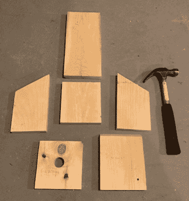

# LoRa 供电的鸟舍可以在互联网瘫痪时实现无线联网

> 原文：<https://hackaday.com/2022/04/09/lora-powered-birdhouses-enable-wireless-networking-when-the-internets-down/>

演变为互联网的网络的设计要求之一是能够保持功能，即使一些节点或链路在战争中被禁用或破坏。仍然驱动着今天的互联网的分组交换架构就是这种情况的直接结果:如果一条链路停止工作，信息会自动重新路由到其预定的目的地。然而，随着科技巨头在全球互联网中占据越来越大的份额，其中一个网站的宕机仍可能造成重大中断。此外，如果多个节点连接到同一个电网，大规模电力中断会使大部分网络瘫痪。

Just six pieces of wood make up the birdhouse.

Wellesley 业余无线电协会的 LoRa Birdhouse 项目解决了这两个问题，尽管规模很小。由马萨诸塞州东部的业余无线电运营商开发，它基本上是一个通用的基于 LoRa 的分组交换网络。由于它是基于开源硬件和普遍可用的组件，其设计允许任何人在自己的区域建立一个类似的网络。

这个网络是由能够从邻居那里接收信息并把它们传递到最终目的地的节点组成的。每个节点包含一个 Semtech SX1276 收发器，工作在 902-928 MHz 频段，从 ESP32 微控制器获取数据。这些节点被放置在室外的战略位置，由太阳能电池板供电，以减少其生态足迹，并确保停电时的恢复能力。为了使整个项目更加环保，每个节点都被建成一个鸟舍，为小鸟提供庇护。

用户可以通过修改后的网络节点访问网络，这些网络节点可以使用 USB 电缆连接到 PC。目前，串行终端程序是与网络交互的唯一方式，尽管正在计划一个更加用户友好的界面。FCC 规则还要求所有用户(除了任何鸟类居民)都是获得许可的业余无线电操作员，并且所有流量都保持不加密。测试表明，在适当的条件下，节点之间一公里的距离可以工作，从而能够在相当大的区域内部署网络。

虽然在核灾难的情况下，Birdhouse 网络可能不是即插即用的互联网替代品，但它确实提供了一个试验分组交换无线网络技术的优秀系统。我们已经看到了类似的基于 LoRa 的网络计划，如 [Qmesh](https://hackaday.com/2021/06/06/qmesh-lora-mesh-networked-voice-communications/) 、 [Cellsol](https://hackaday.com/2020/12/12/irc-over-lora-for-when-things-really-go-south/) 和 [Meshtastic](https://hackaday.com/2020/02/26/lora-mesh-network-with-off-the-shelf-hardware/) ，所有这些都提供了一些无线通信的方式，而不需要任何集中的硬件。