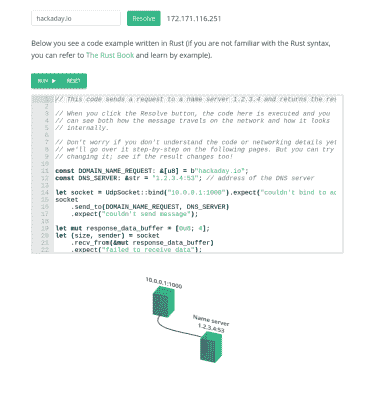

# 低级学院进入细节

> 原文：<https://hackaday.com/2020/10/16/low-level-academy-gets-into-details/>

我们经常说，你不必知道发动机是如何工作来驾驶汽车的，但你可以打赌，印第 500 的每个司机都知道它是如何工作的。你可以对计算机说同样的话。你不需要了解细节，但它真的很有帮助，尤其是在出问题的时候。[低级学院]有一个在线课程，你可以在你的浏览器中用 Rust 编程来学习低级的 TCP 和 UDP 网络细节。

我们还不确定它会跌到多低。八个模块中有三个已经准备就绪。前三个包括数字编码、使用 UDP 交换消息和分段。可靠性、路由、服务器编程、TCP 和 HTTP 还没有出来，但是最终的项目是 web 服务器。此外，新的模块首先发布给赞助商，因此碎片模块等几天后才可用。虽然这看起来不太正统，但这与必须等待 HBO 的节目在基本有线电视上重播没有什么不同。

对于黑客读者来说，数字编码并不是什么新鲜事。它涵盖了像 UTF 8，八进制和十六进制。但是，你应该看看它的交互性。例如，不是仅仅显示一个如何解码一个十六进制数的例子，文本让你改变输入的数字，工作动态地改变以显示值。

同样的技术将您的输入填充到您可以运行或编辑的实时 Rust 代码中。例如，这是我们最喜欢的一个网站的 DNS 查询。

  如果你了解 Rust 或者如果你想学习 Rust，这可能是一个很好的方法，即使你确实了解这个级别的网络。如果你想更多地了解网络是如何工作的，我们不确定这是否是低水平的，但它比许多人去的都低。也许他们将来会有关于 MAC 地址、ARP 和路由协议的系列文章。但即使他们没有，这也值得一看。

如果你足够了解网络在最底层是如何工作的，你就可以根据网络堆栈中的怪癖，探查并找出一台计算机可能使用的是什么操作系统。理解网络基础是[防御网络攻击的关键部分，或者，我们假设，安装一个](https://hackaday.com/2015/01/22/security-problems-with-gas-station-automated-tank-gauges/)。