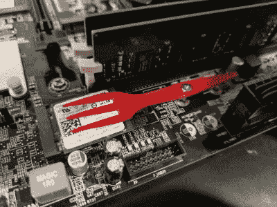
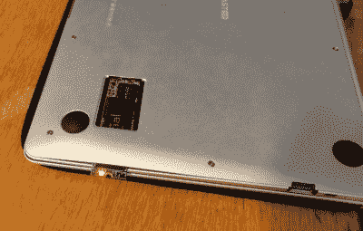
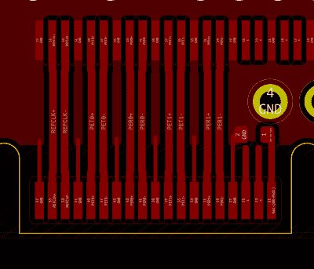

# 黑客的 M.2 卡

> 原文：<https://hackaday.com/2022/11/07/m-2-for-hackers-cards/>

上一次，我已经解释了你想知道的一切，如果你想在你的主板上安装一个 M.2 插座。今天我们来建 M.2 卡！有无数的 M.2 插座在那里，只是要求一个特殊的卡插入其中，也许，这将是你的创造适合。

## 为什么要建卡？

笔记本电脑和其他 x86 主板通常带有 M.2 插槽。你有免费的 B-key 插槽吗？您可以将 RP2040 和一堆传感器放在 B 键 PCB 上，作为一个实验平台，安全地放在您的笔记本电脑中。要不要做一些更高级的 FPGA 实验？这里有一个微型 FPGA 板,可以放在你的笔记本电脑里，让你在这台笔记本电脑上玩 PCIe——整个设置占用空间极小。你正在寻找一个额外的 PCIe 链接，因为你正在[重复使用你的笔记本电脑作为家庭服务器吗？](https://hackaday.com/2017/04/17/broken-yoga-becomes-firewall/)同样，您的 WiFi 插槽将为您提供这一功能。想从蒸汽甲板上来点 PCIe 吗？建一个 M-key 2230 卡似乎是你唯一的希望了！

更简单、不太活跃的设备也有足够的空间。您是否只有一个备用的 M-key 插槽，或者 A 或 E-key 插槽？您可以[用额外的固态硬盘](https://github.com/CRImier/MyKiCad/tree/master/Laptop%20mods/nvme_ae_to_m)替换您的 WiFi 适配器以获得额外的存储空间，或者反过来，将第二张 WiFi 卡[放入您的第二个固态硬盘插槽](https://github.com/CRImier/MyKiCad/blob/master/Laptop%20mods/nvme_bm_to_e/)以满足您所有的驾驶需求！你是不是刚刚在你的主板上发现了一些不用的 SATA 端口痕迹？你可以做我做的事情，创建一个双端口 M.2 卡，它可以从你的电源轨上分离出一个 SSD 插槽，你可以连接额外的 SATA 端口并放入 SATA M.2 SSD。您是否刚刚发现您的芯片组可以在 M-key SSD 插槽上为您提供完整的四个 SATA 端口？你可以做我的朋友做的事情，然后[制作一张卡来打破这些 SATA 端口！](https://github.com/richardg867/m2sata)

即使在 x86 之外，相当多的 ARM SBCs 也会有同样的问题——它们有一个带有特定键(比如 B)的 M.2 插座，不适合您刚买的一些 M.2 扩展器——事实证明，您可以自己制作一个适配器。超出标准怎么办？当然，还有我之前提到的[SparkFun micro mod 生态系统](https://www.sparkfun.com/micromod)。你想开发一个 MicroMod CPU 板，与无数其他设备或你自己的 MicroMod 传感器一起工作吗？[这是一张 M.2 卡。](https://learn.sparkfun.com/tutorials/designing-with-micromod)如果你需要使用 M.2 创建自己的生态系统，也没人会阻止你。

当然，你可以设计完全不同种类的增值卡。例如，你可以通过[设计价格过高的“音频级”固态硬盘](https://twitter.com/eatijr/status/1467443279151124491)来从音响发烧友那里获取现金，固态硬盘上有花哨的电解电容——你不会想让所有的镀金都被低估吧？而且，如果你是一个 SBC 制造商，使用 M.2 插座作为你的扩展槽，当买家说他们想把你的 SBC 用作路由器时，没有人能阻止你设计[一个绝对古怪和巨大的卡](https://www.ebay.de/itm/115277068130)，上面有四个以太网插座。

## 概述卡片

Don’t make your card too short…

M.2 卡为标准尺寸——30 毫米宽 42 毫米高的卡为 3042，22 毫米宽 60 毫米高的卡为 2260；方便的是，这些将是你的 PCB 的确切尺寸。与 mPCIe 卡相反，螺丝槽口居中，通常是一个 M.2 螺丝。你会看到有人说螺丝负责接地连接，其实不然，即使看起来像，插座上的接地引脚就足够了，尽管额外的接地路径往往很好。事实上，也不要求凹口区域暴露铜，它可以只是一个 PCB 切口。

如果为现有设备设计卡，它将是 42 毫米或 80 毫米长。30 毫米在蒸汽甲板和其他低占地面积设备之外很少见，60 毫米超级不起眼。22 毫米是除 WWAN 插槽之外的所有插槽的宽度，这些插槽通常设计为 30 毫米卡宽。当然，并不要求将所有组件都放在卡的一面，这样会使组装更容易。不过请记住，一些设备使用平板或中置插座，底部的高部件可能会成为您意想不到的问题。

M.2 需要 0.8 mm 的 PCB。你不需要 ENIG，但我推荐它。我的理解是，用 HASL 做的焊料涂层会氧化得更快，与卡插座的接触更差——也就是说，我从未尝试过用 HASL。不过，我确信 HASL 可以胜任短期使用的原型。你可能会认为金手指处理是必须的，无论是垫上更厚的金还是卡的斜面边缘——根据我的经验，两者都不是必需的，但更厚的金会增加插拔周期，斜面边缘会使卡更容易插入。我个人一直选择无斜面的普通 ENIG，并且有很好的体验。

…or too long.

当然，在 KiCad 中您会想要一个卡片边缘足迹。我个人一直在使用一个 KiCad m . 2 card edge footprint generator 插件[，这个插件最初是由@STOP-Pi 在 GitHub 上创建的，并由我进行了重构。然而，作者在某个时候删除了他们的 GitHub 帐户，插件不再在 KiCad6 上加载——所有生成的足迹都是在 KiCad5 中完成的。更糟糕的是，在我做出修改和删除之间，他们甚至更新了插件代码——这可能是因为我在删除之前错过了他们的 KiCad 6 兼容性提交。Welp，拉请求最受欢迎！同时，这里有](https://github.com/CRImier/NGFF)[预先生成的 A，B，E，M，A+E 和 B+M 卡边，你已经可以使用，](https://github.com/CRImier/NGFF/tree/master/libs/NGFF.pretty)和【timonsku】也已经[做了一个鹰库](https://github.com/timonsku/M.2-Card-Footprints)，你应该可以很容易地转换成 KiCad。

## 在大纲内部

你可能想知道你是否需要一个四层 PCB，尤其是如果你想做 PCIe，用四层，90 欧姆的阻抗匹配实际上是可以实现的，而 0.8 毫米的接地距离在两层上是不现实的。这是我的经验——我做小型 PCIe 适配器已经有一段时间了，它们在 2 层上工作得很好，这是我的特定[原型工作流的一个要求。](https://twitter.com/FairywrenTech/status/1573249194646966277)通常，M.2 卡占整个 PCIe 链路长度的比例很小，偏差可能不会阻止 PCIe 链路的工作——更长的距离[可能会让您遇到问题](https://hackaday.com/2019/06/26/how-do-you-get-pci-e-on-the-atomic-pi-very-carefully/),直到您升级布线。我不会惊讶地看到更高的错误率或链接在培训期间被降级到更低的一代，但我敢打赌，你的 PCIe 将发挥作用。

需要贴两层？尽可能多地进行阻抗匹配，尊重对待差分对，你的原型就能正常工作——毕竟，[有人说 PCIe 在湿弦上工作，](https://www.youtube.com/watch?v=QMiubC6LdTA&t=7m)我们也看到了一个又一个的证实。我的 diffpairs 典型值为 0.35 mm / 0.15 mm，在廉价的两层工艺范围内，阻抗约为 130 欧姆，虽然不完美，但总比没有好。对于 PCIe 和 SATA 之类的东西，M.2 通常将所有高速差分对都放在卡的顶面，仅此一点就可以帮助一堆人，比如在你的线对下面有一个不间断的接地层。如果你的工作流程和预算允许四层，那就去做吧！

在金手指经过的区域添加一个接地填充层禁止层，否则，在插入卡时，您可能会短路一堆重要的主机侧引脚。该标准还建议在手指下面的内层设置一个禁止层，所以如果你去四层或更高层，请记住这一点。

在印刷时，确保焊膏不会沾到 M.2 卡的手指上——如果沾到了，在回流前清洗干净，因为回流后让它们免于焊接会更痛苦。0.8 毫米的 PCB 很薄，如果你决定对它们进行热风，请以不会对它们产生压力的方式固定它们——我有几个自行设计的 M.2 卡在老虎钳中弯曲，并用热风枪吹，这可能有点超出了它的校准范围。

在功率方面，你只能得到 3.3 伏，在一两安培。这既是一种祝福，也是一种诅咒-这是一种充足的电力，通常不需要额外的监管，因为大多数芯片都可以接受 3.3 V，但 5 V 仍然有一些很好的用途。需要在 M.2 卡上获得 5 V 的制造商往往会求助于受诅咒的解决方案-下面是一个戴尔适配器用 M.2 创建 2.5 英寸硬盘插槽的故事。 这将 GND 引脚之一重新定义为专有卡检测引脚，如果该引脚不是 GND 连接的，则向一组保留的引脚发送 5 V 电压。

## 研究和进行

为现有设备设计一个卡，并期望某个接口？确保它确实存在——正如我提到的，你可以期待 A、E 和 M 插座上的 PCIe，以及 A、E 和 B 插座上的 USB 2.0，其他任何东西都不是给定的。如果互联网在这里没有帮助你，寻找来自插座的痕迹可以工作，但并不总是万无一失的，因为信号可能会通过插座下的过孔。也就是说，如果您能发现走线或 diffpair 串联电容，这将是一个很好的指示，或者使用万用表对 USB2 或 PERST / PEWAKE / CLKREQ 等单端信号进行 IC 内部二极管测试也是合适的。毕竟，相当多的笔记本电脑的 B-key 插槽只有 USB 3.0 (ThinkPad T460s)，甚至只有 USB 2.0 (ThinkPad T470S)，尽管 SATA 和 PCIe 通常是可用的。

“黑客的 M.2”系列到此结束。当你第一次看到 M.2 的时候，有些东西可能看起来很陌生，但我希望我能澄清这是怎么回事，以及你如何才能参与进来。M.2 生态系统不会很快消失，如果我们知道如何在需要的时候让它服从我们的意愿，它会有所帮助！