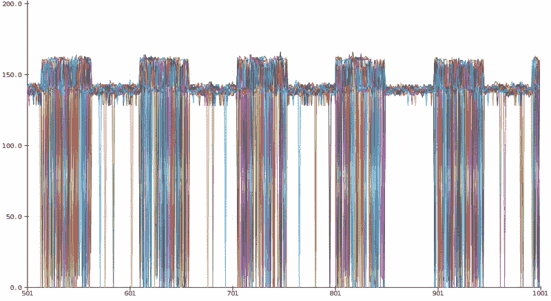

# 机器学习电流传感器窥探 MCU

> 原文：<https://hackaday.com/2021/03/23/machine-learning-current-sensor-snoops-on-mcus/>

任何曾经尝试过对一个硬件进行逆向工程的人都希望有一种魔棒，你可以点击 PCB 来了解它在做什么和为什么。我们认为这就是安全研究人员[Mark C]开发 CurrentSense-TinyML 的原因，这是一个有趣的概念证明，[使用机器学习和敏感的电流测量来尝试和确定微控制器要做什么](https://github.com/Santandersecurityresearch/CurrentSense-TinyML)。

Energy consumption as the LED blinks.

这个想法很简单:只需在电源和被观察的微控制器之间放置一个 INA219 电流传感器，并在它工作时记录测量结果。当然，在这种情况下，[Mark]知道目标 Arduino Nano 在做什么，因为他编写了闪烁板载 LED 的代码。

这使他能够为 TensorFlow 创建训练数据，最终优化成一个可以适合 Arduino Nano 33 BLE Sense(代表我们的魔杖)的模型。最终结果是，该模型可以根据 Nano 使用的电量准确预测它何时点亮 LED。[【Mark】出色地记录了整个过程](https://github.com/Santandersecurityresearch/CurrentSense-TinyML/blob/main/TinyML-CurrentSense-Writeup.ipynb)，这也是将机器学习应用于微控制器的绝佳介绍。

现在我们已经知道你在想什么:显然当 LED 点亮时电流会上升，所以机器学习方面完全没有必要。在这种有限的情况下，这可能是真的，但请记住，这只是一个概念证明，可以作为进一步工作的基础。在未来，随着更多的训练数据，这种技术有可能被用来识别一系列细微的活动。您可以看到 MCU 何时空闲，何时写入闪存，或何时从传感器读取数据。事实上，有了一个足够好的模型，甚至有可能识别被轮询的单个传感器。

现在还为时过早，但我们非常想知道这项研究将走向何方。这可能不是魔术，[但是如果分析咖啡机的电流消耗](https://hackaday.com/2018/08/24/tracking-the-office-coffee-machines-using-current-draw/)可以告诉你办公室里的每个人喝了多少，那么也许[可以帮助我们弄清楚所有这些未标记的集成电路在做什么](https://hackaday.com/2021/03/09/teardown-go-warmer-usb-rechargeable-hand-heater/)。