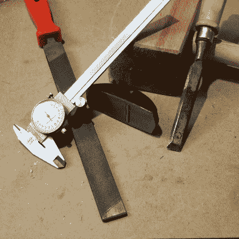

# 机械师的精确度与木工的精确度

> 原文：<https://hackaday.com/2021/03/20/machinists-precision-vs-woodworkers-precision/>

至少有两种方法可以制造完全吻合的零件。第一种方式是笛卡尔方式，机械师方式。想象一下，你可以指定孔的大小和你想放进去的钉子的大小。只要确保你的公差足够紧，并呼吁一个稍微宽一点的洞。见鬼，你可以[在表格中查找你想要的配合类型](https://hackaday.com/2019/02/25/know-your-fits-and-tolerances/)，并指定它。剩下的就是将零件精确加工到合适的公差范围内，就大功告成了。

机械师的方法生死于最后一步——使零件精确地符合尺寸。对比一下传统木工的方法，或者至少是他们教给我的方法，首先就是让零件相互匹配。这是经验主义的方法，也可以说是亚里士多德式的方法。你不必真的关心这两个部分是否正好是 30.000 毫米宽，只要它们的长度正好相同。木工有各种各样的聪明绝招让东西变得一样，或者变得合适，根本不用测量。他们的方法是重在夹具和巧妙的设置，而格外轻在卡尺上。对我来说，来自一个“仔细衡量，并切割一切来衡量”的背景，这些工作方式是一个启示。

这最终完美地表达了[准确度和精度](https://en.wikipedia.org/wiki/Accuracy_and_precision)之间的区别。有时你需要准确无误地计算出数字，而其他时候，你只需要把零件装配好。知道你实际上处于哪种情况是很有用的。

 当然，这些都不是金属或木材独有的，我提到它是因为我发现自己在一种情况下使用了我学到的想法，并在另一种情况下应用了它们。例如，如果你需要一组彼此完全匹配的孔，无论是在金属上还是在木头上，你可以通过一次钻穿两块板或者制作一个模板来免费获得这种精度——不需要测量。如果您只关心两个偏移量是否相同，那么您可以找到一块宽度刚好合适的废料，并使用它来标记两个距离，而不是测量与要素的精确距离。它正好是 1000 英寸宽吗？没有。但是你能用这个来标记相同的位置吗？没错。

你可以用木头制作出令人惊讶的圆形物体，从正方形开始，然后精确地标记出直面的中心，然后切掉边角得到一个八角形。重复中心和切割，直到你再也看不到小平面。然后用砂纸打一下就搞定了。虽然这不会像金属车床一样控制直径，但当你不太关心直径时，你会惊讶地发现这对于制作圆形铝片圆圈有多好。而且锉刀真的不是别的，就是机械师的砂纸(或者凿子？).

我并不是提倡一种工作方式优于另一种，而是要认识到有两种心态，并利用这两种心态。机械师的方法有一定的自由度:如果两个部分都正好是 25.4 毫米长，它们都是精确的英寸，它们会相互匹配。但如果你只在乎精确匹配，那就把它们放在老虎钳里，同时切开。你为什么要用卡尺呢？去掉中间人！

This article is part of the Hackaday.com newsletter, delivered every seven days for each of the last 200+ weeks. It also includes our favorite articles from the last seven days that you can see on [the web version of the newsletter](https://mailchi.mp/hackaday.com/hackaday-newsletter-649368). Want this type of article to hit your inbox every Friday morning? [You should sign up](http://eepurl.com/gTMxQf)!