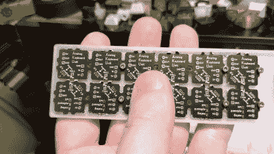
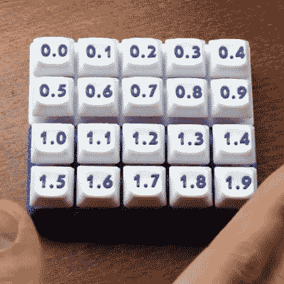

# 磁力开关是咔嗒声的未来

> 原文：<https://hackaday.com/2021/08/02/mag-lev-switches-are-the-future-of-clacking/>

虽然大约每年都会有一个 Cherry MX 克隆产品诞生，但这种完全不同类型的交换机并不常见。这些“无效”开关是由键盘鉴赏家和设计师设计的霍尔效应磁悬浮数字。你能想象在磁铁驱动的开关上发出咔嗒声是多么令人满足吗？由于有更多的小磁铁，它们有可调节的触感*和*行程。但是你不能在团购或其他地方买到这些东西。[如果你想要这些宝贝中的一些，[riskable]说你必须自己打印和组装它们](https://www.reddit.com/r/MechanicalKeyboards/comments/oiznky/teardown_3dprinted_magnetic_levitation_void/)。

 这些吸引人的开关也没有樱桃般的 MX 足迹，所以你需要一些【riskable】的 aku，或者[模拟键盘单元](https://www.youtube.com/watch?v=ZCEvHRZQZGE) (YouTube)来实际使用它们。[riskable]预测，与交换机不同，aku 可能会在未来某个时候被购买。(很好，因为我们真的很想知道这些东西在键盘上是什么感觉！)

那么，它们是如何工作的呢？正如下面嵌入的第一个视频中所解释的，滑块中有一个磁体，外壳中有另一个磁体。这两者相互吸引，所以启动开关将它们分开，这就是霍尔效应的由来。键帽中的第三块磁铁充当悬浮体，帮助开关返回到打开位置。这些开关的触感由两个爱情鸟磁铁之间的塑料厚度决定，因此除了 3D 打印提供的所有其他定制外，你完全可以将它拨到你想要的任何位置。

## 参观和拆卸

 无与伦比的[Chyrosran22]在他的一个拆解视频中展示了这些重要的开关，该视频嵌入在下面。[有风险的]发送的东西之一是一个触觉采样器，从难以想象的 0.0 毫米塑料之间的触觉到不到 2 毫米。

如果你想知道，这个视频对工作来说非常安全，这是令人惊讶的，因为内容创作者倾向于一长串创造性的和连字符的诅咒。我们认为[Chyrosran22]把这些东西留给了糟糕的键盘。

在对[riskable]使用这些开关的手连线模拟宏垫进行了热情洋溢的评论后，请留下来。当你有几分钟空闲时，[在[riskable]的 YouTube 频道](https://www.youtube.com/channel/UCSsm4h2ccJMdR6bsAFyIu6A)上查看这些交换机的视频构建之旅。

那么，这些开关会成为有史以来点击量最大的键盘吗？也许吧，但是[考虑一下这个罢工螺线管设置](https://hackaday.com/2020/05/05/the-clickiest-keyboard-ever/)。

 [https://www.youtube.com/embed/H_Ym9528awM?version=3&rel=1&showsearch=0&showinfo=1&iv_load_policy=1&fs=1&hl=en-US&autohide=2&wmode=transparent](https://www.youtube.com/embed/H_Ym9528awM?version=3&rel=1&showsearch=0&showinfo=1&iv_load_policy=1&fs=1&hl=en-US&autohide=2&wmode=transparent)

 [https://www.youtube.com/embed/XS2NqCB4ufA?version=3&rel=1&showsearch=0&showinfo=1&iv_load_policy=1&fs=1&hl=en-US&autohide=2&wmode=transparent](https://www.youtube.com/embed/XS2NqCB4ufA?version=3&rel=1&showsearch=0&showinfo=1&iv_load_policy=1&fs=1&hl=en-US&autohide=2&wmode=transparent)

