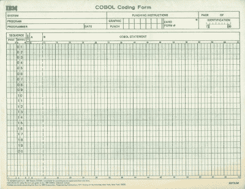
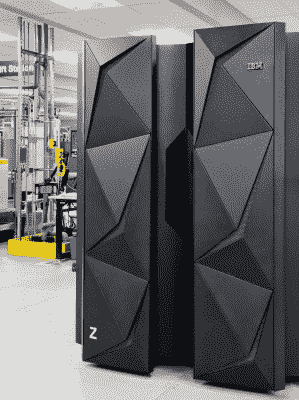
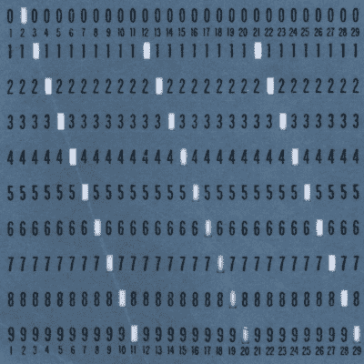

# 为 COBOL 做准备

> 原文：<https://hackaday.com/2022/05/31/making-the-case-for-cobol/>

也许有点出乎意料，在今年 3 月 14 日，GCC 邮件列表收到了一个关于 GCC 编译器第一个 [COBOL](https://en.wikipedia.org/wiki/COBOL) 前端发布的[公告](https://gcc.gnu.org/pipermail/gcc/2022-March/238408.html)。对于外行来说，COBOL 于 1959 年首次发布，这使它成为 63 年来仍在正常使用的最古老的编程语言之一。它持续存在的原因主要是因为它从一开始就专注于作为一种面向事务的、领域特定的语言( [DSL](https://en.wikipedia.org/wiki/Domain-specific_language) )。

它的首字母缩略词代表面向业务的通用语言，明确地引用了它的目标领域。即使使用当前的 COBOL 2014 标准，它本质上仍然是相同的主要面向事务的语言，同时增加了对结构化、过程化和面向对象编程风格的支持。它的大部分核心源自海军上将格蕾丝·赫柏的 T2 流自动语言，可以用清晰的英语高效地描述商业逻辑，就像在金融机构或企业中遇到的一样。

与旧的 GnuCOBOL 项目(将 COBOL 翻译成 C 语言)不同，新的 T2 GCC-COBOL 前端项目取消了中间步骤，直接将 COBOL 源代码编译成二进制代码。所有这些都可能会提出一个问题，为什么要花整整一个人年的时间来研究一种已经被宣布“死亡”了 63 年的语言。

今天学习甚至使用 COBOL 还有意义吗？我们需要一个新的 COBOL 编译器吗？

## 获得笑点

An IBM 704 mainframe in use at NACA in 1957\. (Credit: NASA)

要完全理解 COBOL 的来源，我们必须追溯到 20 世纪 50 年代。这还是在 PDP-8 等小型机出现之前的许多年，更不用说 Apple I 和 kin 等家用电脑了。在这些日子里，随着越来越晶体管化的大型机和高度不同的系统架构，恐龙悄悄潜入大学和企业的深处。

即使在同一个制造商系列的大型机中也存在这种差异，例如 IBM 的 [700 和 7000 系列](https://en.wikipedia.org/wiki/IBM_700/7000_series)。因为每台大型机都必须为其预期目的进行编程，通常是科学或商业任务，这通常意味着如果不进行修改或重写，用于企业或大学的旧大型机的软件将无法在较新的硬件上运行，从而大大增加了成本。

甚至在 COBOL 出现之前，这个问题就已经被一些人认识到了，比如 John W. Backus，他在 1953 年末向他在 IBM 的上司提议开发汇编语言的实用替代语言。这导致了科学编程语言 [FORTRAN](https://en.wikipedia.org/wiki/Fortran) 和数学编程语言 [LISP](https://en.wikipedia.org/wiki/Lisp_(programming_language)) 的发展，两者最初都以 IBM 704 科学主机为目标。

与用大型机的汇编语言编写程序相比，FORTRAN 和其他高级编程语言提供了两个好处:可移植性和高效开发。后者主要是因为能够使用高级语言中的单个语句，这些语句翻译成硬件的一组优化的汇编指令，提供了一个模块化系统，允许科学家和其他人创建他们自己的程序作为他们研究、学习或其他应用的一部分，而不是学习特定的主机架构。

高级语言的可移植性也允许科学家与其他人共享 FORTRAN 程序，然后他们可以在他们研究所的大型机上运行它，而不管大型机的系统结构和其他硬件细节。它所需要的只是一个可用的 FORTRAN 编译器。

A UNIVAC I operator’s console at the Museum of Science in Boston, USA.

虽然 FORTRAN 和 LISP 专注于简化科学领域的编程，但是商业领域有着非常不同的需求。企业的运营有一套严格的规则和程序，要将交易和收入流等投入转化为工资单和季度报表，必须遵循税务部门和其他官方机构制定的规则。将这些编写的业务规则转换成在大型机上完全相同的工作方式是一个重要的挑战。这就是格蕾丝·赫柏的 FLOW-MATIC 语言，以前的商业语言 0，或 B-0，提供了一个针对世界上第一台专用商业计算机 [UNIVAC I](https://en.wikipedia.org/wiki/UNIVAC_I) 的解决方案。

Hopper 的经验表明，商业更喜欢使用简单的英语单词，而不是符号和数学符号。Hopper 上将作为创建了第一个 COBOL 标准的 CODASYL 委员会的技术顾问，这是对 FLOW-MATIC 的成功和 Hopper 在该领域的专业知识的认可。正如她后来在 1980 年的一次采访中所说的，COBOL 60 有 95%是流自动的。另外 5%来自竞争语言——如 IBM 的 COMTRAN 语言——它们有相似的思想，但实现方式非常不同。

有趣的是，在 2002 年标准之前，COBOL 的一个特征是基于列的编码风格，这种风格源于 80 列穿孔卡的使用。这给我们带来了几十年来 COBOL 标准的许多特性更新。

## 他们那个时代的标准

An IBM COBOL coding form from the 1960s.

特别是特定领域语言的一个有趣的方面是，它们既反映了所述领域的状态，也反映了当时技术的状态。当 COBOL 在 20 世纪 60 年代投入使用时，编程不是直接在计算机系统上完成的，而是通常以穿孔卡的形式，或者如果你幸运的话，以磁带的形式，将代码提供给主机。在 20 世纪 60 年代，这意味着“运行一个程序”需要把一堆穿孔卡或特殊的编码形式交给与主机争论的人，他们会为你运行程序并把结果还给你。

当开发新的 COBOL 程序时，这些中间步骤意味着额外的复杂性，并且基于列的风格也是 COBOL-85 更新的唯一选择。然而，在 2002 年的下一次标准更新中，做了很多改变，包括放弃基于列的对齐，采用自由格式代码。这次更新还增加了面向对象的编程和其他功能，包括更多的数据类型，而以前的字符串和数字数据表示有些受限。

保持不变的是 COBOL 缺少代码块。相反，COBOL 源代码分为四个部分:

*   识别部门
*   环境部分
*   数据部分
*   过程部分

除了类和接口规范，标识部分还指定了程序的名称和元信息。环境部分指定了依赖于运行它的系统的任何程序特性，例如文件和字符集。数据部分用于声明变量和参数。过程部分包含程序的语句。最后，每个部分又细分为几个小节，每个小节又由几个段落组成。

An IBM z14 mainframe from 2017, based around the IBM z/Architecture CISC ISA.

在 2014 年最新的 COBOL 更新中，浮点类型格式被更改为 [IEEE 754](https://en.wikipedia.org/wiki/IEEE_754 "IEEE 754") ，以进一步提高其与数据格式的互操作性。然而，正如 Charles R. Martin [在他扎实的 COBOL 介绍中指出的](https://stackoverflow.blog/2020/04/20/brush-up-your-cobol-why-is-a-60-year-old-language-suddenly-in-demand/)，COBOL 的正确比较应该是另一种领域特定语言，如[SQL](https://en.wikipedia.org/wiki/SQL)(1974 年推出)。人们也可以在比较中加入 PostScript、Fortran 或 Lisp。

虽然在技术上可以使用 SQL 和 PostScript 进行常规编程，并在通用(系统)编程语言中模拟 DSL 的特性，但这样做既不快速也不能有效地利用时间。所有这些恰恰说明了这些 DSL 存在的理由:让特定领域内的编程尽可能高效和直接。

IBM 于 1964 年推出的编程语言 One ( [PL/I](https://en.wikipedia.org/wiki/PL/I) )相当简洁地说明了这一点，这是一种通用编程语言，旨在与从 FORTRAN 到 COBOL 的所有语言竞争，但最终未能胜过其中任何一种语言，因为 FORTRAN 和 COBOL 程序员都不相信 PL/I 的优点而改用它。

重要的是要认识到，你不用这些 DSL 来编写操作系统和文字处理器。这种通用性的缺乏既降低了它们的复杂性，也是为什么我们应该仅仅根据它们作为 DSL 的优点来判断它们的用途。

## 合适的工具

COBOL 的一个有趣的方面是，编写它的委员会不是由计算机科学家组成的，而是由商业界的人组成的，他们受到像 IBM、RCA、Sylvania、General Electric、Philco 和 National Cash Register 这样的制造商的需求的强烈驱动，对他们来说，与他们做生意的企业主和政府机构的良好体验是最重要的。

结果，就像 SQL 是如何被有效定义数据库查询和相关需求所塑造的一样，COBOL 也是在数十年间被使业务事务和管理工作顺利进行的需求所塑造的。即使在今天，世界上许多银行和股票交易都是由运行 COBOL 代码的大型机处理的，这主要是因为数十年来对该语言的改进，消除了歧义和其他可能导致代价高昂的错误的问题。

正如移植用 COBOL 编写的业务应用程序的尝试所显示的那样，将语句从 DSL 转移到通用语言的问题是，后者没有任何假设、保护和特性，这正是最初制造 DSL 的原因。一种语言越通用，语句可能出现的意想不到的后果就越多，这意味着除了逐字移植 COBOL 或 FORTRAN(或 SQL)语句，您还必须记住原始语言的所有检查、限制和安全性，并复制它们。

最终，任何将这样的代码移植到通用语言的尝试都将不可避免地导致 DSL 在目标语言中被复制，尽管由于各种原因，出现错误的可能性要高得多。也就是说，虽然泛型编程语言可以实现与 DSL 相同的功能，但真正的问题是这是否是我们想要的。尤其是当停机和错误的成本往往以每秒数百万美元来衡量时，如在一个国家的金融系统中。

因此，DSL 的吸引力在于，它通过简单地不实现那些可能导致这些问题的特性，避免了许多潜在的极端情况和问题。

## GCC-COBOL 适合哪里

尽管需求强劲，但目前仍然严重缺乏 COBOL 开发人员。尽管 GCC-COBOL——像 GnuCOBOL 一样——不是一个经过官方验证的编译器，不会被金融机构中运行 IBM z/OS 的大型机所接受，但是它确实提供了一个宝贵的角色，使人们能够方便地访问 COBOL 工具链。这使得爱好者和学生能够用 COBOL 开发，无论是为了娱乐还是为了潜在的职业。

企业也可以使用这样的开源工具链，用 COBOL 替换遗留的 Java 或类似的工资处理应用程序，而不必投资任何专有工具链和相关的生态系统。根据邮件列表公告中 GCC-COBOL 背后的开发人员的说法，这是目标之一:使大型机 COBOL 应用程序能够在 Linux 系统上运行。

尽管金融机构仍然很有可能选择 IBM Z 系统大型机(“Z”代表“零停机时间”)和相关的防弹服务合同，但看到这样一个重要的 DSL 变得更容易为每个人所用，而且没有任何附加条件，这感觉很好。