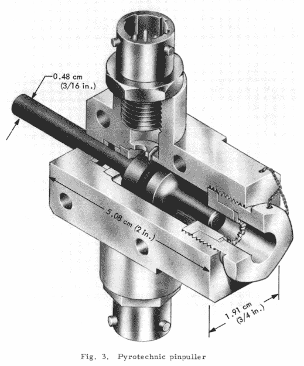
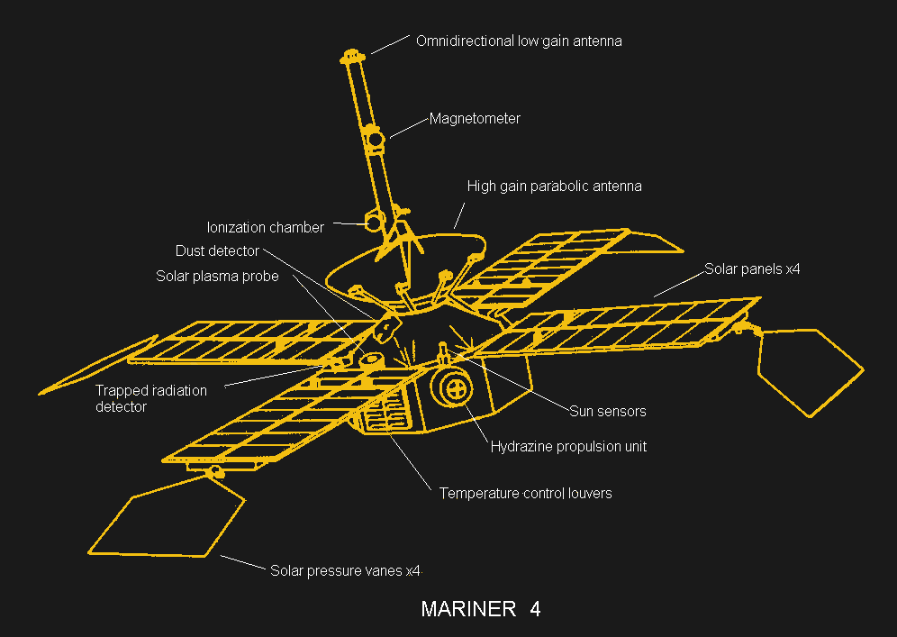
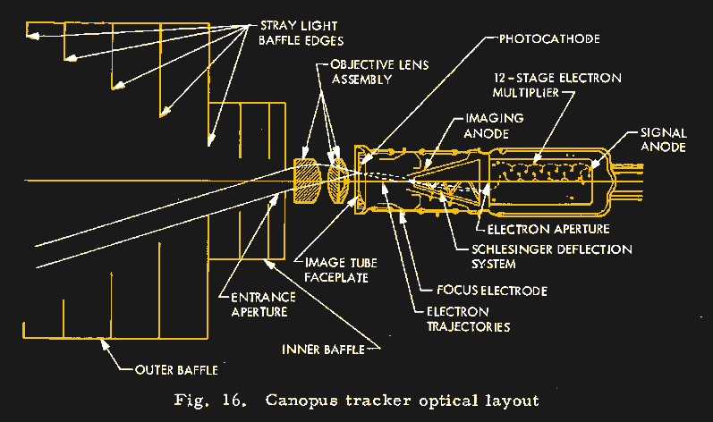
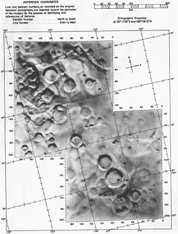

# 水手 4 号:我们第一次近距离观察火星

> 原文：<https://hackaday.com/2021/06/03/mariner-4-our-first-up-close-look-at-mars/>

总的来说，就在不久前，我们太阳系的整个知识体系仅仅是建立在基于地球的观测之上的。首先他们用肉眼观察天空，然后一系列越来越复杂和敏感的光学和射电望远镜收集光谱中所有的光，我们对天文学好奇的祖先做了值得称赞的工作，研究出附近正在发生的事情的大致情况。

但是，在翻滚的空气海洋底部运行的仪器只能收集这么多信息，所以当大约 60 年前向我们的行星邻居发送仪器的机会开始成为可能时，科学家们开始计划如何实现这一目标。其结果是水手计划，1962 年至 1973 年间发射的一系列行星际探测器，执行内行星的飞越任务。

水手计划的成就清单确实很长，它的十个航天器实现的第一数量令人印象深刻。但它是水手 4 号，第一次飞越火星的任务，为今天在火星上和周围进行的许多科学奠定了基础，也是美国宇航局明智地采取“照片或它没有发生”的方法进行行星科学的第一次任务。这是电视摄像机第一次旅行到另一个世界，而且这绝对不是一个肯定会有回报的赌注。

## 迈向明星的第一步

鉴于我们仍在攀登 20 世纪 50 年代末航天飞行学习曲线的最早和最陡峭的部分，开始考虑接触我们的邻近星球是非常大胆的。但是随着十年的变化，后来被称为水手计划的大纲已经制定出来了。它们被设计成有限范围的任务——与即将到来的内行星“大旅行”任务相对。

Pinpuller from Mariner 9, an updated design of the pyrotechnics used to deploy Mariner 4’s solar panels. The two redundant squibs that drive the piston to retract the pin are seen top and bottom. Source: [Technical Memorandum 33-502](https://ntrs.nasa.gov/api/citations/19720007284/downloads/19720007284.pdf?attachment=true)

虽然十个水手任务中的每一个都有特定的科学目标，并且每个航天器都是为此目的定制的，但有一个总的主题:学习如何探索外层空间。在“水手号”构想的时候，俄罗斯和美国已经执行了为数不多的飞行任务，其中大部分不是亚轨道就是低地球轨道。鉴于冷战的紧迫性，许多这样的任务都致力于超越他人，证明一个国家或另一个国家已经占领了制高点，而行星科学受到的关注相对较少，人们对如何到达外层空间以及如何在那里运作知之甚少。

Mariner 的设计也是为了利用新的 Atlas 火箭，这是美国舰队中的第一枚洲际弹道导弹。当与 Agena 第二级配对时，该堆栈能够提升更大的有效载荷并达到地球逃逸速度。Atlas-Agena 组合将发射前五个水手探测器，成功多于失败——水手 1 号和水手 3 号分别因制导问题和有效载荷整流罩损坏而失败。

所有的 Mariner 航天器都是围绕一个或多或少常见的六边形或八边形总线设计的，该总线旨在最大限度地利用 Agena 有效载荷整流罩内的空间。这些探测器都是太阳能驱动的，电池板的数量取决于它们前进的方向——两个是向着太阳的金星或水星，四个是向着火星的任务，以吸收更多较弱的阳光。太阳能电池板是由极轻的铝板制成的，具有刚性的波纹，每个都装饰有 7056 块昂贵的太阳能电池。水手 4 号上的四块面板在弹簧压力下折叠存放；它们曾在轨道上部署过一次，带有烟火引爆装置，能拉出一个固定销。

Mariner 4\. Note the solar vanes on the ends of the solar panels; they were intended to use the solar wind for attitude control, but ended up not working well. Source: NASA/JPL-Caltech

## 和一颗指引她前进的星星

水手号探测器也是第一个利用不断发展的深空网络提供的通信基础设施的航天器，它带有可以指向地球的大型碟形天线。这就提出了精确姿态控制的问题——与 DSN 的持续接触将需要在空间精确定位到一个尚未达到的程度。

在水手计划之前，航天器的导航和姿态控制是一项相对简单的任务。保持绕地球飞行的宇宙飞船指向正确的方向只需要探测天空中最大、最亮的物体——地球本身。当然，其中有微妙之处，但与星际旅行的挑战相比，这些都不算什么，尤其是因为这项任务还没有尝试过。

水手号宇宙飞船都需要在太空中有两个位置来保持正确的姿态。太阳是一个容易攻击的目标，特别是因为保持太阳能电池板或多或少地倾斜于太阳对于最大限度地提高发电量至关重要。Mariner 向阳的上层甲板上的太阳传感器向中央计算机和定序器(CC&S)提供输入，后者是整个航天器的控制器，它激活位于航天器周围的氮气射流，以控制其俯仰和偏航。

Mariner 的第二个定位是基于 Canopus 星，它将控制穿过碟形天线波导的滚动轴。位于船底座南座的老人星是夜空中仅次于天狼星的第二亮的星。自古以来，它就是导航的辅助工具，其特有的亮度，以及其远低于黄道平面的位置，使其成为行星际导航的完美之选。

Canopus star tracker from Mariner 9, which is electro-optically similar to Mariner 4’s tracker. Source: [NASA Technical Memorandum 33-681 – Mariner Mars 1971 Attitude Control Subsystem](https://ntrs.nasa.gov/citations/19750002096)

水手 3 号和 4 号是第一批包含老人星追踪器的宇宙飞船。从成千上万颗星星中挑出一颗特别的星星并不是一件小事。老人星跟踪器由一个带有挡光板的光学望远镜组成，以防止来自检测电子设备的杂散光，检测电子设备由一个称为析像管的特殊真空管组成。这基本上是一个扫描光电倍增管，当航天器围绕其滚动轴缓慢执行搜索动作时，它可以观察一小块空间。任何进入视野的恒星发出的光都会产生一个与其强度和位置成正比的信号，这取决于它在析像管扫描视野中的位置。当发现一颗与老人星强度匹配的恒星时，追踪器向反作用控制喷气机发送一个滚动误差信号，然后保持老人星锁定在视野中。

老人星追踪器花了一点时间才在水手 4 号上正常工作。虽然它能够锁定老人星，但间歇性的明亮信号会在它的视野中出现，导致跟踪器失去对老人星的锁定，并开始另一轮“跳星”。飞行控制人员对此困惑了一段时间，直到确定水手 4 号在太空中呼啸而过的尘埃粒子和油漆斑点云可能是罪魁祸首——即使是靠近追踪器的微小物体也可能看起来像老人星一样明亮或更明亮。这个问题是通过关闭一个 CC&S 程序来解决的，这个程序是用来保护星际追踪器不受地球照射的，因为水手号那时离家很远，星际追踪器可以忽略它。

## -豚鼠特工队

 

火星上亚马逊平原地区以南的一个布满陨石坑的地区。水手 4 号携带的七个科学仪器主要是为了获取地球和火星之间的电磁领域的数据。这将是航天器首次有机会对行星际介质进行采样，因此仪器套件包括磁力计、宇宙射线望远镜、辐射探测器、等离子探测器和宇宙尘埃收集器，以测量微流星体的撞击。这一科学装载将作为许多后续星际探测器科学有效载荷的模型。

虽然所有这些工具都很重要，但水手号的设计者认识到，激发公众兴趣是这项任务的一个重要软目标，在 20 世纪 60 年代初，没有比电视更能赢得公众的心。在任务开始之前，一种特殊的电视摄像机被设计用来拍摄水手号快速经过火星时的照片。

以一个特殊的摄像管为中心的摄像机设计，在由“巫师先生”唐·赫伯特亲自主持的一部电影中得到了概述——这一举动进一步利用了电视的力量。

 [https://www.youtube.com/embed/hTfn0MSNTCc?version=3&rel=1&showsearch=0&showinfo=1&iv_load_policy=1&fs=1&hl=en-US&autohide=2&wmode=transparent](https://www.youtube.com/embed/hTfn0MSNTCc?version=3&rel=1&showsearch=0&showinfo=1&iv_load_policy=1&fs=1&hl=en-US&autohide=2&wmode=transparent)

“水手”号的最初计划是在开始飞越火星之前将它遮盖起来。但是有了尘埃云干扰老人星追踪器的经验，控制人员决定提前丢弃相机的镜头盖，给任何碎片一个分散的机会。相机完美地工作，从大约 9800 公里的高度拍摄了 22 张窄角照片。这些照片揭示了轮廓分明、数量众多的环形山，打消了火星仍然有厚厚的大气层和液态水的任何希望。

Mars by the numbers. The first “photograph” of Mars, hand-colored with pastels on strips of paper printed from Mariner 4 telemetry. Source: NASA/JPL/Dan Goode, public domain.

虽然水手 4 号对火星的近距离观察令一些人失望，特别是那些仍然对古老运河纵横交错的郁郁葱葱的植被抱有幻想的人，但这证明了火星是一个比我们的地球更加陌生和有趣的地方。水手 4 号已经证明，不仅可以安全地在星际空间航行，而且有可能将仪器送到那里并进行有用的科学研究，甚至跨越巨大的太空海湾。以一种非常真实的方式，水手号探测器为行星科学设立了标准，并为我们探索火星和更远的地方铺平了道路。

【主图像:[水手 4 号火星图像](https://www.nasa.gov/image-feature/mariner-4-image-of-mars)通过 [NASA](https://nssdc.gsfc.nasa.gov/imgcat/html/object_page/m04_11e.html)

【感谢 Noel 提出深入探讨这个话题的想法。]