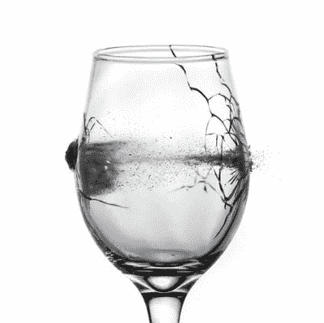

# 测量高速子弹的速度

> 原文：<https://hackaday.com/2020/05/04/measure-the-speed-of-a-speeding-bullet/>

在弹道学的研究中，如果不知道射弹的速度，你能做的很少。无论您需要击中一英里以上的目标，检查彩弹枪对对手是否安全，还是拍摄高速物体，您都需要一种测量速度的方法。[td0g]喜欢拍摄子弹冲击的挑战，并创造了一款[开源弹道计时器](https://td0g.ca/2020/04/19/ballistic-chronograph-mk2-diy/)来帮助实现这一目标。

A rifle bullet punching through a wine glass, captured with the help of the chronograph

[td0g]的设计利用两个相隔一定距离的光门，测量物体在两者之间穿行的时间，并用于计算速度。大多数商用弹道计时器也是以这种方式工作的。[td0g]使用成对的红外光电二极管和发光二极管创建了光门。当光电二极管接收的光量突然下降时，Arduino 控制电路知道有物体通过了光电二极管和 led 之间，并触发计时器。Arduino 上的 LCD 屏用于控制软件和显示速度。正如您可能猜到的那样，时钟精度对于这种时间测量非常重要，[td0g]演示了一种简单的技术，使用智能手机节拍器应用程序手动校准时钟，使其达到可接受的精度。

这是[td0g]制造的第二款计时码表，他将框架改为 3D 打印，以简化结构，并将传感器板升级为定制 PCB，而不是 perfboard。如果你想建造自己的，所有的设计文件都在 Github 上，光门传感器应该很快就会在 Tindie 上出售。他已经成功地使用该装置测量了从 100 米/秒(彩弹)到 875 米/秒(步枪子弹)的各种射弹。对于大功率步枪，计时器需要距离枪口至少 2 米，以避免枪口爆炸造成的损坏或错误读数，这也意味着需要仔细瞄准，以使子弹穿过感应区，而不会在此过程中损坏计时器。

让快门在正确的时刻触发可能是高速摄影的最大挑战。我们有许多不同的触发器，包括用于水球摄影的[和用于水滴的](https://hackaday.com/2014/10/02/simple-photo-flash-trigger-for-water-balloon-photography/)[激光。](https://hackaday.com/2013/05/31/high-speed-photography-with-friggin-lasers/)